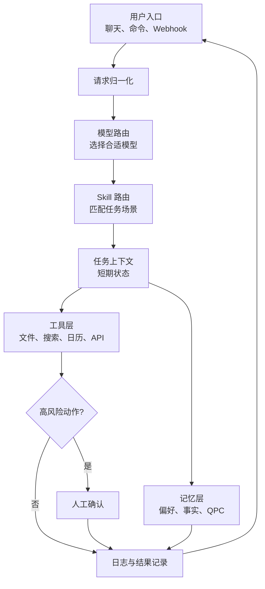

个人助理智能体不需要一开始就有复杂平台。

一个最小可用架构，只要能稳定完成“理解请求、选择流程、调用工具、记录结果、必要时请人确认”这条链路，就已经能解决很多实际问题。

## 架构图

## 入口：只负责接收请求

入口可以是聊天窗口、飞书消息、命令行或 Webhook。

入口不应该承担复杂逻辑。它只需要把用户请求、用户身份、时间和上下文传给后面的处理链路。

这样以后更换入口时，不需要重写核心逻辑。

## 模型路由：按任务选择模型

不是所有任务都需要最强模型。

简单分类、格式整理、固定模板生成，可以使用便宜快速的模型。复杂推理、长文写作、代码分析，才需要更强模型。

模型路由的目标不是炫技，而是控制成本和延迟。

## Skill 路由：把任务交给稳定流程

个人助理的大多数任务有明确场景：记一条知识、查一个配置、写一篇博客、生成复盘、检查服务器。

Skill 路由比无约束 ReAct 循环更适合这些任务。它先识别场景，再进入对应流程，减少“想太多”和“乱调用工具”的概率。

## 工具层：只接入少数可靠工具

工具层应该从少开始。

优先接入：

- 文件读写。
- 搜索和查询。
- 日历或提醒。
- 个人知识库。
- 必要的部署和运维命令。

每个工具都要有权限等级和失败处理方式。

## 记忆层：只保存必要信息

记忆层不应该什么都存。

它应该保存长期有价值的信息：用户偏好、稳定事实、项目状态、常用流程、知识条目。临时上下文只在任务内保留，过期就丢弃。

QPC 这类极简知识结构适合个人助理，因为写入成本低。

## 日志和确认机制

日志记录每次请求发生了什么。

确认机制处理高风险动作：删除文件、修改配置、远程命令、发公开消息、财务操作。只要动作不可轻易撤销，就应该让人确认。

最小架构不是功能最少，而是边界最清楚。
