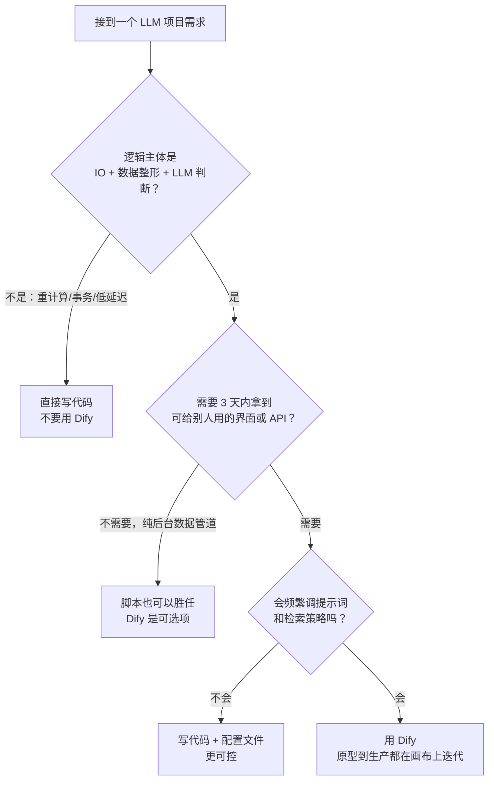

# Dify 深度玩法（一）：它适合做什么，不适合做什么

> 本系列共五篇，基于 2026 年的 Dify（含新版 Agent 与 MCP 能力）整理自实际调研与项目设计。
> 这一篇先回答最容易被跳过的问题：**什么项目该用 Dify，什么项目用了反而更慢。**

## 一句话定位

Dify 是一个 LLMOps 平台：把「可视化编排 + 知识库 RAG + Agent + 一键发布（Web App / API / 嵌入组件）」装进同一个画布。它与 LangChain 这类代码框架的本质区别是——**Dify 是产品，LangChain 是框架**。框架给你最大自由，产品给你最快速度，代价是边界由平台划定。

## 三条判断标准

一个项目"适合 Dify"，通常同时满足三条：

1. **逻辑主体是 IO + 数据整形 + LLM 判断**。抓数据、清洗、让模型打分或判定、输出文本——这条链路是 Dify 节点的母语。
2. **需要快速拿到可调用的出口**。你需要在几小时内拥有一个能点开的 Web App、一个 REST API、一个可嵌入的聊天组件，而不是先写两周前后端。
3. **改提示词的频率远高于改代码的频率**。Dify 上改一个 LLM 节点的 prompt 是秒级的，不需要重新发版。如果你的项目半年才改一次提示词，这个优势归零。

反过来，满足不了这三条的，用 Dify 通常更慢。下面这张决策图可以直接对着用：

## 场景对照表

| 场景 | 用 Dify | 原因 |
|---|---|---|
| 多源抓取 → 清洗 → LLM 打分 → 输出日报 | ✅ | 典型的 IO + LLM 链路，改数据源不动代码 |
| 文档知识库问答（RAG） | ✅ | 分块、检索、重排、引用都是现成节点 |
| 一次性深度调研报告生成 | ✅ | 多 Agent 分工 + 引用校验节点 |
| 需要快速给客户演示的垂直领域助手 | ✅ | Web App 与 API 一键发布 |
| 高频低延迟 API（P95 要求数百毫秒内） | ❌ | 每个节点都有额外开销与队列 |
| 视频渲染、大规模数值计算 | ❌ | 沙箱 30 秒超时 + 内存上限，干不了重活 |
| 复杂有状态业务流程（事务、回滚、幂等） | ❌ | 声明式分支表达不了状态机 |
| 逻辑需要严格 code review 与版本控制 | ⚠️ | 工作流导出为 YAML，diff 可读性差 |

## 关于"拖拉拽"的真实配比

一个常见误解是"用 Dify = 纯拖拽"。实际项目里有效的配比是**约八成拖拽、两成 Code 节点**：

- LLM 的输出天生不稳定，凡是后续节点要机器可读的数据，中间都要过一道 Code 节点做清洗和校验；
- 正则抽取、格式转换、去重、范围校验，这些活交给 Code 节点比反复调提示词可靠得多。

这也给出一个反向判断标准：**当一个工作流里 Code 节点占比超过一半，说明这个项目的核心逻辑已经不在"编排"层了，应该整体改写为代码。** Dify 的甜蜜区在中间——编排和集成它替你做了，但核心算法得是你的。

## 本系列地图

| 篇 | 主题 | 一句话 |
|---|---|---|
| 一（本篇） | 定位与边界 | 先决定该不该用 |
| 二 | [部署选型与模型 Key](/posts/2026-09-26-dify-deep-dive-02-deploy-and-keys/) | 云版够不够，自托管怎么落地 |
| 三 | [节点自定义的五个层级](/posts/2026-09-26-dify-deep-dive-03-node-customization/) | 每个节点能改到什么程度 |
| 四 | [RAG 深度玩法](/posts/2026-09-26-dify-deep-dive-04-rag/) | 分块、检索、元数据三件套 |
| 五 | [Agent、MCP 与完整实战](/posts/2026-09-26-dify-deep-dive-05-agent-mcp-practice/) | 从能力到跑通一个真实项目 |

## 小结

Dify 的价值不是"让不会写代码的人做 AI 应用"，而是**让会写代码的人把时间花在提示词、检索策略和判断标准上，而不是花在胶水代码、部署和界面上**。先用三条标准判断项目性质，再决定进不进画布——这一步的判断错误，是后面所有返工的源头。

下一篇讲第一个实际决策：云版还是自托管。
