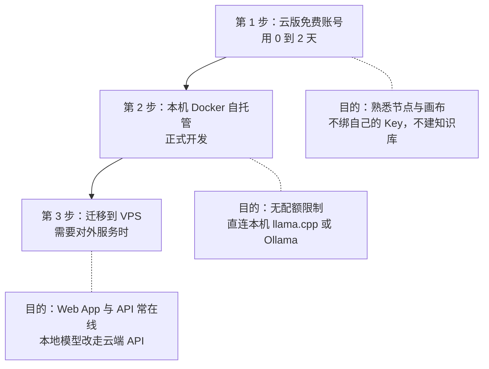

# Dify 深度玩法（二）：云版还是自托管？部署决策与模型 Key 清单

> 上一篇：[Dify 适合做什么](/posts/2026-09-26-dify-deep-dive-01-positioning/)。
> 本篇回答第二个实际决策：在哪跑、接什么模型。

## 先澄清一个常见误解

很多人以为云版免费额度限制的是"调用量"。真实情况是：**自带 API Key 的调用不消耗 Dify 的 message credits**（credits 只在使用 Dify 内置供应商时消耗）。云版免费版（Sandbox）真正的瓶颈是：

| 维度 | 云版 Sandbox（免费） | 自托管 Community |
|---|---|---|
| 应用数 | **5 个** | 不限 |
| 知识库 | **50 篇文档 / 50 MB** | 取决于你的磁盘 |
| 本地模型（llama.cpp / Ollama） | 访问不到你的 localhost | 容器内直连 |
| 费用 | 0（够用要升级到约 59 美元/月） | 0（电费与磁盘） |
| 维护 | 无 | 升级需读 release note、改环境配置后重启 |

结论很直接：**多项目 + RAG 的组合，云版免费版装不下**。应用数和知识库容量这两个上限，恰好卡在个人开发者的典型需求上。

## 三阶段部署路径

不建议二选一，建议分三步走：



第 1 步不要投入任何东西——云版只用来确认"画布的工作方式你是否接受"。第 2 步才是正式开发环境。第 3 步等真的要给别人用时再做，因为自托管应用可以导出 DSL 迁移，前期投入不会浪费。

## 自托管的资源底线

官方文档写的最低配是 2 核 4 GiB 内存，但那是理论值。Docker Compose 会起约 15 个容器（Postgres、Redis、Weaviate、nginx、SSRF 代理、代码沙箱等），实际建议：

1. **磁盘**：镜像加插件动辄数 GB。Windows 用户先把 Docker Desktop 的镜像与数据卷位置改到数据盘，再拉镜像。
2. **内存**：建议 16 GB。如果只有 8 GB，Dify 容器会和本机大模型推理抢内存——这种配置下建议把模型放 VPS，本机只跑 Dify。
3. **Docker Compose 版本不低于 2.24.0**。
4. 安装即标准三步：clone 仓库、复制环境变量模板、`docker compose up -d`，然后访问安装页创建管理员。
5. 安全底线：替换默认的 SECRET_KEY 与 Agent 服务密钥；**社区版的代码沙箱不要暴露给不可信用户**——官方文档对此有明确警告。

## 模型 Key 清单：四类能力

Dify 把模型按能力分四类，其中前两类是刚需：

| 能力 | 是否必需 | 用途 | 推荐方案 |
|---|---|---|---|
| 文本生成 LLM | ✅ 必需 | 所有 LLM 节点、Agent 推理 | DeepSeek、通义千问、GLM 系列 |
| 文本向量化（Embedding） | ✅ 必需 | **不配它知识库根本建不了** | BGE-M3（硅基流动有免费额度）、通义 embedding |
| 重排序（Rerank） | 强烈建议 | 检索结果精排，RAG 准确率提升明显 | BGE-reranker-v2-m3 |
| 语音（识别/合成） | 可选 | 语音输入输出 | 需要时再配 |

按预算分三档组合：

- **零成本调试档**：本机 llama.cpp 跑 LLM + 硅基流动免费 Embedding。适合打分类节点、格式清洗、跑批。注意：2B 级别的本地模型做不了复杂 Agent 推理，只能承担简单判定。
- **常规开发档（推荐主力）**：云端 LLM（DeepSeek 或通义）+ BGE-M3 + BGE 重排。个人项目每月几十到两百元的量级。
- **高质量档**：在常规档之上，给 Agent 节点单独配一个原生工具调用可靠的强模型。做调研、做代码类项目时值得。

## 接入方式：内置插件优先

优先用 Dify 内置的模型供应商插件（DeepSeek、通义、智谱都有官方插件），它会正确处理各家参数差异。**只有本地模型才走"OpenAI-API 兼容"自定义供应商**，典型配置如下：

```yaml
供应商类型: OpenAI-API-compatible
Base URL: http://host.docker.internal:11434/v1
API Key: 留空或任意值（本地服务不校验）
模型名称: qwen2.5-7b-instruct
模型类型: 对话 / 文本 Embedding（各建一条）
上下文长度: 按模型实际值填
```

三个细节：
- Docker 部署的 Dify 访问宿主机服务必须用 `host.docker.internal`，写 `localhost` 指向的是容器自己。
- 服务端需提供模型列表与对话补全两个 OpenAI 风格端点。
- 每家供应商的接口地址随版本会变，以官方文档为准。

## 四个必踩的坑

1. **别只看接口像 OpenAI 就以为能跑 Agent。** Dify 的 Agent 依赖模型真实的函数调用能力。接入后必须实测工具调用，不能按接口形状假设兼容。
2. **不配 Embedding 模型，知识库直接建不了**。很多人卡在这一步，以为是平台故障。
3. **用 OpenAI 时注意 API 类型**：Dify 新版对新模型系列默认改用 Responses API，沿用旧的 Chat Completions 配置会报错。
4. **Key 管理纪律**：用子账号 Key、设消费上限、定期轮换；不要把管理员权限的 Key 填进平台；`SECRET_KEY` 上线前必须替换。

## 小结

部署决策的本质是"**配额换维护**"：云版替你扛运维但卡容量，自托管给你全部容量但要自己管容器。个人开发者的合理路径是云版试手感、本机自托管做开发、VPS 做交付。模型侧记住一句：Embedding 和 LLM 是两条独立的配置线，缺一个 RAG 就动不了。

下一篇进入画布内部：每个节点到底能自定义到什么程度。
