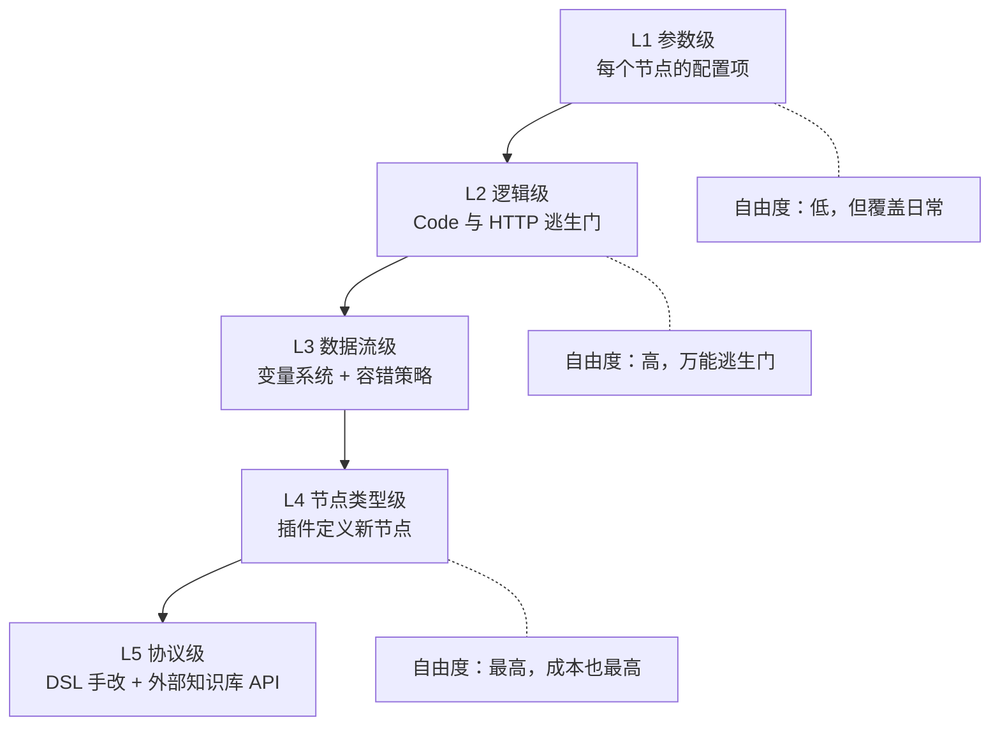

# Dify 深度玩法（三）：节点自定义的五个层级

> 上一篇：[部署选型与模型 Key](/posts/2026-09-26-dify-deep-dive-02-deploy-and-keys/)。
> 进了画布，第一个问题是"这东西到底能改多深"。答案是分层看：**参数、逻辑、数据流三层几乎不设限；节点类型可靠插件扩展；硬边界只有两处。**

## 五个层级总览



## L1 参数级：每个节点都有一层配置

- **LLM 节点**：每个节点独立选模型、独立调参数（温度、最大输出等），提示词模板可引用任意上游变量，支持结构化输出、视觉输入、会话记忆。
- **知识检索节点**：可挂多个知识库，检索模式、返回条数、相似度阈值、重排模型逐项可配。
- **问题分类器 / 参数提取器**：分类类别和抽取字段完全由你定义，抽取方式可选函数调用或提示词驱动。

这一层覆盖了八成日常需求，特点是"改配置不改逻辑"。

## L2 逻辑级：两个万能逃生门

**Code 节点**（Python 3.10+ 或 Node.js 18+）负责任意数据变换。一个真实可用的例子——对抓取结果做归一化去重：

```python
def main(items: list) -> dict:
    import json, hashlib

    seen, deduped = set(), []
    for it in items:
        # URL 哈希做主键，标题归一化做副键
        url_key = hashlib.md5(it["url"].encode()).hexdigest()
        title_key = "".join(it["title"].split()).lower()
        if url_key in seen or title_key in seen:
            continue
        seen.add(url_key)
        seen.add(title_key)
        deduped.append({
            "title": it["title"].strip(),
            "url": it["url"],
            "source": it.get("source", "unknown"),
        })
    return {"deduped": deduped, "dropped": len(items) - len(deduped)}
```

要点：函数名必须是 `main`，入参来自你映射的输入变量，返回字典的键自动注册为输出变量，供下游引用。

**HTTP 节点**负责任意外部调用：方法、地址、请求头、鉴权、超时、重试全部开放。有 API 就能接，这是 Dify 不被生态绑死的根本原因。

## L3 数据流与容错级

- **变量系统**：环境变量、会话变量、跨节点引用构成完整的数据流，配合变量聚合器可以把多条分支的结果合并回一条线。
- **每节点独立容错**：自动重试（最多 10 次、间隔可配）、失败默认值、失败分支。做生产前给 LLM 节点和 HTTP 节点都配上失败分支，是一条纪律。

## L4 节点类型级：插件系统

插件包可以定义全新的 Workflow 节点类型、工具和模型接入。自定义工具还有两条轻量路：导入 OpenAPI 规范即成工具；或接入 MCP Server（支持按请求动态注入请求头）。L4 自由度最高，但成本也最高——除非有复用价值，否则不建议个人项目碰。

## L5 协议级：DSL 手改

应用可以导出 DSL（YAML 格式），**直接改文件再导入**能绕开画布配置的限制。比如把某个节点的重试次数和超时批量统一：

```yaml
# 从导出的 DSL 中摘出的节点片段（示意）
- data:
    type: http-request
    title: 拉取数据源
    retry_config:
      max_retries: 3
      retry_interval: 2000
    timeout:
      connect: 15
      read: 60
```

这正是云版与自托管之间迁移的载体：导出、改、导入，前期投入不浪费。

## Code 节点的硬约束

这是自定义深度的真实边界，逐条记：

| 约束 | 默认值 | 自托管能否放宽 |
|---|---|---|
| 执行超时 | 约 30 秒（按节点可调，有平台上限） | ✅ 改容器配置 |
| 内存 | 约 256 MB | ✅ |
| 依赖包 | **白名单**：json/re/math、numpy、pandas、requests 等，白名单外导入直接失败 | ✅ 改沙箱依赖配置后重建 |
| 文件系统 / 进程 | 完全禁止 | ❌ 设计如此 |
| 网络访问 | 默认禁止，放行也走 SSRF 代理 | ⚠️ 可配，但代理默认拦内网与本机地址 |
| 输出体积 | 字符串 40 万字符、对象嵌套不超过 5 层 | ❌ |

两条推论：

1. **重活不要放 Code 节点**。30 秒加 256MB 很容易顶到，批量数据清洗应该拆到外部服务，用 HTTP 节点调用。
2. **Code 节点里访问本机服务（比如 llama.cpp）会撞 SSRF 代理对本机地址的拦截**。需要调整代理配置，或改用 HTTP 节点加 `host.docker.internal` 并放行对应地址。这是自托管之后实测最多的地方。

## 内置节点改不了的部分

- 内置节点的**内部算法**不能改：混合检索的打分合并、分类器的内部实现，只能换参数换模型，或用外部知识库 API 整体绕过。
- 节点在画布上的外观不可定制。
- 复杂有状态流程（多轮状态机、事务、回滚）依然吃力——声明式分支表达不了。

## 小结

一个实用的自检标准：**当一个工作流里 Code 节点占比超过一半，说明核心逻辑已经不在编排层，应该整体改写成代码。** Dify 的甜蜜区是"节点内给你逃生门、节点间给你可塑的数据流"，但节点类型和沙箱边界是平台划定的——认清边界再设计，比撞了墙再改方案便宜得多。

下一篇讲最常用的能力：RAG 到底能做成什么样。
