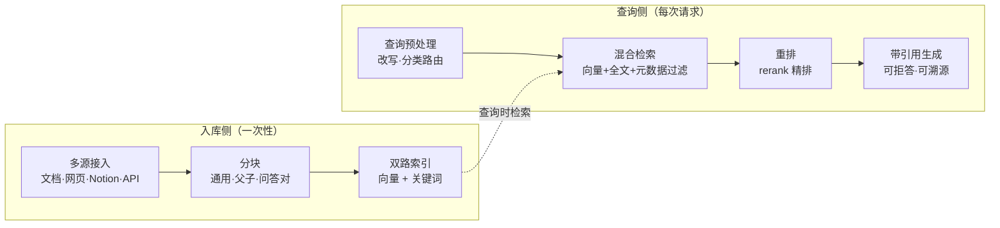

# Dify 深度玩法（四）：RAG 做到什么程度才算到位

> 上一篇：[节点自定义的五个层级](/posts/2026-09-26-dify-deep-dive-03-node-customization/)。
> 自托管 Dify 的 RAG 不是"上传文档然后问答"，而是一条每一段都能调参的流水线，且没有云版的容量阉割。

## 全链路：入库与查询



平台能力是现成的。**效果差异来自三个你自己做的决定：分块策略、检索模式、元数据设计。**

## 效果的四层阶梯

| 层次 | 做出来的效果 | 依赖能力 |
|---|---|---|
| 1. 基础问答 | 回答带引用来源，知识库里没有就明确说不知道 | 混合检索 + 重排 + 阈值 |
| 2. 精准知识库 | 长文档问答不丢上下文；检索自动限定在某类文档 | 父子分段 + 元数据过滤 |
| 3. 可编程检索流水线 | 查询改写、分类路由、多库检索、生成前校验全部画进画布 | RAG 流水线 / Chatflow |
| 4. 外挂检索引擎 | Dify 只当编排层，检索打到你自己写的 API（ES、数据库、自建向量服务） | 外部知识库 API |

第 2、4 层是自托管的意义所在：云版免费额度装不下，而外部知识库接口意味着可以整体绕开内置向量库。

## 决定一：分块策略

| 策略 | 原理 | 适用 |
|---|---|---|
| 通用分段 | 按分隔符/长度切，可设重叠窗口 | 结构简单的文本 |
| **父子分段** | 子块小而精准用于匹配，命中后返回父块给模型 | 长文档、技术教程 |
| 问答对 | 把文档整理成一问一答的形式入库 | 客服话术、FAQ |

**父子分段是差异化能力**，典型效果：检索命中一个代码片段（子块），返回的是整个函数定义（父块）。对教程类文档，子块放单个参数说明段落、父块放完整章节，问答准确率明显高于裸段落。

## 决定二：检索模式

三种模式：向量（语义）、全文（关键词倒排）、混合（两者加权合并）。一个实证场景：

**查 CLI 参数必须用混合检索，不能只用向量检索。** `--n-gpu-layers` 这类 flag 是精确 token，语义检索容易漏掉或混淆相近参数；全文检索恰好治这个。凡是"专有名词、编号、代码标识符"类的查询，全文检索都是主力。

## 决定三：元数据过滤

给文档打元数据（主题、时间、版本、标签），检索时有三种过滤模式：

1. **disabled**：不过滤；
2. **manual**：在画布里写死过滤条件；
3. **automatic**：**由模型分析用户问题后自动生成过滤条件**——问"勘误表相关的"就自动只查打了 errata 标签的文档。

automatic 模式让"一个知识库服务多个场景"成为可能，是三个决定里性价比最高的一个。

## 生成节点的提示词模板

检索结果拼进上下文后，生成节点的系统提示词建议带上"拒答 + 引用"两条纪律。可直接用的版本：

```text
你是技术文档助手。请严格遵守以下规则回答问题：

1. 只依据下方"参考资料"回答，禁止使用资料之外的知识。
2. 回答中的每个结论后标注来源编号，如 [1]。
3. 如果参考资料不足以回答，直接回复：
   "知识库中没有找到相关内容"，并说明检索到的主题范围。
4. 保持原文的参数名、命令和代码块原样输出，不要改写。

参考资料：
（此处插入知识检索节点的输出变量）
```

## 生成前校验：一段可复用的代码节点

引用完整性校验——每条结论必须有来源，否则降级为"待人工确认"：

```python
def main(answer: str, sources: list) -> dict:
    import re

    # 提取答案中引用的编号，如 [1] [2]
    cited = set(re.findall(r"\[(\d+)\]", answer))
    valid = {str(i + 1) for i in range(len(sources))}

    missing = cited - valid          # 引用了不存在的来源
    unused = valid - cited           # 来源没被引用过（弱信号）

    if missing:
        status = "retry"             # 建议回退重新生成
    elif unused:
        status = "pass_with_note"    # 通过，但提示有冗余来源
    else:
        status = "pass"
    return {"status": status, "cited": sorted(cited), "unused": sorted(unused)}
```

配合 L3 的失败分支：`status` 为 retry 时走重试或人工通道，这就是"引用幻觉"的硬闸门。

## 调参工作法：召回测试

后台的召回测试（hit testing）是 RAG 调参的主战场：输入一句真实的用户问题，直接看召回了哪些分块、相似度多少。调参节奏建议固定为：

1. 用 20 条真实问题做测试集；
2. 每改一次分块或检索参数，全量跑一遍记录命中率；
3. 拿不到预期分块的问题，回查是"没分对块"还是"没排上位"——前者改分块，后者调重排。

## 边界，如实说

- 默认向量库是 Weaviate，但支持 20 多种后端（Qdrant、Milvus、PGVector、Chroma 等），内存紧张换 PGVector 更轻。
- 经济模式（纯关键词、不建向量索引）零 embedding 成本，但语义理解没了，只适合精确查参数这类单一用途。
- 复杂 PDF（扫描件、多层表格）解析能力一般，支持 OCR 但别期望完美；Markdown 源文件效果最好。
- 图谱式 RAG（GraphRAG）不是内置能力，需要外挂；就多数个人项目而言，混合检索加元数据已经够用。

## 小结

RAG 的上限不在平台，在**分块、检索、元数据**这三个决定上。一句话行动指南：教程类长文档用父子分段，参数与代码类查询开混合检索，多场景知识库上 automatic 元数据过滤，最后用 20 条真实问题建测试集持续回归。

下一篇收官：Agent、MCP，以及把这些串起来的完整实战。
