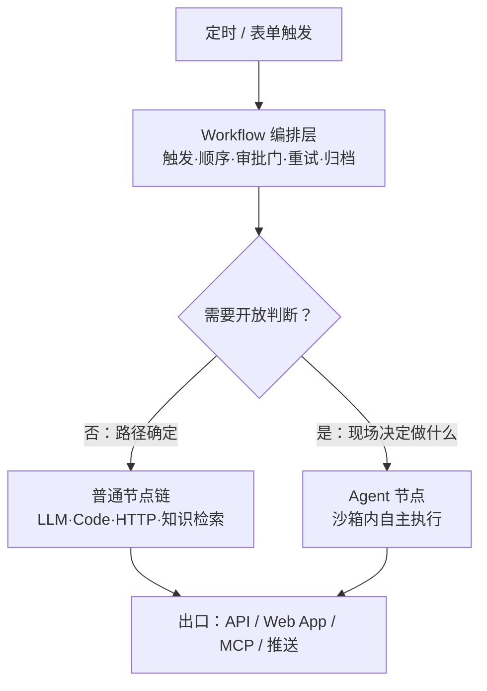
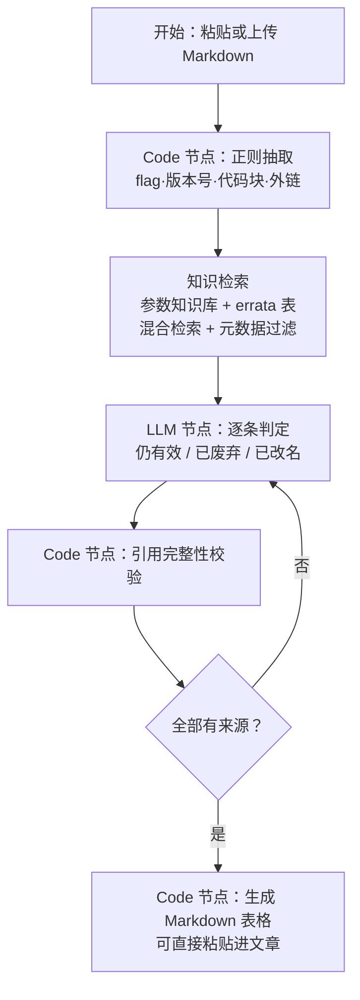

# Dify 深度玩法（五）：Agent、MCP 与一个完整实战

> 上一篇：[RAG 深度玩法](/posts/2026-09-26-dify-deep-dive-04-rag/)。
> 本篇是收官：先讲清 Agent 与 Workflow 的分工原则，再讲 MCP 的实际价值，最后把整个系列串成一个跑得通的真实项目——博客勘误官。

## Agent 与 Workflow：谁管什么

新版 Dify 的 Agent 带来了 Linux 沙箱与技能（Skills）体系：Agent 可以在隔离环境里执行命令、管理文件、按需安装依赖。能力变强之后，最重要的设计原则反而是**克制**：

- **Agent 管判断**：任务路径开放的环节——自己决定查什么、跑哪个脚本、怎么补证据；
- **Workflow 管编排**：触发、顺序、分支、审批门、重试、归档——所有需要确定性的环节。



反例是"一个 Agent 干全部"：触发它自己定、写操作它自己批、失败它自己咽——这类流程出问题时你连现场都还原不了。**自主性是成本，不是默认值。**

## MCP：把你的工作流变成别人的工具

2026 年 Dify 支持双向 MCP：

- **作为客户端**：接入外部 MCP Server，其工具自动出现在 Agent 与工作流的工具列表里（如 GitHub、文件系统、数据库）；
- **作为服务端**：**把任何一个 Workflow 直接暴露成 MCP Server**，外部系统（Cursor、Claude Code、你自己的客户端）无需你写 API 封装即可调用。

后者的价值常被低估：你在 Dify 里做的每个工作流，都可以低成本变成所有支持 MCP 的客户端里的一个工具。比如"查我的知识库""跑一次勘误检查"，配置即用：

```text
在 Dify 应用的"访问 API"页面开启 MCP 服务端能力，
将给出的 MCP Server 地址填入任意 MCP 客户端的配置中，
该工作流即以工具形式出现，输入输出即工作流的开始/结束变量。
```

注意安全：MCP 服务端暴露的应用要过权限审查——它等于把你的工作流开给了外部客户端。

## 完整实战：博客勘误官

**痛点**：技术博客里的 CLI 参数、版本号会随上游项目升级而过时。读者按旧参数执行命令失败，是最伤信任的一类问题。目标：输入一篇文章，自动比对参数知识库，产出勘误建议。

### 全流程



### 第一步：正则抽取（Code 节点）

抽取交给代码，不交给提示词——确定性活用确定性工具：

```python
def main(content: str) -> dict:
    import re

    flags = sorted(set(re.findall(
        r"(?<![\w-])--[a-z][a-z0-9-]{2,30}", content)))
    versions = sorted(set(re.findall(
        r"\b[vV]?\d+\.\d+(?:\.\d+)?\b", content)))
    code_blocks = re.findall(
        r"```[a-z]*\n(.*?)```", content, re.S)

    return {
        "flags": flags,
        "versions": versions,
        "code_blocks": code_blocks,
        "count": len(flags) + len(versions),
    }
```

输出是一份结构化的"待核对清单"。正则先给候选集，LLM 只做判定不做抽取——分工越纯，幻觉越少。

### 第二步：判定（LLM 节点提示词）

```text
你是 llama.cpp 文档一致性审核员。输入为一批从文章中抽取的
参数与版本号，以及知识库检索到的官方参数对照资料。

对每一项输出判定，JSON 数组格式，字段固定为：
- item:      被核对的参数或版本号
- verdict:   valid（仍有效）/ deprecated（已废弃）/ renamed（已改名）/ unknown（资料不足）
- current:   若 renamed，给出当前名称；其余留空字符串
- evidence:  判定依据，必须直接引用资料中的原文片段
- action:    建议动作，如"替换为 --X""删除该段""保留"

硬性规则：
1. evidence 为空时，verdict 必须是 unknown，禁止编造来源。
2. 不确定就输出 unknown，不要猜测。
3. 只输出 JSON，不要输出其他文字。
```

模型参数建议：温度调到最低，开启 JSON 结构化输出。逐项判定的输出随后交给校验节点。

### 第三步：校验与出表（Code 节点）

引用校验的思路与[第四篇](/posts/2026-09-26-dify-deep-dive-04-rag/)的通用版本一致：`evidence` 为空即判 `unknown`，`unknown` 与 `renamed` 项标记"待人工确认"。最后一步把 JSON 转成 Markdown 表格：

```python
def main(items: list) -> dict:
    lines = [
        "| 原文参数 | 判定 | 现名 / 建议 | 依据（人工确认用） |",
        "|---|---|---|---|",
    ]
    for it in items:
        if it["verdict"] == "unknown":
            it["verdict"] = "unknown（待人工确认）"
        lines.append("| {} | {} | {} | {} |".format(
            it["item"], it["verdict"],
            it.get("current") or it.get("action", "-"),
            (it.get("evidence") or "-")[:60]))
    return {"table": "\n".join(lines)}
```

产出直接对齐既有写作规范：**旧写法到新写法的映射表**，粘贴进文章的勘误小节即可，旧读者不会被顺序打乱。

### 上线后的迭代记录

- 第一版把抽取也交给 LLM，漏检率高；改成正则候选加 LLM 判定后，参数检全率显著提升。
- 知识库只放"官方参数表 + errata 历史"两个文档，配合元数据按项目过滤，检索噪声极小。
- 每次上游大版本发布后重索引一次知识库（支持增量索引），这是唯一需要记住的维护动作。

## 系列总结

五篇串起来是一条完整的路径：**先用三条标准判断项目性质（一），再选部署形态和模型（二），然后认清节点的能力边界（三），把检索类需求做成有纪律的 RAG（四），最后在确定性的编排里嵌入克制的 Agent（五）。**

Dify 不替代工程能力，它把工程能力重新分配——把胶水代码的时间省下来，花在分块策略、判定标准和数据质量上。这才是"低代码"对会写代码的人的真实价值。

- [（一）它适合做什么，不适合做什么](/posts/2026-09-26-dify-deep-dive-01-positioning/)
- [（二）云版还是自托管？部署决策与模型 Key 清单](/posts/2026-09-26-dify-deep-dive-02-deploy-and-keys/)
- [（三）节点自定义的五个层级](/posts/2026-09-26-dify-deep-dive-03-node-customization/)
- [（四）RAG 做到什么程度才算到位](/posts/2026-09-26-dify-deep-dive-04-rag/)
- （五）本篇
