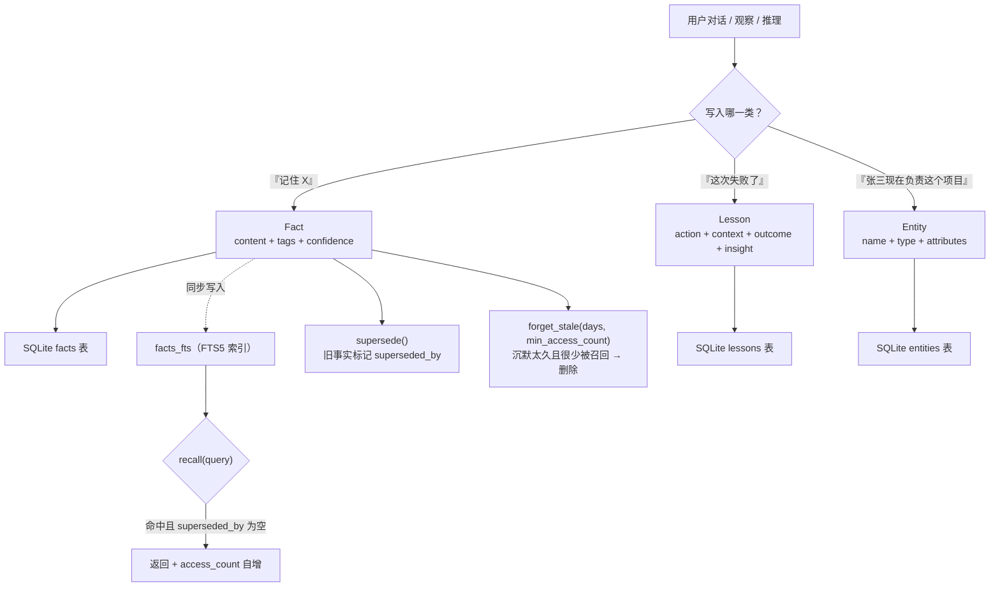

# Agent 技能解剖（一）：Agent Memory——把「记住」做成数据层

> 本系列共四篇，逐篇拆解四个当前装机量最高的 Agent 技能，全部基于**下载技能包后的源码级阅读**，不是对 README 的转述。
> 解读视角固定为 prompt 工程：它把哪一部分不确定性交给了模型，又把哪一部分交给了代码。

## 为什么先拆这一个

关于「让 Agent 记住」，业内长期存在两种做法：

1. **塞进上下文**——把历史对话、文件、笔记尽可能多地带进 prompt；
2. **外置成存储**——把记忆写成结构化数据，需要时检索回来。

第一种做法的问题不是「不够长」，而是**成本与轮次线性相关**：每一轮都要为全部历史重新付费，且上下文越长，模型对中段的注意力越差。第二种做法把问题从「prompt 长度」转换成了「数据工程」，代价是要自己定义 schema、自己做检索、自己处理过期与冲突。

`Agent Memory` 是第二种路线上装机量最高的技能之一。它值得拆的地方在于：**代码只有 680 行，却把一个记忆系统该有的骨架全都摆出来了**——三种记忆类型、覆盖率、冲突覆盖、遗忘机制。骨架清晰，正好适合当教学样本；同时它的几处实现与宣称不一致，也正好适合当反面教材。

## 技能档案

| 项 | 值 |
|---|---|
| 技能名 | Agent Memory |
| slug | `agent-memory` |
| 作者 | dennis-da-menace |
| 版本 | 1.0.0 |
| 下载量 | 145,610 |
| 安装量 | 25,555 |
| 星标 | 172 |
| 来源 | ClawHub |
| 代码规模 | `src/memory.py` 688 行 + 3 个 CLI + 1 个测试文件 |
| 外部依赖 | **无**（`requirements.txt` 仅一行「No external dependencies - just Python stdlib」） |

数据抓取于 2026-09-28，口径为 SkillHub 聚合榜。

注意最后一行：**零外部依赖**。这一条在后面会变成关键线索——它直接决定了这个技能的检索能力上限。

## 三种记忆，不是一种

多数「Agent 记忆」方案只有一个桶：往里面丢文本，需要时搜回来。`Agent Memory` 把记忆分成三个异构原语，这是它第一个值得学的设计决策。

| 原语 | 回答的问题 | 关键字段 |
|---|---|---|
| **Fact**（事实） | 「我知道什么？」 | `content`、`tags`、`source`、`confidence`、`expires_at`、`superseded_by` |
| **Lesson**（教训） | 「什么做法有效/无效？」 | `action`、`context`、`outcome`、`insight`、`applied_count` |
| **Entity**（实体） | 「我在和谁/什么打交道？」 | `name`、`entity_type`、`attributes`、`first_seen`、`last_updated`、`fact_ids` |

为什么要分三种？因为**它们的写入触发点、检索方式和失效逻辑完全不同**：

- 事实会**过期**（「老板这周在深圳」），所以 Fact 有 `expires_at`；教训不会过期，但会**被反复应用**，所以 Lesson 有 `applied_count`；
- 事实的检索方式是**语义相关**，教训的检索方式通常是**按情境过滤**（`get_lessons(context="trading", outcome="negative")`），实体的检索方式是**按名字精确查**；
- 事实会被**新事实覆盖**，教训不会——「RSI 单独用不够」这条教训不会因为后来用了别的策略而失效。

把这三者塞进同一张表，就必须用一堆「可空的类型字段」来区分，检索逻辑也会变成一团 if-else。分开建表，每一种记忆都能有自己最合适的生命周期。

下面这张图是本技能的实际数据模型与生命周期：



## 源码解剖：它到底存了什么

初始化建了四张表，其中一张是虚拟表：

```sql
CREATE TABLE IF NOT EXISTS facts (
    id TEXT PRIMARY KEY,
    content TEXT NOT NULL,
    tags TEXT,                    -- JSON 数组
    source TEXT DEFAULT 'conversation',
    confidence REAL DEFAULT 1.0,
    created_at TEXT NOT NULL,
    last_accessed TEXT NOT NULL,
    access_count INTEGER DEFAULT 1,
    expires_at TEXT,
    superseded_by TEXT,
    embedding TEXT                -- 注释写的是：JSON array for semantic search
);

CREATE VIRTUAL TABLE IF NOT EXISTS facts_fts
    USING fts5(content, tags, tokenize='porter');
```

请盯住最后两行。这是本文最重要的一处发现。

## 检索是词法，不是语义

技能的模块开头写着：

> A lightweight memory layer that helps AI agents: … Search memories **semantically** …

`facts` 表里也预留了 `embedding TEXT` 列，注释标明「JSON array for **semantic search**」。

但把整个技能包读完，结论是：

| 宣称 | 实际情况 |
|---|---|
| 语义检索（semantic search） | `recall()` 的实际查询是 `WHERE facts_fts MATCH ? ORDER BY fts.rank`，即 **SQLite FTS5 全文检索 + BM25 排序** |
| `embedding` 列用于向量检索 | 该列**从未被写入**——`remember()` 的 INSERT 语句里根本没有它；全包搜索 `embedding`，只命中 schema 定义那一行，没有任何读取方 |
| 有外部依赖 | `requirements.txt` 明写零依赖，即不可能有任何 embedding 模型 |

也就是说：**这是一个纯词法检索系统，`embedding` 是一个为未来预留、从未接线的空列。**

这件事对 prompt 工程师的意义，比「它是不是语义检索」本身大得多：

- **改写即失效**。事实存的是「老板偏好简短更新」，你查「他喜欢什么样的汇报」，FTS5 匹配不到任何 token，召回为空。而语义检索能跨过这个改写。
- **中文会明显退化**。`tokenize='porter'` 是**英文词干化**分词器（把 running/runs 归并到 run），它对中文不起作用——中文会被按字节/字符切分，检索质量取决于你 query 的字面重叠度。对一个中文用户占多数的市场，这是一个实打实的能力缺口。
- **写入时的措辞会被后续检索绑架**。存的时候怎么写，查的时候就得用哪些词。这等于把「检索质量」这个负担，从前端（embedding 模型）转移到了写入时的 prompt 上。

如果你的 Agent 记忆是给中文场景用的，**在写入事实时就应该固化关键词**——SKILL.md 里的用法示例 `mem.remember("Important information", tags=["category"])` 恰恰是最糟的写法：正文不含关键词，只靠 `tags` 兜底。

顺带一个正面发现：`confidence` 字段是**真的接了线**的。它出现在 `recall()` 的过滤条件里（`AND f.confidence >= ?`）、也能从 CLI 传入（默认 0.9）。所以「按置信度过滤」是可用能力，只是 Python 库接口的默认值是 1.0——不显式传参就等于没有置信度分层。

## 生命周期：覆盖、遗忘、访问计分

这三件事是多数自建记忆系统会漏掉的，而这个技能都做了。

**覆盖（supersede）**——新事实不删除旧的，而是给旧的打上指针：

```python
def supersede(self, old_fact_id: str, new_content: str, **kwargs) -> str:
    new_id = self.remember(new_content, **kwargs)
    cursor.execute("UPDATE facts SET superseded_by = ? WHERE id = ?", (new_id, old_fact_id))
    return new_id
```

这是一个**保留历史的更正机制**，而不是原地更新。好处有三：可以追溯「当时为什么这么判断」；所有检索都自动过滤 `superseded_by IS NULL`，不会召回过期结论；出问题时可以反向恢复。这和本站《Dify 深度玩法》系列里强调的「工作流导出 YAML 便于 diff」是同一类取向——**状态变更要留下痕迹**。

**遗忘（forget_stale）**——按「沉默时长 + 召回次数」双条件清理：

```python
DELETE FROM facts
WHERE last_accessed < ?          -- 超过 N 天没被碰过
  AND access_count <= ?           -- 且召回次数不超过阈值
  AND superseded_by IS NULL       -- 且不是历史版本
```

**访问计分**——`recall()` 命中一条事实后，会顺手更新 `last_accessed` 与 `access_count`。这意味着「被用得多的事实活得更久」，形成一条极简的强化回路。

但这里藏着一个**危险的默认值**：`forget_stale(days=30, min_access_count=1)` 的条件是 `access_count <= 1`，也就是**只被召回过 0 次或 1 次的事实就会被删除**。想一下「不要在周五下午部署」这类事实——它可能一个月才相关一次，第一次被召回前就已被清理。**低频但高价值**的记忆恰好是这套清理策略最容易误伤的对象。

对比同为 30 天周期的做法，更稳的写法是把「低频高价值」与「低频低价值」区分开，例如引入显式的 `pinned` 标记，或让 Lesson 类的记忆豁免于遗忘机制（教训本来就不该过期）。

## prompt 工程视角：瓶颈在写入门控

把代码看完会发现一件反直觉的事：**这个技能里最薄的环节不是存储、不是检索，而是「什么时候该写」。**

SKILL.md 给的写入触发是这么一段：

> ## When to Use
> - **Starting a session**: Load relevant context from memory
> - **After conversations**: Store important facts
> - **After failures**: Record lessons learned
> - **Meeting new people/projects**: Track as entities

以及一段建议贴进 `AGENTS.md` 的协议：

> On session start: Load recent lessons, check entity context, recall relevant facts
> On session end: Extract durable facts from conversation, record lessons learned, update entity information

这套指令能生效，靠的是三样东西：

1. **时机锚点**（session 开始 / 结束），而不是「觉得重要时」——把判断交给事件，不交给模型的自觉；
2. **分类映射**（失败 → Lesson，新人 → Entity）——给了模型一个判别树，而不是「存储重要信息」这种无法执行的抽象要求；
3. **四个槽位的抽取模板**（`action` / `context` / `outcome` / `insight`）——写入 Lesson 时模型必须填满这四个字段，等于用**数据结构反向约束了抽取质量**。

第三点最值得抄。当你要求模型「总结一下这次教训」时，得到的是段落；当你要求它填 `outcome` 这个枚举字段（positive / negative / neutral）时，它被迫做出一次判断。**把自由度收窄到枚举与具名槽位，是提升抽取质量最便宜的手段。**

而它缺的那一环也同样明显：**没有任何「什么算重要」的判据**。SKILL.md 把这一步完全交给模型自由裁量，结果是记忆库会被大量无价值的对话摘要稀释，而稀释本身会降低检索精度——低质量条目会挤占 `LIMIT`。对比本系列第三篇要讲的 Self-Improving Agent，后者用明确的复现次数与时间窗门槛来解决这个问题，是更成熟的答案。

## 失效模式清单

综合源码与文档，这个技能在以下情形会出问题：

| 失效模式 | 触发条件 | 后果 |
|---|---|---|
| 改写导致召回为空 | 用同义词/改述查询，且非英文 | 明明存过却「想不起来」 |
| 中文检索退化 | query 与正文无字面重叠 | 召回率显著下降 |
| 误删低频高价值事实 | `forget_stale` 默认阈值 + 长期未召回 | 关键约束被静默清除 |
| `embedding` 空列误导 | 集成方按注释期待向量检索 | 需要自己补实现 |
| 无并发控制 | 多进程/多 subagent 同时写 | `database is locked` 或丢失更新 |
| 无去重 | 同一事实反复写入 | 库膨胀，检索被重复项占满 |
| 缺少写入门控 | 让模型自由判断「重要性」 | 记忆污染，信噪比持续下降 |

前两条是**同一根因**：把检索质量押在写入措辞上，却没有要求写入方为「可检索性」负责。第 3、6 条是**缺失老化与去重机制**。第 5 条是工程细节——每次操作都新建 `sqlite3.connect()`，且未启用 WAL 模式，读写会互相阻塞。

## 可迁移方法论

把这个技能拆完之后，有四条可以直接搬进你自己的 prompt 与记忆设计：

1. **按生命周期分类，而不是按内容分类。** 「会过期的」「会被反复应用的」「按名字查的」应该是三类不同的存储，而不是一个文本桶。
2. **用槽位与枚举收窄抽取自由度。** 要求模型填 `outcome ∈ {positive, negative, neutral}` 比要求它「总结教训」得到的数据干净得多。
3. **检索方式决定写入规范。** 如果你用的是词法检索（关键词、BM25、FTS），就必须在写入 prompt 里强制要求「写入正文包含未来可能的查询词」；只有用了向量检索，才可以把措辞负担卸下来。
4. **更正要留痕，不要原地改。** `supersede` 这种「新增 + 打指针」的模式，在任何需要可追溯的场景都优于 UPDATE。

至于这个技能本身是否值得用：**它的价值主要在骨架示范，而不在开箱可用**。零依赖、纯词法、默认清理阈值偏激进，这三点决定了你几乎一定要改它——那就干脆把它的 schema 设计与生命周期思路搬走，检索层换成你自己信得过的方案。

## 本系列地图

| 篇 | 技能 | 一句话 |
|---|---|---|
| 一（本篇） | Agent Memory | 把「记住」做成三种异构数据 + 生命周期 |
| 二 | [Ontology](/posts/2026-09-28-agent-skill-anatomy-02-ontology/) | 给记忆加一层 schema 与约束校验 |
| 三 | [Self-Improving Agent](/posts/2026-09-28-agent-skill-anatomy-03-self-improving/) | 把纠错日志晋升成规则与技能 |
| 四 | [Proactive Agent](/posts/2026-09-28-agent-skill-anatomy-04-proactive/) | 上下文存活的四个协议与主动性边界 |

> 数据说明：文中下载量、安装量、星标均为 2026-09-28 从 SkillHub 聚合市场抓取的快照；源码结论均基于当日下载的 `agent-memory` v1.0.0 技能包，可用 `lightmake.site/api/v1/download?slug=agent-memory` 复核。
