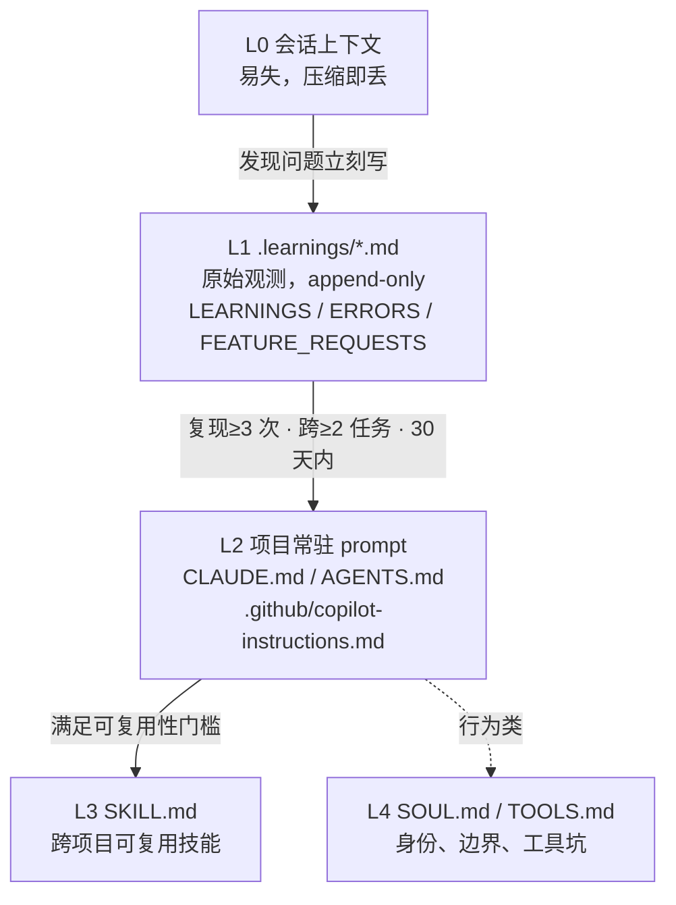

# Agent 技能解剖（三）：Self-Improving Agent——从纠错日志到规则晋升

> 前两篇解决的是一致性问题：怎么把记忆存成数据、怎么用 schema 约束它。
> 但记忆本身不改变行为。**你知道一件事，不等于你会因此改变做法。**
> 这一篇讲的是把「知道」变成「改掉」的机制。

## 一个被普遍误读的词

「自我改进的 Agent」这个说法容易让人想到权重更新、在线微调、参数层面的学习。而本系列讨论的这类技能，做的完全是另一件事：

> **它把「学习」实现为一个文档编辑流程。**

模型的行为由 prompt 决定，那么「改变行为」的最短路径就不是训练，而是**改 prompt**。于是「自我改进」被拆解成一条可执行的流水线：把纠正与错误写成结构化日志 → 反复出现的模式被识别出来 → 蒸馏成一句规则 → 写进项目的常驻 prompt 文件。

这个技能就是这个流水线的一份完整、且经过版本迭代的实现。它是当前**装机量最高的技能（86,140）**，不是偶然——它解决的是所有 Agent 用户都有的痛感。

## 技能档案

| 项 | 值 |
|---|---|
| 技能名 | self-improvement（包名 `self-improving-agent`） |
| slug | `self-improving-agent` |
| 作者 | pskoett |
| 版本 | 3.0.24 |
| 下载量 | 1,268,197 |
| 安装量 | **86,140**（SkillHub 全站第 1） |
| 星标 | 4,517 |
| 来源 | ClawHub |
| 组成 | 三份日志模板 + 两个 hook 脚本 + 一个 OpenClaw hook + 技能提取脚本 |

数据抓取于 2026-09-28。版本号走到 3.0.24 说明它经历了长期实际使用与修正。

## 四层记忆阶梯

先看它把知识放在了哪几层。这是理解全技能的钥匙：



四层的分工非常明确，且**晋升是单向的**：

| 层 | 内容性质 | 生存周期 | 谁在消费 |
|---|---|---|---|
| L1 日志 | 原始事件，未蒸馏 | 长期保留（无自动清理） | 模型自己回顾 |
| L2 项目 prompt | 蒸馏后的规则 | 项目周期 | 每次会话自动注入 |
| L3 技能 | 可跨项目复用的方法 | 永久 | 按需加载 |
| L4 身份/工具 | 行为边界与工具坑 | 永久 | 每次会话自动注入 |

这个阶梯最值得学的地方不是分层本身，而是**每一层之间的晋升条件都被写明了**。多数人做「记忆系统」只有「写」和「读」，没有「升」。结果是日志越积越多，但没有一条进入常驻 prompt——**记了很多，一点行为都没变。**

## 晋升门槛：把「重要」变成可计算

这是全技能最有价值的一节。原文给出了三条并列条件：

> - `Recurrence-Count >= 3`
> - Seen across at least 2 distinct tasks
> - Occurred within a 30-day window

三条缺一不可。逐条看它们各自在防什么：

| 条件 | 防的问题 |
|---|---|
| 复现 ≥ 3 次 | 防「一次性事故被当成规律」。偶发问题写进常驻 prompt 是纯噪声 |
| 跨 ≥ 2 个不同任务 | 防「同一个任务里反复踩同一个坑」被误判为普遍规律——那通常说明是那只任务本身特殊 |
| 30 天窗口内 | 防「跨越半年的三次偶发」被拼凑成规律 |

用「次数 × 多样性 × 时间窗」三个正交维度定义重要性，比任何「请你判断这条是否重要」的提示词都可靠。**这是把主观判断变成可计算判据的范例**，也是上一篇里 Ontology 用 schema 约束数据、这里用阈值约束抽象的同一种思路。

## 条目结构：用 schema 约束抽取

写入日志时必须填一份固定结构的条目（以 Learning 为例）：

```markdown
## [LRN-20250115-001] category

**Logged**: ISO-8601 时间戳
**Priority**: low | medium | high | critical
**Status**: pending
**Area**: frontend | backend | infra | tests | docs | config

### Summary
一句话说明学到了什么

### Details
完整上下文：发生了什么、错在哪、正确的是什么

### Suggested Action
具体的修复或改进

### Metadata
- Source: conversation | error | user_feedback
- Related Files: path/to/file.ext
- Tags: tag1, tag2
- See Also: LRN-20250110-001
- Pattern-Key: simplify.dead_code     （可选，用于重复模式追踪）
- Recurrence-Count: 1                 （可选）
- First-Seen / Last-Seen: 2025-01-15  （可选）
```

几点设计上的讲究：

1. **`Priority` 与 `Area` 都是枚举**，不是自由文本。上一篇讲过这个原理——枚举字段强迫模型做一次真实判断，而不是写一段模糊的描述。
2. **`Pattern-Key` 是去重键**。`simplify.dead_code` 这种稳定键让「同一类问题第 N 次出现」变成一次 grep，而不是让模型凭印象判断「这两条是不是同一个问题」。
3. **`See Also` + `Recurrence-Count` 构成计数机制**。重复出现时不新增条目，而是给已有条目自增计数、更新 `Last-Seen`——**这正好是晋升门槛的数据来源**。晋升条件不是靠模型回忆，而是靠字段统计。
4. **ID 规约 `TYPE-YYYYMMDD-XXX`**（`LRN` / `ERR` / `FEAT`），让日志天然按类型与时间可排序、可引用。

状态机同样完整：`pending` → `in_progress` / `resolved` / `wont_fix` / `promoted` / `promoted_to_skill`。**每一个终态都有明确含义**，其中 `wont_fix` 要求写明理由——这条常被忽略，但它防止了「悄悄放弃」。

## 蒸馏规范：写规则，不要写事故报告

晋升时最容易犯的错，是把日志原文抄进 `CLAUDE.md`。技能用一组对照给出了正确做法：

**日志原文（冗长）：**

> Project uses pnpm workspaces. Attempted `npm install` but failed. Lock file is `pnpm-lock.yaml`. Must use `pnpm install`.

**写进 CLAUDE.md（简洁）：**

```markdown
## Build & Dependencies
- Package manager: pnpm (not npm) - use `pnpm install`
```

**再看一组：**

日志原文 →「修改 API 端点后必须重新生成 TypeScript client，否则运行期类型不匹配」。

写进 AGENTS.md（可执行）：

```markdown
## After API Changes
1. Regenerate client: `pnpm run generate:api`
2. Check for type errors: `pnpm tsc --noEmit`
```

规则是：**晋升物是「下次该怎么做」的预防指令，不是「上次发生了什么」的叙事。** 原因很直接——常驻 prompt 的每一行都占预算，而事故报告里 90% 的内容对下一次执行是无用的。

技能还额外要求 `Recurrence-Count >= 3` 的条目「写成短的预防规则（before/while coding 该做什么），不要写长篇事故复盘」。这把上面的规范从「建议」升级成了「门槛」。

## 真实 prompt 文本解剖

这个技能最有意思的部分是它的 hook——它不只是文档，而是真的往上下文里注入文本。三个注入点，逐个看。

### 1. `activator.sh`：四个自检问句

在每次用户提交 prompt 后注入（原文，约 50–100 token）：

```
<self-improvement-reminder>
After completing this task, evaluate if extractable knowledge emerged:
- Non-obvious solution discovered through investigation?
- Workaround for unexpected behavior?
- Project-specific pattern learned?
- Error required debugging to resolve?

If yes: Log to .learnings/ using the self-improvement skill format.
If high-value (recurring, broadly applicable): Consider skill extraction.
</self-improvement-reminder>
```

三个设计细节值得抄：

- **用问句，不用命令。** 写「请记录这次学到的东西」是一个可以被泛泛执行的指令，模型会敷衍地写一条；写「是否发现了非显然的解法？」则要求模型先做判断，不做判断就没法回答。
- **用 XML 标签包裹并命名**（`<self-improvement-reminder>`）。这让注入内容与对话内容有明确边界，模型不容易把它当作用户说的话来处理——**这是对抗「外部内容当指令」问题的同一套手法**。
- **显式声明 token 预算**（脚本注释里写「Keep output minimal (~50-100 tokens)」）。常驻注入的每一句话都要乘以会话轮数，把预算写进注释是工程自觉。

### 2. `error-detector.sh`：字符串匹配做触发器

在 Bash 工具执行后触发，对输出做模式匹配：

```bash
OUTPUT="${CLAUDE_TOOL_OUTPUT:-}"
ERROR_PATTERNS=(
    "error:" "Error:" "ERROR:" "failed" "FAILED"
    "command not found" "No such file" "Permission denied"
    "fatal:" "Exception" "Traceback"
    "npm ERR!" "ModuleNotFoundError" "SyntaxError" "TypeError"
    "exit code" "non-zero"
)
```

思路很清楚：**「这是不是一次错误」这个判断，不要交给模型，用字符串匹配确定性地做掉。** 能确定的事不交给概率模型，是全篇贯穿的同一原则。

但这个脚本有一处注释与实现不符，值得单独指出。脚本第 12 行写着：

```bash
# Patterns indicating errors (case-insensitive matching)
```

而实际匹配用的是 Bash 的 `[[ "$OUTPUT" == *"$pattern"* ]]`，**是大小写敏感的**。之所以看起来「能用」，是因为模式表里手动枚举了大小写变体（`error:` / `Error:` / `ERROR:` / `failed` / `FAILED`）来掩盖这个问题。

这带来两个实际后果：

- **覆盖不全**：枚举永远不完备，`Fail`、`ERROR `（尾随空格变体）、中文报错（`错误`、`失败`）全部漏检；
- **误报**：`error:` 会命中任何把这几个字当正常输出打印的日志，例如本文这种讨论错误处理机制的文章，或一条 grep 结果。

一个更稳的写法是统一转小写后匹配（`OUTPUT_LC="${OUTPUT,,}"`），并把模式表精简成不含大小写变体的版本。**枚举大小写变体是有害的——它掩盖了真正的缺陷。**

### 3. `handler.js`：OpenClaw bootstrap 注入

OpenClaw 平台上的版本更有工程含量。它在 `agent:bootstrap` 事件里注入一个**虚拟文件** `SELF_IMPROVEMENT_REMINDER.md`，让提醒以「工作区文件」的形态进入上下文。三个防御性细节：

- **占用检查**：注入前先检查 `bootstrapFiles` 里是否已有同路径的**真实**文件；若有则直接放弃注入（`occupiedByOtherFile` → `return`）。**绝不覆盖用户的真实文件。**
- **幂等去重**：先过滤掉所有「本技能注入过的」条目，再重新插入一条，避免多次触发造成重复注入。
- **跳过子代理**：`sessionKey.includes(':subagent:')` 直接 return，避免子代理会话的 bootstrap 被污染。

这三条与上一篇 Ontology 的 `resolve_safe_path` 属于同一层次的素养：**技能在改动用户环境之前，先确认自己不会破坏它。** 这是判断一个技能是否成熟的实用标准。

## 缺失的一环：遗忘

把整个技能读完，会注意到一个明显的空白——**它没有任何清理机制。**

对比第一篇的 Agent Memory：那里有 `forget_stale(days)`、有 `access_count`、有 `superseded_by`。而这里的 `.learnings/` 文件只增不减，技能也没有提供任何归档、合并或淘汰流程。SKILL.md 只在「Best Practices」里写了一句「Review regularly - stale learnings lose value」——**把清理完全交给人。**

后果是渐进的：日志持续膨胀 → 模型回顾时的检索成本上升 → 有效信号被噪声稀释 → 最终没人再看这些文件。整套机制的终点不是「Agent 变强」，而是「多了一个没人维护的目录」。

可行的补法有三条，都不复杂：

1. **对日志做定期归档**：`resolved` 且 90 天未被 `See Also` 引用的条目，移入 `archive/`；
2. **给日志文件设体量上限**，超出时强制走一次「晋升或丢弃」的二选一；
3. **用 `Last-Seen` 做衰减**：超过 180 天无复现的模式，`Recurrence-Count` 归零重算。

## 另外两个隐性风险

**自评偏差。** 「这是不是一个非显然的解法？」「这条够不够格晋升？」——这两个判断都由模型自己做。而模型的自我评估在有偏样本上系统性偏乐观：它倾向于认为自己做的东西比实际更有价值。技能用「复现次数 / 跨任务 / 时间窗」三条门槛压缩了这部分自由度（这点做得很好），但 `Priority` 与 `Area` 的填写仍是纯自评。

**对身份文件的改动没有 review 门禁。** 晋升目标里包含 `SOUL.md`——那是定义 Agent 行为边界与身份的文件。改它等于改所有会话的行为基线。而这个技能对 `SOUL.md` 的改动没有任何额外审批要求，只要「行为模式」满足门槛就写。相比之下，第四篇要讲的 Proactive Agent 给自我演化配了明确的禁令清单与打分门槛（不许做不能验证的改动、不许用「直觉」当理由、加权分低于 50 就不做）。**把两者合起来用，才是完整的：一个负责产生候选，一个负责否决候选。**

## 失效模式清单

| 失效模式 | 触发条件 | 后果 |
|---|---|---|
| 日志无限膨胀 | 长期使用，无归档 | 检索成本上升，信号被稀释 |
| 错误检测漏报 | 非英文报错、未枚举的大小写变体 | 该记的错误没记 |
| 错误检测误报 | 正常输出中含 `error:` 字样 | 噪声条目 |
| 自评偏差 | 模型判断「重要性/优先级」 | 优先级失准，噪声进入常驻 prompt |
| 晋升污染身份文件 | 行为类规则直接写入 `SOUL.md` | 全会话行为漂移 |
| 条目重复 | 未按 `Pattern-Key` 去重 | 同一问题多条记录，计数失真 |
| 敏感信息泄漏 | 记录时未脱敏 | 密钥/内部信息进入日志（技能已明确禁止，但靠模型遵守） |

## 可迁移方法论

1. **给「重要」下一个可计算的定义。** 次数 × 多样性 × 时间窗，三个正交维度；不要写「请你判断是否重要」。
2. **知识要分级，并且级别之间有门槛。** 只有写入、没有晋升的记忆系统，等于没有记忆系统。
3. **晋升物是预防规则，不是事故报告。** 常驻 prompt 里每一行都在消耗每一轮的预算。
4. **用结构化字段承载计数。** `Recurrence-Count` 这类字段让「复现次数」变成可统计的事实，而不是模型的印象。
5. **能确定性判断的，不要交给模型。** 错误检测用字符串匹配、去重用 `Pattern-Key`、门槛用数值比较。
6. **加一条衰减机制。** 没有遗忘，就没有长期信噪比。

这个技能最值得称赞的地方，是它把「自我改进」这件听起来很玄的事，落实成了**文件、字段、阈值、状态机**——四个全部可审计的东西。它最明显的缺口，则是完全没有为「写入」配一个「淘汰」。前者是设计能力，后者是把设计跑长的能力，两者缺一不可。

## 本系列地图

| 篇 | 技能 | 一句话 |
|---|---|---|
| 一 | [Agent Memory](/posts/2026-09-28-agent-skill-anatomy-01-memory/) | 把「记住」做成三种异构数据 + 生命周期 |
| 二 | [Ontology](/posts/2026-09-28-agent-skill-anatomy-02-ontology/) | 给记忆加一层 schema 与约束校验 |
| 三（本篇） | Self-Improving Agent | 把纠错日志晋升成规则与技能 |
| 四 | [Proactive Agent](/posts/2026-09-28-agent-skill-anatomy-04-proactive/) | 上下文存活的四个协议与主动性边界 |

> 数据说明：文中指标为 2026-09-28 从 SkillHub 聚合市场抓取的快照；代码与注入文本结论基于当日下载的 `self-improving-agent` v3.0.24 技能包，可用 `lightmake.site/api/v1/download?slug=self-improving-agent` 复核。
