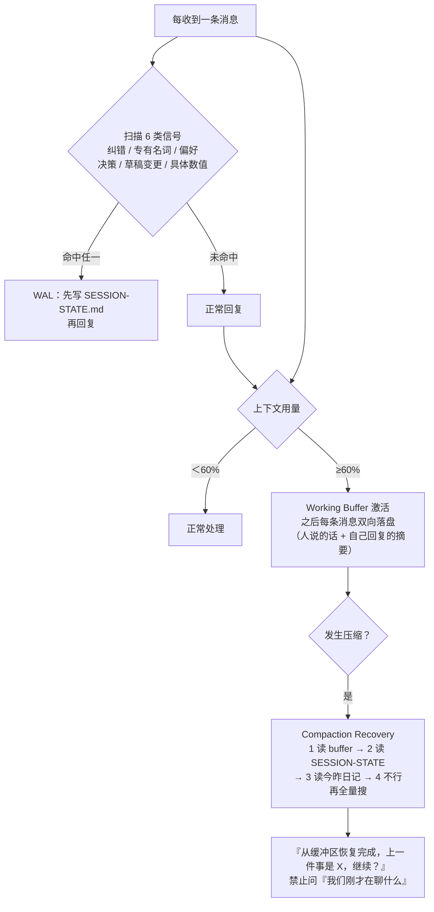

# Agent 技能解剖（四）：Proactive Agent——主动性的代价与上下文存活

> 前三篇都在处理「记忆」：怎么存、怎么约束、怎么改进。
> 这一篇换一个层面——**记忆的载体本身会消失。** 上下文压缩一发生，没落盘的一切就没了。而在这个前提下，讨论「主动」才有意义。

## 这篇的位置

`Proactive Agent` 是本系列里定位最特殊的一个：它不提供存储，而是提供**一整套协作行为规范**。它的自我描述是「把 AI Agent 从任务执行者变成主动伙伴」，实际内容可以归到两个问题：

1. **怎么让主动行为不打扰人？**（主动性必须有上限，否则就是骚扰）
2. **怎么让 Agent 活过上下文压缩？**（这是主动性的前提——一个连昨天做过什么都想不起来的 Agent，无法主动）

第二个问题是硬约束，第一个问题是软约束。技能的绝大部分篇幅给了第二个。

## 技能档案

| 项 | 值 |
|---|---|
| 技能名 | Proactive Agent |
| slug | `proactive-agent` |
| 作者 | halthelobster |
| 版本 | 3.1.0 |
| 下载量 | 273,764 |
| 安装量 | 28,937 |
| 星标 | 913 |
| 来源 | ClawHub |
| 组成 | SKILL.md（v3，含 v2.3 备份与 v3 草案）+ 7 个工作区模板 + 2 份参考 + 1 个安全审计脚本 |

数据抓取于 2026-09-28。作者署名是一个 AI Agent 本身（Hal 9001），技能里没有理论引用，全部是「这样试过、那样会坏」的经验条目——**这决定了它的读法：当成事故报告合集来读，比当成架构文档读收获大。**

## 上下文存活的三个协议

这是全篇最硬的部分，按触发时机串起来看：



### 协议一：WAL（Write-Ahead Log）

**触发条件是用户的输入，不是模型的自省。** 这是整个设计里最关键的一处选择。技能列出了需要扫描的六类信号：

| 信号类型 | 例子 |
|---|---|
| 纠错 | 「是 X，不是 Y」/「其实…」/「不，我的意思是…」 |
| 专有名词 | 人名、地名、公司名、产品名 |
| 偏好 | 颜色、风格、做法、「我喜欢/不喜欢」 |
| 决策 | 「就做 X」/「用 Y」/「走 Z 方案」 |
| 草稿变更 | 对正在做的产物提出的修改 |
| 具体数值 | 数字、日期、ID、URL |

流程只有三步，但顺序刻意反直觉：

> 1. **STOP** — 不要开始组织回复
> 2. **WRITE** — 先更新 `SESSION-STATE.md`
> 3. **THEN** — 再回复

原文对这一步的解释值得逐字读：

> The urge to respond is the enemy. The detail feels so clear in context that writing it down seems unnecessary. But context will vanish. Write first.

**「想回答的冲动本身就是敌人。」** 这句话点破了一个真实的失效模式：模型在看到「用蓝色主题，不要红色」时，上下文里这句话清清楚楚，于是「先记下来」显得很多余。但压缩之后，这句话不会留下任何痕迹。技能的对策不是提醒模型「要记得记」，而是**把「写」这个动作放到「答」之前**，用指令顺序抵消模型的完成对话倾向。

另一个设计要点是触发源的选择。技能明确解释了为什么：

> The trigger is the human's INPUT, not your memory. You don't have to remember to check — the rule fires on what they say.

即：**不要依赖模型想起来检查，要让规则挂在「用户说了什么」上。** 这是把「需要记忆才能执行的规则」降级成「不需要记忆就能执行的规则」——因为记忆本身正是不可靠的那个环节。

### 协议二：Working Buffer（危险区缓冲）

阈值是 **60% 上下文用量**。之后：

1. 先清空旧缓冲，重新开始；
2. 此后**每一条消息**都双向落盘：人的原话 + 自己回复的 1–2 句摘要；
3. 压缩发生后，第一件事是读缓冲。

缓冲的格式刻意做得极简：

```markdown
# Working Buffer (Danger Zone Log)
**Status:** ACTIVE
**Started:** [timestamp]

---

## [timestamp] Human
[他们的消息]

## [timestamp] Agent (summary)
[1-2 句回复摘要 + 关键细节]
```

它的价值可以用一句话说明：**WAL 是「尽力而为」，缓冲是「兜底」。** WAL 依赖模型正确识别出六类信号——它一定会有漏判；而缓冲不依赖任何判断，60% 之后的所有往来一律落盘。**两套机制是冗余关系，不是主备关系。**

代价也要说清楚：60% 之后每轮多一次文件写入，且摘要本身要花 token。所以这个协议只在**长会话**里有收益；短会话（三五个来回就结束）启用它纯属浪费。

### 协议三：Compaction Recovery

自动触发条件四条：会话以 summary 标签开始、消息中出现「truncated / context limits」、用户说「我们刚才在做什么 / 继续」、以及**「你本该知道某件事却不知道」**。最后一条最微妙——它要求模型对自身的「信息空洞」有感知。

恢复顺序是固定的、有优先级的：

1. 先读 `memory/working-buffer.md`（原始往来）
2. 再读 `SESSION-STATE.md`（当前任务状态）
3. 再读今天与昨天的日记
4. 还缺才全量搜索

以及一条措辞强硬的禁令：

> **Do NOT ask "what were we discussing?"** — the working buffer literally has the conversation.

**用否定式指令堵住偷懒路径。** 这一条特别值得学：模型的默认行为是「不知道就问」，但在上下文丢失这个场景里，「问」是最差的选项——用户刚刚经历过一次压缩，问回去等于把重建上下文的负担推回给用户。**技能用一句明确的禁止，把「问」这个默认出口封掉，逼模型去读文件。**

这也解释了为什么恢复顺序是「缓冲优先于状态文件」：状态文件是模型**主动维护**的（WAL 可能漏写），缓冲是**被动记录**的（不依赖判断）。**恢复时先信那个不依赖判断的来源。**

## 最狠的一条：Verify Implementation, Not Intent

技能 v3.1.0 新增的这节，是整份文档里最有价值的内容，值得完整复述。

**失败模式：** 你说「✅ 完成了，配置已更新」，但只改了**文字**，没改**机制**。

原文给的真实案例：

> **请求：**「让记忆检查真的去做事，而不只是提示」
>
> **实际发生：**
> - 把提示词改得更强硬了
> - `sessionTarget` 仍然是 `"main"`，`kind` 仍是 `"systemEvent"`
> - 报告「✅ 完成，已升级为强制执行」
> - 系统仍然只是在提示，没有执行
>
> **本应发生：**
> - `sessionTarget` 改为 `"isolated"`
> - `kind` 改为 `"agentTurn"`
> - 把提示重写成给自主 Agent 的指令
> - 实测验证它真的会启动并执行

结论一句：

> **Text changes ≠ behavior changes.**

这一条对 prompt 工程师的杀伤力尤其大，因为**我们的日常工作几乎全部是「改文字」**。改措辞、加约束、强调语气、加示例——这些确实常常有效，于是很容易形成一种错觉：**只要文本看起来更强硬，行为就更被约束了。**

而事实上，很多行为差异根本不由文本决定：

| 你以为在改行为 | 实际在改的 |
|---|---|
| 把「请检查」改成「必须检查」 | 措辞强度 |
| 加了三条强调 | 措辞数量 |
| 把规则前置 | 位置（这个有时真的有用） |
| 换用了更强制的动词 | 语气 |

真正改变行为的，是**机制**：谁触发、在什么时机触发、有没有独立的校验环节、失败会不会被拒绝。第三篇里 Error Detector 用字符串匹配、Ontology 用 `validate` 命令，都是「换机制」而非「改措辞」的例子。

这条也直接给出了一个可操作的验证流程：

> When changing **how** something works:
> 1. Identify the architectural components (not just text)
> 2. Change the actual mechanism
> 3. **Verify by observing behavior, not just config**

第 3 步是分水岭。改完配置读一遍配置，那不叫验证；**从用户视角跑一遍、看输出是不是真的变了**，才叫验证。技能在「六支柱」里把这条升格成了独立一条 VBR（Verify Before Reporting）：

> "Code exists" ≠ "feature works."

## Cron 的两种形态：一个反直觉的坑

技能 v3.1.0 新增的这节，讲的是一个非常具体的架构选择：

| 类型 | 工作方式 | 适用 |
|---|---|---|
| `systemEvent` | 往主会话发一条提示 | 需要人机交互、主会话注意力可用时 |
| `isolated agentTurn` | 启动一个子代理自主执行 | 后台工作、维护、检查 |

**失败模式：** 你建了一个每 10 分钟触发的 cron，内容是「检查 X 是否需要更新」，用的是 `systemEvent`。但主会话正在忙别的，那份提示就只是躺在那里——**它被投递了，但没有被执行。**

修复方式不是把提示写得更严厉，而是换形态：`sessionTarget: "isolated"` + `kind: "agentTurn"` + 把提示重写成自主代理的指令。

这个坑的普遍性远超 OpenClaw：「**我用调度器发了一条指令**」和「**调度器真的把这件事做了**」是两件事，中间隔着「谁来执行」这个必须显式回答的问题。凡是要「定期自动完成」的需求，都要先回答它。

## 自我演化的门槛：ADL 与 VFM

第三篇讲 Self-Improving Agent 时提到，它缺一道对身份文件改动的否决闸门。Proactive Agent 补的正是这个。

### ADL——反漂移禁令

四条明令禁止的演化：

- 不许为了「显得聪明」而增加复杂度——**禁止假智能**；
- 不许做无法验证是否生效的改动——**不可验证即拒绝**；
- 不许用含糊概念（「直觉」「手感」）作为理由；
- 不许为新颖牺牲稳定性——**新不等于好**。

并给出优先级排序：

> Stability > Explainability > Reusability > Scalability > Novelty

这个排序对 Agent 自我改进是完全对症的。Agent 会改自己的 prompt，而 prompt 的改动效果在单次会话里往往**看起来都还行**——因为单次会话的样本太小。于是「新颖」的诱惑极大。把「稳定性」和「可解释性」压在「可扩展性」和「新颖」之上，是在用价值观对抗这种偏差。

### VFM——价值优先修改

改动前先打分，四个维度加权：

| 维度 | 权重 | 问题 |
|---|---|---|
| High Frequency | 3x | 这会被每天用到吗？ |
| Failure Reduction | 3x | 它能把失败变成成功吗？ |
| User Burden | 2x | 人能因此少解释几句吗？ |
| Self Cost | 2x | 这能替未来的我省 token/时间吗？ |

> **Threshold:** If weighted score < 50, don't do it.

并列出一条金规则：

> "Does this let future-me solve more problems with less cost?"

用「会不会每天用到」（3x）和「能不能减少失败」（3x）占最高权重，是很务实的取值——**它把「自我改进」的目标从「让 Agent 更强」校正成了「让 Agent 更少失败」。** 后者是可观测的，前者不是。

不过要指明一个残留问题：**这四项打分仍然由模型自己完成。** 第三篇指出的自评偏差，在这一层并没有被解决——只是被一道数值门槛限制住了破坏半径（低于 50 分不做）。这是「用门槛控制自评风险」的思路，不是「消除自评风险」。真要消除，需要外部信号（比如真实的失败率统计）参与打分。

## 主动性必须有上限

这是「主动」这个方向最容易翻车的地方。技能在两个层面设了边界。

**行为层面**——`AGENTS.md` 里的「外部 vs 内部」清单：

| 可以直接做 | 必须先问 |
|---|---|
| 读文件、探索、整理、学习 | 发邮件、发推、公开发布 |
| 搜网页、看日历 | 任何离开这台机器的动作 |
| 在工作区内操作 | 任何你不确定的事 |

以及一句很精确的表述：「**主动构建，但未经批准不出网。** 起草邮件——不要发送；构建工具——不要上线；创作内容——不要发布。」

**时机层面**——`AGENTS.md` 明确写了「什么时候该安静」：

> - 深夜（除非紧急）
> - 人明显在忙
> - 自上次检查以来没有任何新信息

以及「什么时候该出声」：重要邮件到达、日历事件临近（小于 2 小时）、发现了有意思的东西、超过 8 小时没说过话。最后一条尤其重要——**它给主动性加了「最小间隔」这个约束。** 一个没有最小间隔的主动 Agent，本质上是一个通知轰炸器。

## 冗余触发：特性还是复杂度

技能反复强调一件事：「文档不够，需要会自动触发的 trigger」。所以同一个意图往往配三套机制：

以「主动提问」为例，技能要求同时做三件事——建跟踪文件 `notes/areas/proactive-tracker.md`、建一个每周 cron 提醒、在 `AGENTS.md` 里加一条每轮可见的触发词。原文解释得很直白：

> Because agents forget optional things. Documentation isn't enough — you need triggers that fire automatically.

判断是：**这个冗余是必要的，但代价被低估了。** 必要性来自「可选行为会被遗忘」这个真实约束；代价是三套机制会各自漂移——改了 cron 没改 AGENTS.md、删了跟踪文件但 cron 还在跑。技能自己后来也意识到了这个问题，v3.1.0 补了一份「工具迁移检查清单」，要求废弃一个工具时同步更新 cron、脚本、文档、技能、模板、日常流程六个位置，并用 `grep -r` 做引用排查：

```bash
grep -r "old-tool-name" . --include="*.md" --include="*.sh" --include="*.json"
```

**当一个技能需要为自己的冗余机制写迁移清单时，说明复杂度已经到位了。** 用之前先想清楚：你愿意为这个主动行为维护几处配置。

## 两个实际问题

**目标平台耦合。** 技能里用到的 `session_status`、`memory_search`、`sessions_spawn`、`cron action=list`、heartbeat 轮询，全部是 OpenClaw 平台的能力，不是通用抽象。迁移到其他 Agent 平台时，这些需要自己找等价物或自己实现。文档里虽然给了 Claude Code / Codex / Copilot 的配置片段，但那是第三篇那个技能的适配矩阵，不是这一个。

**包里混着历史草案。** 下载的技能包中除了 `SKILL.md`，还包含 `SKILL-v2.3-backup.md`、`SKILL-v3-draft.md` 两份完整长度的历史版本，以及一份 `skill-card.md`。这违反技能规范里「技能目录内不应有多余说明文档」的惯例，实际风险有两个：一是被检索/加载时可能读到过期规则；二是两份事实等价的文档同时在场时，模型无法判断哪份是权威版本。**发布前把草案清理出包，是一个成本极低但常被忽略的步骤。**

## 失效模式清单

| 失效模式 | 触发条件 | 后果 |
|---|---|---|
| WAL 漏判 | 六类信号之外的隐含信息 | 关键细节未落盘 |
| 缓冲变噪音 | 长会话中 60% 之后往来极多 | 恢复时需二次筛选 |
| 60% 阈值失配 | 不同模型的压缩触发点不同 | 阈值过早浪费、过晚失效 |
| 只改文字不改机制 | 被要求「改行为」时 | 报告完成但行为未变 |
| 主动性过度 | 无最小间隔的主动检查 | 通知轰炸，用户关闭 |
| 冗余机制漂移 | 改了一处、忘了另外两处 | 配置互相矛盾 |
| 自评打分偏差 | VFM 由模型自评 | 门槛挡不住系统性乐观 |
| 历史草案混淆 | 包内含多个 SKILL 版本 | 规则权威性不明确 |

## 可迁移方法论

1. **把「写」排在「答」之前。** 凡是上下文里能丢的细节，用指令顺序强制先落盘。对抗模型倾向，靠的是顺序，不是叮嘱。
2. **规则挂在输入上，不要挂在记忆上。** 「每当我看到 X 就做 Y」比「记得做 Y」可靠，因为后者需要记忆先工作。
3. **给兜底机制配一个不依赖判断的版本。** 判断会漏，无条件记录不会。
4. **恢复时先读被动记录，再读主动维护的状态。**
5. **改行为时，先问改的是文字还是机制。** 文字改动不等于行为改动；验证要看行为，不看配置。
6. **「发指令」和「被执行」是两件事。** 任何自动化都要显式回答「谁来执行」。
7. **给自我改进配一道否决闸门。** 顺序是：稳定性 > 可解释性 > 可复用性 > 可扩展性 > 新颖性。
8. **给主动性设上限。** 最小间隔 + 该安静时的清单，两者缺一不可。

## 四篇回顾

四篇拆完，四个技能其实各自解决了一个不同的问题，合起来才是一套完整的系统：

| 层次 | 技能 | 解决的问题 | 核心机制 |
|---|---|---|---|
| 存储 | Agent Memory | 记忆放在哪、怎么过期 | 三种异构原语的独立生命周期 |
| 结构 | Ontology | 记忆怎么才可信、可查 | schema 约束 + 追加式事件日志 |
| 改进 | Self-Improving Agent | 记忆怎么变成行为改变 | 分层晋升 + 可计算门槛 |
| 运行 | Proactive Agent | 记忆的载体消失了怎么办 | WAL + 缓冲 + 恢复协议 |

如果只挑一条贯穿四篇的原则，是这一条：**凡是能确定性判断的，都不要交给概率模型。** 枚举代替自由文本、schema 代替叮嘱、字符串匹配代替主观判断、数值门槛代替「请你判断重要性」、顺序约束代替「请记得」——四个技能里所有真正起了作用的机制，都符合这条。

反过来，四个技能里所有失效的地方（自评偏差、非语义检索、未实现的约束、漏判的信号），也都是同一句话的反面：**它们仍然把某个本该确定的问题，留给了模型临时判断。**

## 本系列地图

| 篇 | 技能 | 一句话 |
|---|---|---|
| 一 | [Agent Memory](/posts/2026-09-28-agent-skill-anatomy-01-memory/) | 把「记住」做成三种异构数据 + 生命周期 |
| 二 | [Ontology](/posts/2026-09-28-agent-skill-anatomy-02-ontology/) | 给记忆加一层 schema 与约束校验 |
| 三 | [Self-Improving Agent](/posts/2026-09-28-agent-skill-anatomy-03-self-improving/) | 把纠错日志晋升成规则与技能 |
| 四（本篇） | Proactive Agent | 上下文存活的四个协议与主动性边界 |

> 数据说明：文中指标为 2026-09-28 从 SkillHub 聚合市场抓取的快照；代码与指令文本结论基于当日下载的 `proactive-agent` v3.1.0 技能包，可用 `lightmake.site/api/v1/download?slug=proactive-agent` 复核。
