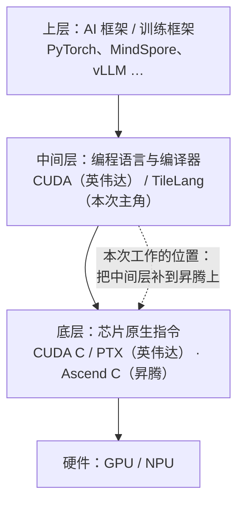
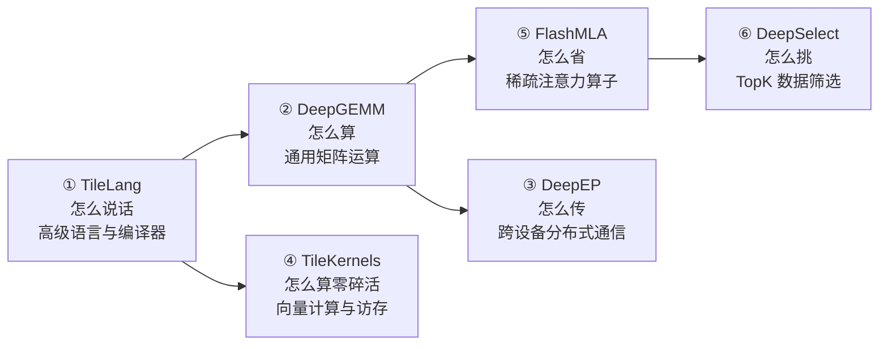
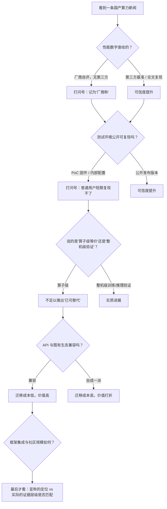

# DeepSeek 开源昇腾版 TileLang：一份写给非底层读者的阅读指南

> 2026 年 9 月 30 日，DeepSeek 官宣开源一批面向华为昇腾算力平台的基础设施组件：**TileLang 高级语言编译器、计算库、分布式通信库**，共六个组件，与它此前面向英伟达平台开源的那一套「一一对应」。
>
> 这条新闻在国内被反复转述为「对标 CUDA」。这个说法**方向对、程度夸**。本文想做的事只有一件：让没写过 CUDA、也没碰过昇腾的读者，读完之后能自己判断这类新闻里哪句是事实、哪句是厂商自评、哪句是媒体加的戏。

## 一、30 秒结论

先把答案给出来，后面全是展开。

1. **发生了什么**：DeepSeek 把自己训练和推理**真正在用的那套底层软件**，从英伟达平台搬到了华为昇腾平台上，并且开源了。核心是编程语言层（TileLang），外围是六个可直接调用的库。
2. **为什么重要**：英伟达真正难被替代的不是芯片，是芯片外面那层软件。别人能做出一块算力接近的卡，但做不出「让四百万开发者不用重新学习就能把模型跑起来」的那层东西。这次是**模型厂商第一次把自己吃饭的家伙下沉到国产芯片上**，性质比「适配一下模型」重得多。
3. **哪句要打折**：所有性能数字都是**厂商自评**，没有第三方基准；跑出那些数字用的还是**非公开的 PoC 固件**；官方**没有说** V4 已经在昇腾上完成了全量训练。
4. **一句话定位**：这不是「国产 CUDA 建成了」，而是「国产芯片的软件生态，第一次有了一个由顶级模型团队亲手填上的、可用的关键零件」。

## 二、补三个概念：写给不写底层代码的人

要读懂这条新闻，只需要三个概念。它们都有日常类比。

### 2.1 算子（kernel）：AI 芯片的「招式」

大模型跑起来，本质上是无数次的矩阵乘法、加法、数据搬运。每完成一个不能再拆的基本运算单元，就叫一个**算子**（英文 kernel，直译「内核」，但在中文语境里叫算子更准确）。

类比：如果 AI 芯片是一台厨房设备，**算子就是一套固定的刀工**——切片、切丝、剁馅。市面上有现成的刀工（框架自带的算子），但顶级厨师遇到特殊食材时，必须自己设计一套新刀法。这套新刀法就是「自定义算子」。

**关键点：算子的效率决定了芯片效率。** 同一块芯片，算子写得好能跑到理论性能的 99%，写得差可能只有 30%。芯片参数的差距，经常被算子水平的差距盖过去。

### 2.2 编译器 / DSL：从「人话」到「机器指令」的翻译官

直接对着芯片写指令，等于让人用汇编语言写 App——不是不行，是太慢太痛苦。于是有了**编译器**：你用一门更接近人话的语言描述「我要做什么」，它负责翻译成芯片能执行的指令，并顺手做优化。

这门「更接近人话的语言」如果只为某个领域服务，就叫 **DSL**（领域专用语言）。TileLang 就是这类东西，而且是 Python 风格的——这一点很重要，因为后面所有性能优势都来自「写起来像 Python，跑起来像手写汇编」。

### 2.3 CUDA：英伟达真正的护城河

CUDA 是英伟达的编程语言 + 整套工具链。它之所以是护城河，不是因为语言本身多优美，而是因为：

- 十几年积累的库、调试器、性能分析器、文档；
- 几乎所有 AI 框架都优先支持它；
- 据《纽约时报》估计，全球约 **400 万开发者** 已经会用它。

换一块卡容易，换掉这 400 万人脑子里的东西很难。**这就是为什么「国产芯片」的瓶颈常常不在算力，而在软件。**

三者串起来，就是今天这件事发生的舞台：

一句话：**芯片是硬件问题，TileLang 这类东西是「能不能用得顺手」的问题。** 而后者往往更决定生死。

## 三、TileLang 是什么，凭什么是它

### 3.1 出身：不是 DeepSeek 发明的

这一点必须澄清，否则会误解整件事的性质。

TileLang 由**北京大学计算机学院团队主导**开发，微软亚洲研究院参与，2025 年 1 月在 GitHub 开源（项目地址 `tile-ai/tilelang`），论文发表于 ICLR 2026。它是一个领域专用语言（DSL），基于 TVM 编译器基础设施。

DeepSeek 没有单独开一个 TileLang 仓库。本次昇腾后端的工作落在开源社区的 `tile-ai/tilelang-ascend` 项目里——该项目自 **2025 年 9 月 29 日**就已开源，比这次官宣早了整整一年，并已在昇腾 A2 / A3 上验证。

> 辨析点：媒体说「DeepSeek 开源了 TileLang 昇腾版」。更准确的说法是——**TileLang 昇腾后端是一个社区开源项目，DeepSeek 参与把它推到了生产可用、并且把自己整套算子库搬了上去。** 这个区别决定了后面「这件事有多难复制」的判断：语言层是共建的，真正的增量和门槛在 DeepSeek 那六个库。

### 3.2 它解决的是什么问题

写高性能算子有两条老路，TileLang 想走的是中间那条：

| 路线 | 代表 | 优点 | 致命短板 |
|---|---|---|---|
| 高层 DSL | Triton | 写起来快 | **不给你底层控制权**。遇到瓶颈无法精细调教 |
| 手写底层 | CUDA / Ascend C | 性能极致 | 几百行起步，开发成本极高，换硬件要重写 |
| **TileLang** | — | 写起来像 Python，**同时开放线程绑定、内存布局、流水线等控制接口** | 心智负担仍高于 Triton |

它的核心设计是把**「要算什么」（数据流）和「怎么算」（调度策略）解耦**。你只描述数据怎么流动，编译器负责剩下的优化；默认策略不够用时，再手动干预。它的关键抽象把「**tile（数据分块）**」提升为一等公民——这个粒度刚好：细到能表达内存层级和流水线，粗到能形成稳定的可复用接口。

### 3.3 被引用的性能证据

论文给出的数字（英伟达平台）：

- 相对 Triton：H100 上平均 **3.02 倍**加速，AMD 上 **2.65 倍**；
- 用约 **70 行 Python** 实现 MLA 算子，达到手写 FlashMLA 库约 **98%** 的性能；
- 写 FlashAttention 类算子所需的代码量，相对手写实现大幅缩减。

昇腾侧，社区项目自报的对比数据是：**GEMM 约为手写 Ascend C 的 0.98 倍，向量算子约 0.96 倍，Cube-Vector 类（如 Flash Attention）约 0.95 倍。**

> 请注意措辞：这是**项目自报数据**，不是第三方独立测试。但它的价值在于——它证明了「用高层语言写昇腾算子、性能不塌」这件事**已经有人真的做出来并在仓库里留了证据**，而不是只停留在发布会 PPT 上。

## 四、这次到底开源了什么

DeepSeek 官方把它拆成六个组件。用「模型训练和推理的链路」串起来看最清楚——**从「怎么说话」到「怎么算」「怎么传」「怎么省」**。

### 六件套逐一说明

| # | 组件 | 通俗解释 | 昇腾侧状态（官方口径） |
|---|---|---|---|
| ① | **TileLang（昇腾版）** | 写算子的「语言」。把昇腾 Ascend C 底层指令封装起来，让你用高层语法写，同时不损失性能 | 官方称 DeepSeek 训练中用到的**每一个** TileLang 算子，昇腾上都有对应高性能实现 |
| ② | **DeepGEMM-Ascend** | 矩阵乘法的加速库，AI 计算的绝对主力 | **与英伟达版完全 API 兼容**，同一包名；支持 BF16 / FP8 / FP4，面向昇腾 950 |
| ③ | **DeepEP-Ascend** | 大规模跨卡通信，主要服务 MoE（混合专家）模型 | 公开 buffer API 与英伟达版对齐 |
| ④ | **TileKernels** | 一堆「零碎但高频」的算子：MoE 路由、量化、Engram、流形超连接等 | **同一套 Python 接口，运行时自动选择后端**，GPU 与 NPU 通吃 |
| ⑤ | **FlashMLA** | 稀疏注意力算子，专治长上下文 | 已适配 |
| ⑥ | **DeepSelect** | 高效数据筛选（TopK），用于注意力索引和采样 | 已适配 |

**「一一对应」「API 兼容」这两个词是这条新闻里最有含金量的部分。** 它的意思是：写模型的人不需要学两套东西。同一个 Python 接口，在英伟达卡上跑和昇腾卡上跑，代码基本不用改。

官方同时透露了一个不太被媒体注意的细节：双方还共同推进了基于**昇腾 950 的 128 卡超节点方案**，并把计算与通信做了深度联合优化。华为侧给出的方案是 SuperPoD Flex 超节点 + UBL128 组网（单层 128 卡、3.2 Tbps 互联，两层可扩展到 256K 卡）。

### 官方挂出来的性能数字

这部分是本文唯一需要「看数据」的地方。DeepGEMM-Ascend 的密集 GEMM 表现（Ascend 950DT，CANN 9.20）：

| 计算类型 | 矩阵规模 | 实测 (TFLOPS) | 硬件上限 | 利用率 |
|---|---|---|---|---|
| FP4×FP4 | 4096×7168×16384 | 1701 | 1730 | 98.3% |
| FP8×FP4 | 同上 | 861 | 865 | 99.5% |
| FP8×FP8 | 同上 | 861 | 865 | 99.5% |
| BF16×BF16 | 同上 | 431 | 432 | **99.8%** |

通信侧，DeepEP-Ascend 在 Ascend 950DT 上的带宽随专家并行规模（EP）的变化如下——这张图值得看，因为它暴露了一个诚实的细节：**规模越大，带宽越掉**。

<svg viewBox="0 0 680 300" role="img" aria-labelledby="ds-tl-t ds-tl-d">
<title id="ds-tl-t">DeepEP-Ascend 在 Ascend 950DT 上的通信带宽随 EP 规模变化</title>
<desc id="ds-tl-d">折线图。EP8 到 EP128 五种规模下，dispatch 带宽从约 374 GB/s 降至约 316 GB/s，combine 带宽从约 346 GB/s 降至约 275 GB/s。</desc>
<line x1="70" y1="240" x2="650" y2="240" stroke="#adb5bd" stroke-width="1"/>
<line x1="70" y1="40" x2="70" y2="240" stroke="#adb5bd" stroke-width="1"/>
<line x1="70" y1="40" x2="650" y2="40" stroke="#e9ecef" stroke-width="1"/>
<line x1="70" y1="106.7" x2="650" y2="106.7" stroke="#e9ecef" stroke-width="1"/>
<line x1="70" y1="173.3" x2="650" y2="173.3" stroke="#e9ecef" stroke-width="1"/>
<text x="62" y="44" text-anchor="end" font-size="11" fill="#6c757d">400</text>
<text x="62" y="110.7" text-anchor="end" font-size="11" fill="#6c757d">350</text>
<text x="62" y="177.3" text-anchor="end" font-size="11" fill="#6c757d">300</text>
<text x="62" y="244" text-anchor="end" font-size="11" fill="#6c757d">250</text>
<text x="34" y="140" text-anchor="middle" font-size="11" fill="#6c757d" transform="rotate(-90 34 140)">GB/s</text>
<polyline points="100,74.7 232,106.7 364,123.3 496,140 628,151.3" fill="none" stroke="#2563eb" stroke-width="2.5"/>
<polyline points="100,112 232,120.7 364,144 496,178.7 628,206.7" fill="none" stroke="#f59e0b" stroke-width="2.5"/>
<circle cx="100" cy="74.7" r="4.5" fill="#2563eb"/>
<circle cx="232" cy="106.7" r="4.5" fill="#2563eb"/>
<circle cx="364" cy="123.3" r="4.5" fill="#2563eb"/>
<circle cx="496" cy="140" r="4.5" fill="#2563eb"/>
<circle cx="628" cy="151.3" r="4.5" fill="#2563eb"/>
<circle cx="100" cy="112" r="4.5" fill="#f59e0b"/>
<circle cx="232" cy="120.7" r="4.5" fill="#f59e0b"/>
<circle cx="364" cy="144" r="4.5" fill="#f59e0b"/>
<circle cx="496" cy="178.7" r="4.5" fill="#f59e0b"/>
<circle cx="628" cy="206.7" r="4.5" fill="#f59e0b"/>
<text x="100" y="258" text-anchor="middle" font-size="11" fill="#495057">EP8</text>
<text x="232" y="258" text-anchor="middle" font-size="11" fill="#495057">EP16</text>
<text x="364" y="258" text-anchor="middle" font-size="11" fill="#495057">EP32</text>
<text x="496" y="258" text-anchor="middle" font-size="11" fill="#495057">EP64</text>
<text x="628" y="258" text-anchor="middle" font-size="11" fill="#495057">EP128</text>
<rect x="90" y="270" width="12" height="12" fill="#2563eb"/>
<text x="108" y="280" font-size="12" fill="#212529">Dispatch（分发）</text>
<rect x="250" y="270" width="12" height="12" fill="#f59e0b"/>
<text x="268" y="280" font-size="12" fill="#212529">Combine（合并）</text>
</svg>

数据来源：DeepEP-Ascend 项目 README，采样自 EP8–EP128，测试条件为 16384 tokens/rank、hidden 7168、256 专家 top-6 路由。区间取各 rank 的上下限中值。

官方对此的说明是：**EP32 及以下的 dispatch 能达到物理有效载荷带宽上限的 90%–95%**；而**更大的 EP 规模和 combine 仍在优化中**，原因是 combine 需要额外的本地规约开销，且与 URMA 存在 HBM 争用，华为侧固件改进也在计划中。

**这段话的价值在于它承认了短板在哪里。** 一份只有「接近硬件上限」六个字的宣传稿，和一份明确标出「哪一段还没做好」的 README，可信度不在一个层级上。

## 五、为什么这件事值得认真对待

把它放到三层来看。

### 第一层：从「适配模型」到「下沉工具」

过去国产芯片的进展叙事，基本是「某模型已适配某芯片」——那是**把别人的东西搬过来跑通**。这次不一样：DeepSeek 把自己 V4 系列训练中**大部分算子的实现**（官方口径）搬了过去，并且连编程语言层一起搬。

这意味着两件事：
- 昇腾上不再只有「能跑」，而是有了「能高效开发新算子」的工具；
- DeepSeek 自己的训练管线，第一次具备了**在不改代码的前提下换芯片**的现实可能性。

### 第二层：一一对应，才是迁移成本的关键

六个组件与英伟达版**一一对应、API 兼容**——这句话的分量比任何性能百分比都重。

因为真正的迁移成本从来不是「重写一遍」，而是「重写一遍之后，所有工具、经验、调试流程、监控指标全部作废」。保持 API 兼容，等于把迁移成本从「重构」降到了「换后端」。

### 第三层：作为模板，而不只是作为一个产品

DeepSeek 自己给这件事的定位是：**「希望为更多 AI 芯片建立高可用软件生态起到示范作用」**。

这是很聪明的表述。它没有说「昇腾赢了」，而是说「这条路可以走通，别的芯片照这个模式来」。TileLang 本身就被设计为**支持多种硬件后端**——目前已知生态合作方还包括摩尔线程、沐曦等。语言层中立、后端各自实现、模型厂商把自己的算子库贡献上去，这是一套可复制的分工模式。

## 六、必须打折扣的地方

这一段是本文最重要的部分。以下七点，建议在转述这条新闻时一并带上。

**1. 所有性能数字都是厂商自评。** 截至本文写作时，**没有第三方独立基准**。官方数字来自 DeepSeek 自己的测试套件和华为自己的测试环境，这和你自己买卡跑出来的结果之间，隔着未知的距离。

**2. 跑出那些数字用的固件还没公开。** DeepEP-Ascend 的 README 明确写了：测试用的是**提供给 DeepSeek 的 PoC HDK，并做了额外手工配置，该配置不属于公开发布版本**。华为面向商用、包含满带宽所需配置的 Q3 HDK 版本，计划在 **2026 年 10 月 15 日前后**通过 Atlas 850E 下载页开放申请。官方自己也提醒：**用早期 PoC 版本的用户可能观察到更低带宽。** 换句话说，仓库里的漂亮数字，普通用户短期内复现不了。

**3. 「V4 已在昇腾上完成全量训练」——官方没说。** 官方原话是「训练中用到的每一个 TileLang 算子，在昇腾上都有对应的高性能实现」。这是**算子级别的等价性**，不等于**整机级别的训练验证**。这两者之间的距离，通常是几个月到一年。媒体报道在这一点上普遍语焉不详，甚至有的直接滑向了「V4 已在昇腾训练」。

**4. 单卡性能差距没有消失。** 这次解决的是软件层问题，不是硬件层问题。据流传的梁文锋投资者交流会记录，其判断是：**昇腾 950 大约落后英伟达 GB300 两年，约需 4 张华为卡才能抵 1 张当前代英伟达卡**；同时华为 2026 年提供给 DeepSeek 的 16000 张卡，与中国互联网大厂拿到的量相比仍是零头。这段内容来自未经官方确认的泄露记录，引用需谨慎，但它至少提示了一点：**软件生态补齐 ≠ 算力差距补齐**。

**5. 「比 CUDA 简单」是相对而言。** TileLang 比 CUDA 简单，这句话成立。但「比 CUDA 简单」**不等于「普通人能写」**——它仍然要求你理解分块、内存层级、流水线这些硬件概念。TileLang 降低的是**专家的工作量**，不是**入门门槛**。

**6. CUDA 的护城河不只是编程语言。** 要真正形成替代，一个生态需要的清单大致是：编译器工具链、算子库、分布式通信原语、框架集成（vLLM / SGLang 等）、性能分析与调试工具、文档、开发者社区。这次的六个组件**覆盖了其中几层**，但**框架集成和社区规模**这两块，目前没有任何一方给出可对比的数据。

**7. 128 卡超节点方案的进度，各方说法不一。** 有的报道说「已完成落地」，有的说「仍在推进」。官方表述是「共同推进」。**「推进」不是「完成」。**

## 七、可复用：国产算力新闻「七问清单」

这条新闻不会只是孤例。今后你还会反复看到「对标 CUDA」「性能逼近硬件上限」「生态闭环」这类表述。把上面那七点抽象出来，就是一份可以直接拿去用的核对清单：

这张图的用法很简单：**顺着往下走，每一步只问「证据在哪」。** 绝大多数夸大新闻，会在第二问或第三问就暴露。

## 八、谁该关心，下一步看什么

**如果你只是应用层开发者（写 Prompt、搭 Agent、做业务系统）：暂时不用动。** 这件事离你的日常还有一段距离，它改变的是「模型在哪块卡上跑、跑得贵不贵」，短期内不会改变你调用的 API。

**如果你在做国产算力选型或需要评估迁移：值得建一个小规模验证。** 具体建议是——先不要信任何百分比，用你自己的模型和 shape，在真实机器上跑一遍 DeepGEMM-Ascend 和 TileKernels 的 benchmark（两个仓库都自带测试与性能脚本，`pyproject.toml` 里依赖清晰：CANN 9.2.0+、PyTorch 2.13+、TileLang 0.1.15+）。**能不能复现，比宣称多少倍重要得多。**

**接下来值得盯的四个信号**（按可信度从高到低）：

1. **华为 Q3 商用 HDK 是否如期在 10 月中旬开放**——这是从「厂商自评」走向「可公开复现」的开关；
2. **第三方基准**——高校、云厂商或其他模型团队能否在昇腾上跑出与官方量级接近的数字；
3. **框架集成**——vLLM / SGLang 等主流推理框架是否出现昇腾 + TileLang 的正式支持路径。这比算子库本身更能说明生态成熟度；
4. **是否有第二家模型厂商跟进采用同一套模式**——如果只有 DeepSeek 一家用，那是特例；如果有第二家、第三家，那才是模式。

## 九、结语

把这件事说小，它是「DeepSeek 给华为写了几个库」；说大，它是「一个顶级模型团队，第一次把自己训练模型的底层工具链，完整地搬到了非英伟达的芯片上，并且开源了」。

**两个说法都对，区别只在于你关心的是三个月还是三年。**

我倾向于这样看：这条新闻最值得记住的，不是那些 99% 的利用率数字，而是一个结构性的变化——**过去是芯片公司求着开发者用，现在是模型公司主动把自己的工具链铺到芯片上。** 当模型厂商开始为芯片生态买单，说明这个生态已经进入「有人真的要用」的阶段了。

这比任何一个性能百分比都更接近「拐点」的定义。

---

**本文信息来源**：DeepSeek 官方公众号 2026-09-30 发布内容；`deepseek-ai/DeepGEMM-Ascend`、`deepseek-ai/DeepEP-Ascend`、`deepseek-ai/TileKernels` 仓库 README（均为 2026-09-30 更新）；`tile-ai/tilelang-ascend` 仓库 README 与更新日志；TileLang 论文（arXiv 2504.17577，ICLR 2026）；华为 Atlas 950 SuperPoD / Atlas 850E 公开资料；路透社、Quartz、新浪科技、凤凰科技等媒体报道。文中所有性能数字均为**厂商自报**，未经独立验证。
