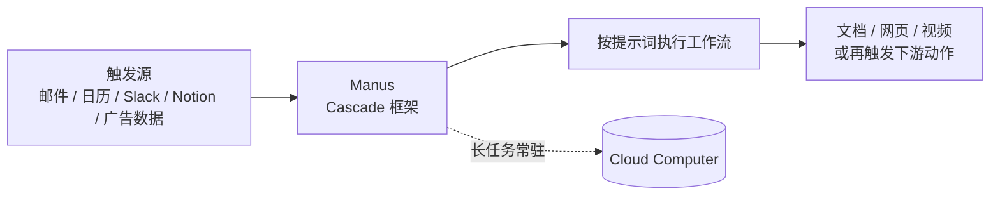

# Manus 2.0 拆解：Cascade、云电脑与 Cue——把 Agent 做成「卖电脑的生意」

> 2026 年 9 月 28 日，Manus 发布 2.0。此时距它 9 月 1 日正式恢复独立运营，只过了 27 天。
>
> 官方开篇第一句就把调子定死了：「**Manus 2.0 不是一次版本更新。它是围绕一个根本问题构建的新架构、新产品和新能力：下一代 Manus 应该是什么样的？**」
>
> 这篇文章要回答的是：这个「全家桶」里，哪些是真变化，哪些只是把已有能力重排了一遍；以及为什么它和同月上线的 Meta Muse，走的几乎是相反的两条路。

## 一、30 秒结论

1. **最硬的一项**：自研 Agent 框架 **Cascade**。官方数据是 token 消耗降 23.2%、任务耗时降 28.2%、运行成本降 32%——注意官方同时声明**这是单项测试配置的结果，不是全场景平均**，这个自我限定比数字本身更值得注意。
2. **最实用的两项**：**Cloud Computer**（可购买的云电脑，让项目在用户合上笔记本后继续跑）与 **Automations**（把「定时任务」升级为「**事件触发**」——一封邮件、一条 Slack 消息、一次 Notion 更新都能启动工作流）。
3. **最有想象力的一项**：个人 Agent 产品 **Cue**。每个 Agent 拥有**独立的邮箱、电话号码、钱包和自己的电脑**，可以在预算内付款、代接电话并留摘要，还能把多个 Agent 拉进同一个群聊协作。
4. **最好记的一句定位**：创始人肖弘说「我一直觉得 Manus 挺像是一个**卖电脑的生意**」——工作之外也得能看视频、打游戏。这句话解释了 2.0 为什么要把视频、游戏、远程控制全塞进来。
5. **和 Meta Muse 的分野**：Muse 追求「**尽可能多的人**」，用 WhatsApp 触达二十亿用户；Manus 追求「**尽可能深的活**」，把 Agent 做成一个可购买、可常驻、可协作的工作空间。

## 二、Cascade：这一版的重点，是「省」

Agent 框架这个层面，用户的感知最弱，但它决定了产品的成本结构和上限。

Cascade 的设计思路，官方原话是：「**它从一开始就让项目保持轻量，只在工作需要时引入专门的能力。**」简报、页面、视频和自动化始终属于「一个互联的项目」，而不是彼此割裂的会话。

这和主流做法是相反的。多数 Agent 的做法是「一开始就把所有工具定义塞进上下文」，好处是模型随时知道有什么能用，代价是**每一轮对话都在为用不到的工具付费**。

Cascade 选的是「按需装载」：项目起步时保持轻，等任务真的需要视频处理或代码执行时，再把对应能力接进来。官方把它概括为「**更好的结果。更少的浪费。**」

| 指标 | 官方公布的相对变化 | 口径说明 |
|---|---|---|
| Token 使用量 | 减少 23.2% | 单项测试配置，非综合平均 |
| 任务完成时间 | 缩短 28.2% | 同上 |
| 运行成本 | 降低 32% | 同上 |

**怎么读这三个数字**：它们的方向是可信的（按需装载确实省 token），但幅度不能直接外推到日常使用。官方自己加了限定，这比那种「平均提升 X%」的笼统说法要诚实。真正值得关注的是它背后的取舍——**按需装载意味着更多的动态决策，也就意味着更多的失败分支**。轻量化的代价通常是鲁棒性，这一点要等真实复杂任务的表现来验证。

## 三、Manus Studio：从「聊天框」到「共享工作台」

桌面端这次升级成了 **Manus Studio**，官方定义是「**一个供人与 AI 共享的工作空间**」。

它的设计逻辑有一句很关键：「每种工作都需要自己专业的工具，但**把所有能力都带入每个任务只会让相同的工作变得更慢、成本更高**。因此 Studio 只引入你项目所需的功能。」

Studio 覆盖文档、表格、PDF、幻灯片，以及网站、代码、游戏和视频。其中针对视频和游戏各开了一个专业环境。

**视频编辑器**的定位很务实。场景是：Manus 已经做完了一支广告的初剪，你只想换个配乐、或把产品图换成自拍。传统做法是重写提示词、整支视频重新生成；Studio 的做法是给出**时间轴**——片段、图像、文字、动态图形、音频都是独立元素，你可以换配乐、插素材、调动画位置，然后导出；改完还能交回 Manus：「让 Manus 再修一版，它会基于你的编辑继续创作。」

官方给的适用场景是短产品广告（30–60 秒）、AI UGC、数据动态图形、教程、Vlog。配套的 **Alchemy 模式**把 Manus 摆在「创意总监」的位置，**把视频生成与代码生成结合**，用于对质量要求更高的场合。

**Game Dev** 则更能说明 Manus 的野心：它同时调用视频、图像和编码模型，在 **Max Ultra 模式**下直接从可玩模板起步，「第一次会话即可玩上自己的创意」。编辑面板能看游戏运行、管资源、改代码，也能手动调美术——官方举的例子是「把村民头发改成银色而不影响其他内容」。

最值得注意的是它的**多人游戏路径**：配置 → 多人游戏 → 选择云电脑 → 购买一台。游戏需要一台「所有玩家都能访问、且始终在线」的服务器，托管、组网、维护都不轻松，Manus 把这几步压成了几次点击。

## 四、Cloud Computer：把「常驻」变成一件可购买的商品

Cloud Computer 是 2.0 里商业含义最直接的一项。

官方给的理由很朴素：「**有些项目超出单台机器的承载能力**」——多人联机游戏需要一台「在你合上笔记本电脑后仍然保持运行的服务器」，自动化流程需要「一个可以全天候运行的地方」。

这里有一个容易被忽略的转变：**Agent 的「常驻」从一个技术特性，变成了一个可单独售卖的商品**。此前「关掉 App 还在跑」是云端产品自带的属性；现在你为「独立计算环境」单独付费，并且它归属于某个具体项目。

对个人开发者来说，这个模型的吸引力在于**边界清晰**：不需要自己维护一台 VPS、不需要处理组网与运维，按项目买算力。真正的成本问题在于长期持有——一个需要 7×24 常驻的项目，云电脑是持续开销，这笔账要自己算。

## 五、Automations：从「定时」到「事件触发」

这一项是本次更新里**范式变化最明显**的一处，但也是最容易被标题党盖过去的。

旧版 Manus 的定时任务只能在**设定时间点**开工。2.0 改成**事件触发**：当已连接的服务里发生某件事时，工作才开始。官方列出的触发源包括——

- 一封新邮件
- 一次广告表现的变化
- 一个日历事件
- 一条 Slack 消息
- 一次 Notion 更新

使用方式是「**只需通过一个提示词告诉 Manus 要监听什么以及接下来要做什么，它就会搭建并运行整个工作流**」。

为什么说这是范式变化：定时任务的前提是**流程已知且稳定**（每天九点跑一次报表）。事件触发的前提是**流程已知但时机不可预测**（客户什么时候回信不确定）。后者才更接近真实工作，但它对 Agent 的要求也更高——**它得在没人看的时候自己判断「这件事要不要处理」**。误判的成本，从「这次跑偏了」变成「它自作主张动了手」。

## 六、Cue：给 Agent 一个独立身份

如果说前面几项是「把活干得更好」，Cue 是 Manus 在产品形态上另开的一支。

**Cue 是一款独立应用**，支持手机和桌面端，构建在与 Manus 相同的基础设施上。它给每个 Agent 配齐了一套**独立的办事条件**：

| 能力 | 说明 |
|---|---|
| 独立邮箱 | Agent 有自己的收件地址，可用于对外沟通 |
| 电话号码 | 拥有独立号码，能代接电话并在 Cue 里留下摘要 |
| 钱包 | 可在用户设定的预算内完成付款 |
| 电脑 | 在自己的机器上独立完成任务 |

它还支持**把多个 Agent 放进同一个有共同目标的群聊里协作**。官方举的例子是：一个为纽约发布会调研场地，另一个筛出候选清单，第三个起草演示文稿，「你设定方向并做出最终决定」。

日常服务层面，官方给的场景是：在餐厅扫个二维码，你的 Agent 就能替你点餐或排队。

创始人肖弘对 Cue 的定义，来自他公开发表的一段话，值得整段引用：

> 「一个有独立的手机号、邮箱、支付、电脑和足够的『智能』的『东西』，也许可以称之为『人』。」

他还进一步设想：「如果真的是人，上层的壳，应该有很多变化，比如是不是应该有个很多人和 bot 的群？」——**这就是那场「多 Agent 群聊」的产品来源**。

**Cue 目前处于早期体验阶段**，官方说明是凭邀请码免费使用，邀请码 `MEETCUE` 面向有限数量的早期用户、先到先得，每位拿到访问权限的用户还会获得额外的邀请码用于分享。

一个务实的提醒：Cue 的**iOS 版本仍在 App Store 审核中**，目前可用的是网页版、Mac 与 Android。

## 七、这条路线的来龙去脉

理解 Manus 2.0 为什么长成这样，需要知道它过去一年半走了什么路——这条路在 AI 创业公司里算相当曲折的。

- **2024 年**：以蝴蝶效应（北京蝴蝶效应科技有限公司）为主体成立，早期获真格基金、红杉中国、腾讯等投资
- **2025 年 3 月**：凭通用 AI Agent 产品进入公众视野
- **2025 年**：完成由 Benchmark 领投的 7500 万美元融资，总部迁至新加坡
- **2025 年 12 月**：官宣年度经常性收入（ARR）突破 1 亿美元，从 0 到 1 亿用了约 8 个月
- **2025 年 12 月 29 日**：Meta 宣布收购，市场消息称估值区间在 20 亿至 30 亿美元
- **2026 年 4 月**：收购终止，双方完成业务拆分
- **2026 年 9 月 1 日**：正式恢复独立运营，创始团队重新执掌
- **2026 年 9 月 28 日**：发布 Manus 2.0

值得注意的是，Manus 并**不自研基础模型**，而是基于 Anthropic 等公司的基础模型构建 Agent 系统。这次 2.0 把重心压在**自研 Agent 框架（Cascade）**上，逻辑是清楚的：**在别人的模型之上，唯一能建立差异化的地方就是「怎么调度」**。

另外，官方在发布同步表示正在组建面向国内市场的产品团队，与国产大模型厂商和生态伙伴的合作在推进中，具体时间表未披露。

## 八、与 Meta Muse 对照：同月发布的两种路线

把 Manus 2.0 和[同月发布的 Meta Muse](/posts/2026-10-01-meta-muse-agent-teardown/) 放在一起看，会发现它们几乎是镜像的：

| 维度 | Meta Muse | Manus 2.0 |
|---|---|---|
| 核心目标 | 尽可能多的人用上 | 尽可能深的活干完 |
| 主要入口 | iOS / Android / **WhatsApp**（二十亿用户） | 桌面 / Web / 移动 + **Studio 工作台** |
| 计算形态 | 云端**专属 VM**（用户不需要知道） | **Cloud Computer**（用户按项目购买） |
| 触发方式 | 用户下达 + Agent 主动建议 | 用户下达 + **事件触发**（邮件/Slack/Notion） |
| 身份设计 | 一个 Agent 服务一个人 | **每个 Agent 有自己的邮箱、电话、钱包** |
| 变现 | 订阅打底，**交易抽佣**是长期模式 | 订阅 + **算力/云电脑售卖** |
| 安全重心 | **出网管控**（Sentinel 守门） | **权限与预算边界**（钱包限额、连接授权） |

一句话概括这个分歧：**Muse 把 Agent 变成「一个更聪明的入口」，Manus 把 Agent 变成「一台你能买、能常驻、能组队的机器」。** 前者赌的是分发，后者赌的是留存。

两者都不是终局。但可以看到一个共同的趋势：**2026 年的 Agent 竞争，已经从「模型能做什么」转到了「权限怎么给、成本怎么算、出问题谁负责」**。

## 九、我的判断

**这一版最有价值的，不是任何一个功能，而是三个结构性判断：**

1. **Agent 框架值得自研。** 在基础模型高度同质的当下，Manus 把资源压在 Cascade 上，是把赌注放在「调度效率」这条护城河上。官方给出的是成本数字，但真正的门槛是**长期积累的调度策略**，这个抄不走。
2. **「事件触发」比「定时任务」重要得多。** 它把 Agent 从「按表执行的脚本」推向「有判断力的值守者」。这项能力一旦稳定，Agent 的价值会从「省时间」跳到「不用惦记」。
3. **给 Agent 配独立身份，是产品思路上的分水岭。** 独立邮箱 + 独立号码 + 独立钱包，意味着 Agent 开始以**独立主体**的身份参与交易与沟通，而不是「用户的另一个输入框」。这一步走出去，后面的一整套问题（Agent 之间的信任、Agent 的合规身份、Agent 的钱归谁）都会跟着来——Meta Muse 被 Amazon 封禁，正是这个问题的先兆。

**需要谨慎看待的三点：**

1. **性能数字的口径**。三项数据都来自单项测试配置，官方已明确限定。在多步、长链路的真实任务里，按需装载带来的动态决策会更频繁，实际收益需要独立验证。
2. **云电脑的持有成本**。「按项目买算力」听起来干净，但常驻项目的开销是持续的。对个人开发者，这笔账要和「自己开台 VPS」认真比一次。
3. **Cue 的完成度**。iOS 待审、处于邀请制早期、钱包与电话涉及真实的资金与通信责任。**这类能力一旦上线就不好收回**，早期阶段建议只用于低风险的日常事务。

**一句话总结**：Manus 2.0 是一次「**把 Agent 变成基础设施**」的尝试——框架是发动机，Studio 是工作台，云电脑是场地，Automations 是值班表，Cue 是给 Agent 办的一张身份证。方向清晰，剩下的问题是：**它能不能在成本真的降下来的同时，让这些常驻的东西不出事。**
