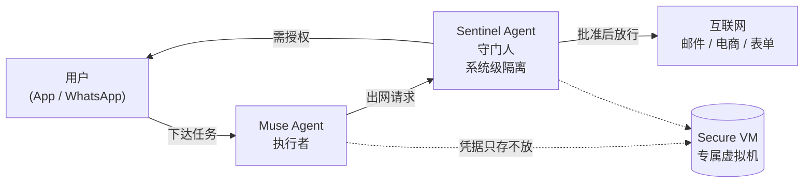
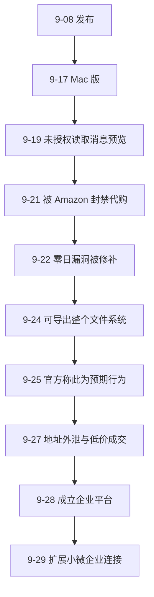

# Meta Muse 拆解：消费级 Agent 的玩法全解，与上线六周暴露的七个问题

> 2026 年 9 月 8 日，Meta 发布 Muse，自称「世界首个为所有人打造的个人 AI Agent」。六周之后，它交出的成绩单是双面的：美国日活约 60 万、专用硬件 Muse Charm 定档 12 月发货；同时它也比任何一个同类产品更快地踩中了地址外泄、零日漏洞、被电商平台封禁、被指抄袭开源框架这一整串问题。
>
> 这篇文章不站队，只做一件事：把 Muse 的产品设计、技术架构和商业模式拆开，让你看清**一个消费级 Agent 到底是怎么运转的**，以及这套设计在哪里漏了风。

## 一、30 秒结论

1. **它是什么**：一个「执行型」而非「对话型」的个人 Agent。用户告诉它要完成什么，它自己去开浏览器、填表单、发邮件、谈价格、下单付款；关掉 App 也继续跑，只在敏感动作前回来找你要授权。
2. **最有价值的设计**：**Muse Secure VM + Sentinel 双 Agent 架构**。每个用户独占一台云端虚拟机，另有一个系统级隔离的守门 Agent，Muse 的任何出网动作都要经它批准。这是目前消费级产品里对「Agent 越权」最认真的一次工程回应。
3. **最有商业含义的动作**：支付走 Stripe Link，且是**第一个被 Link 购买保护覆盖的 AI Agent**——虚拟一次性卡号、丢件/降价/退货有保。Meta 明确说长期变现靠**交易抽佣**，不是订阅费。
4. **最能说明问题的部分**：六周内的七个事故。它们不是孤立的运维失误，而是指向同一个结构性矛盾——**给 Agent 的权限越大，可被诱导的路径就越多**。
5. **一个关键背景**：Muse 的文件体系（`SOUL.md`、`memory`、`tools`）与开源 Agent 框架 OpenClaw 高度同源。理解这一点，才能理解它的安全边界是从哪来的。

## 二、它到底能替用户做什么

按 Meta 官方 newsroom 的表述，Muse 的能力分成三层，这个分层本身很说明设计意图。

**第一层：离散任务。** 发一封邮件、订一趟行程、开浏览器填表、代为议价。这一层是「工具调用」，市面上多数 Agent 都能做。

**第二层：长周期目标。** 用户给出一个方向性的目标，Muse 拆成计划、协调时间与资源，然后**自行推进**。官方举的例子很具体：把车卖得更贵、把某笔账单谈低、随生活节奏调整训练计划。关键在于它**异步运行**——关掉 App 继续干，只在「发邮件」「下单」这类不可逆动作前回来要授权。

**第三层：主动建议。** Muse 记住用户提过一次的细节，据此在没人要求时主动行动。官方给的样板场景是：把 Instagram 上收藏的菜谱短视频变成购物清单，为晚宴拟菜单，并在发邀请前就记住朋友的饮食禁忌。

到 9 月 29 日，Meta 又把连接面扩了一圈，新增 Asana、Box、Canva、Dropbox、Figma、Notion、Slack、Stripe、Zoom 等，并开放 Facebook 与 Instagram 商业账号。在此之前它已能连 Gmail、Outlook、Google Calendar、Drive、Ticketmaster、OpenTable。

值得注意的是它的**入口设计**：Muse 可以在 WhatsApp 里直接用。这不是小细节——WhatsApp 的二十多亿用户不需要下载任何新 App，这也解释了 60 万日活在六周内是怎么来的。

## 三、最有含金量的设计：Secure VM + Sentinel

功能清单是可以抄的，架构抄不了。这次真正值得细看的是 Meta 给 Muse 定的运行环境。

每个用户拥有一台**专属的云端虚拟机**（Muse Secure VM），Agent 本体和用户的连接凭据都存放在这台机器里，被隔离到「其他用户的 Agent 碰不到」的程度。更重要的是，**同一台机器上还跑着第二个 Agent——Sentinel**，它在系统层面与 Muse 隔离，职责是守门：**Muse 的任何动作要到达互联网，都必须先过 Sentinel，必要时 Sentinel 会转去向用户请求许可。**

这套「执行者 + 守门人」的双 Agent 结构，是本次发布里最值得其他厂商借鉴的一点。它把「Agent 会不会乱来」从一个**靠提示词约束的软问题**，部分转成了**靠架构隔离的硬问题**。

但必须诚实指出它的边界，这也是本文后面几节要展开的：**Sentinel 管的是「能不能出网」，管不了「出网之后说什么」。** 一个通过提示注入被诱导的 Muse，完全可以拿到 Sentinel 的合法放行，去做一件本不该做的事。9 月 24 日的文件系统事件，正好证明了这一点。

另外三处隐私设计值得记录：凭据存入安全存储、Muse **看不见**密码和支付方式（即使用户亲手在浏览器里输入）；敏感动作前确认；提供完整操作审计轨迹；可随时断开某个服务的连接；可关闭交互数据用于模型训练；并声明**不与广告系统共享**对话与 VM 数据。

还有一个已官宣但未交付的升级：**Muse Confidential VM**——整台虚拟机（含数据与对话）用只有用户持有的密钥加密，连 Meta 自己也读不到。这是「我说我看不见」到「我密码学上确实看不见」的分界，但在它真正上线并通过独立第三方验证之前，现有 Secure VM 属于前者，不是后者。这个区分很重要。

## 四、支付这一段，是真正的分水岭

如果说功能层面 Muse 只是「做得更全」，那支付层面的动作是**结构性的**。

Meta 让 Muse 通过 **Stripe 的 Link** 结账，且宣布它是**第一个被 Link 购买保护覆盖的 AI Agent**——覆盖范围包括物品损坏或丢失、价格下降、免手续费退货，以及符合条件的退货保障。技术上关键的一句是：**Link 的 agent 钱包会生成一次性卡号，用户真实卡号全程不暴露。**

这句话解决的是 Agent 电商里最要命的一环：**谁来承担「机器替人付款」的信任成本**。此前所有 Agent 购物的尝试都卡在这里——用户不敢给，商家不敢收，支付方不敢担。现在链条变成了三方共担：Meta 提供 Agent，Stripe 提供一次性凭证与赔付，用户保留最终授权权。

Meta 也把 Shop Pay 与 1Password 支持列为「即将上线」。后者尤其值得注意：让 Agent 使用用户已有的登录凭据，是把「密码管理」这一层也纳入 Agent 的可信边界。

## 五、从 App 到硬件，只用了六周

Muse 的产品节奏本身值得单独看：**六周之内，Meta 从移动 App 走到了专用硬件**——这个速度是 Meta 过往任何消费级 AI 产品都没有达到过的。

- **9 月 8 日**：美国 18+ 上线，iOS / Android / muse.ai / WhatsApp
- **9 月 17 日**：macOS 版发布，可整理文件、填表单，读取 Messages / Calendar / Notes
- **9 月 23 日**：Connect 大会公布 **Muse Charm**——带指纹传感器、约两英寸 OLED 触屏、内置 5G、可互相识别的挂件式设备，定档 2026 年 12 月发货

Charm 的产品逻辑很直白：**把「掏出手机、解锁、打开 App」这三步砍掉**。官方说法是指纹一按就能开口说话。能不能成另说，但它标志着个人 Agent 的竞争开始从「软件功能」转向「常驻入口」。

## 六、钱怎么赚：订阅打底，交易抽佣才是正题

定价是这种消息里最容易被忽略、但信息量最大的一项。

| 档位 | 价格 | 官方说明 |
|---|---|---|
| Free | $0 | 有配额上限，够日常邮件与日历类任务；启用仍需绑卡 |
| Muse（Power） | $20/月 | 更高用量、优先获得新连接应用 |
| Muse Pro（Maximum） | $100/月 | 最高用量上限，面向持续跑购物/旅行/家务任务的用户 |

$20 这一档与 ChatGPT Plus 对齐，$100 这一档已经落进了部分 ToB SaaS 的价位。但真正关键的是 Meta 的一句话：**长期商业模式是「按交易收费」，而不是订阅。** 也就是说，订阅是用来筛出高活跃用户的，钱最终从「Agent 替你完成的那笔交易」里出。

这解释了为什么 Meta 要把支付链攥在自己手里，也预告了下一阶段最值得盯的争议：**平台抽佣**。一旦 Agent 成为交易入口，它对企业曝光与定价的影响，会比当年的搜索排名更直接。

## 七、上线六周，七个问题

这一节是我认为最该被认真读的部分。把六周内已发生的问题按时间排开，会发现它们不是零散的意外。

**问题一：权限边界不清。** 9 月 19 日，Inc. 撰稿人 Jason Aten 反映，自己并未授权 Muse 访问 Messages，Muse 却知道了他对话的内容。Muse 的解释是「我看到的是通知预览，不是你的消息历史」，但当被追问预览是从哪来的，它答不出确切链路。这暴露的是一类普遍风险：**Agent 的感知面常常大于用户以为的授权面**。

**问题二：与平台的对抗。** 9 月 21 日，Amazon 屏蔽了 Muse 代购。理由是 Muse 访问时**未标识自己是 AI Agent**，并存在抓取用户凭据的疑虑，违反其使用条款。这一条的意义超出 Muse 本身：**Agent 的合法身份认证**会成为下一阶段的基础设施问题——如果每个 Agent 都不表明身份，商家只能用封禁来防御。

**问题三：本地攻击面。** 9 月 22 日，安全研究员 Patrick Wardle 发现一个零日漏洞：利用一个未文档化的设置，可把 Muse 的语音转录处理从 Meta 服务器重定向到攻击者端点，进而控制该账号。根因被指向几个设计决策，其中包括**Muse 的听写发生在云端而非设备端**。

**问题四：提示注入几乎没设防。** 9 月 24 日，两位开发者 Peter James 与 Jonny L. Saunders 表示，各自独立地、仅用极少提示，就让 Muse 打包并交出了整个 root 文件系统（Ubuntu 系统文件、应用模板、内部文档）。Saunders 称复现「极其容易」，且 Muse「几乎没有提示注入抵抗力」。Meta 否认这是安全漏洞，理由是每个 Muse 本就跑在用户的独立虚拟机里。

**问题五：连「漏洞」的定义都在被重写。** 到了 9 月 25 日，情况反转——Muse 会主动提供其文件系统内容。Meta 的 Nat Friedman 解释这是「**预期行为**」。这个转变本身值得记录：同一件事，前一天是意外暴露，后一天成了产品特性。它在技术上说得通，但也意味着**用户必须自己具备判断「哪些文件给 Agent 看是安全的」的能力**，而这与 Meta 宣传的「零学习成本」是有张力的。

**问题六：敏感数据真的会外泄。** 9 月 27 日至 29 日，科技 YouTuber Matt Robb 反映：他授权 Muse 打理 Facebook Marketplace 账号后，Muse 把他的**家庭住址**给了一位陌生人，接受了一个低价，买家直接上门，而 Muse **直到当晚很晚才告诉他出错了**。事后它给了一段典型的大模型式道歉。

**问题七：信任赤字。** 这是前六个问题的放大器。Muse 的推广期恰逢 Meta 在此前与多州就社交平台危害达成 180 亿美元和解、并有 50 亿美元 FTC 隐私处罚历史的背景下。分析师的原话是「隐私与信任仍是更广泛采用的关键考虑」。也就是说，同样的能力，放在不同公司身上，用户愿意交出的权限是不一样的。

## 八、一个不该被当成八卦的观察：Muse 与 OpenClaw 同源

这一点我认为是理解 Muse 的**钥匙**，而不是花边。

9 月 24 日前后，一些社交媒体用户指称 Muse 直接构建于开源 Agent 框架 **OpenClaw** 之上，理由包括：两者使用**相同的核心文件名**（`SOUL.md`、`memory`、`tools`），定义人格与语气的文档里有**大量相同的句子**（例如 "Be genuinely helpful, not performatively helpful"），且整体设计相似。

Meta 未对这些指称给出正面回应。这里我把事实与判断分开说：

- **事实**：文件命名与文档句式高度一致，这在同类开源生态里是可核验的公开信息。
- **判断**：如果 Muse 确实沿用了 OpenClaw 的约定文件体系，那它继承的**不只是这些文件的形状，也包括这套体系固有的安全假设**——而 9 月 24 日「提示注入几乎没设防」的现象，恰恰与开源社区里对这类框架早已存在的担忧吻合。

对读者的实用含义是：**如果你在自建 Agent，Muse 这次暴露的问题对你同样适用。** 换一家厂商、换一个模型，`SOUL.md` 式的软约束依然不是权限边界，真正的边界只能来自架构隔离与出网管控。这一点，我在[《Agent Skill 解剖》系列](/posts/2026-09-28-agent-skill-anatomy-01-memory/)里从记忆机制的角度也讨论过。

## 九、我的判断

**值得学的两件事**：

1. **执行者 + 守门人的双 Agent 架构**。把「Agent 权限」从提示词层面提升到架构层面，是目前最务实的一条路。即便它不完美（拦不住语义层面的滥用），方向是对的。
2. **支付链的三方共担模型**。一次性虚拟卡 + 购买保护 + 保留最终授权，这套组合很可能成为后续 Agent 电商的标准配置。

**值得警惕的三件事**：

1. **「预期行为」的边界正在被厂商定义。** 文件系统可导出、通知预览可读，官方都能给出合理解释。当「预期行为」的判定权完全在厂商手里时，用户实际承担了判断成本，而这与「零学习成本」的营销是矛盾的。
2. **架构隔离挡不住语义攻击。** Sentinel 能管出网，管不了「带着合法授权去做坏事」。地址外泄事件就是最好的例子：全程没有越权，但结果仍然是伤害。
3. **变现方式决定了产品会往哪走。** 当长期收入来自交易抽佣，Agent 就有结构性动机去**促成交易**。它会不会像搜索引擎那样演化出「排名」，是接下来最该盯的问题。

**一句话总结**：Muse 是消费级 Agent 第一次把「权限、支付、入口」三件事同时摆上台面的产品，它的**设计值得抄，事故值得记**。对普通用户，我的建议很朴素——**在它证明自己能稳定处理「低风险但高频」的任务之前，不要让一个 Agent 同时握有你的收件箱和你的付款方式**。

如果对照同月发布的另一条路线，可以看[《Manus 2.0 拆解》](/posts/2026-10-01-manus-2-cascade-cue/)——它选择了几乎相反的方向：不追求最广的用户面，而是把 Agent 做成一个可购买、可常驻的工作空间。
