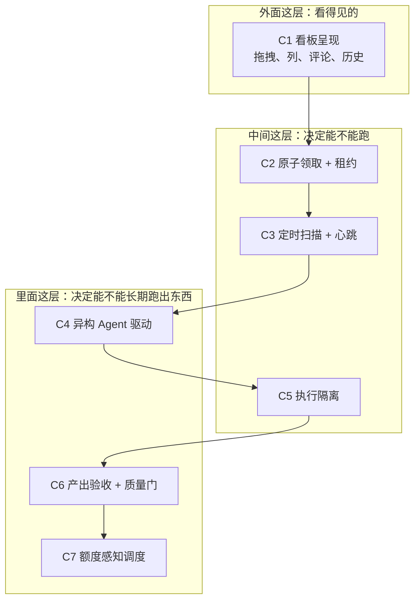
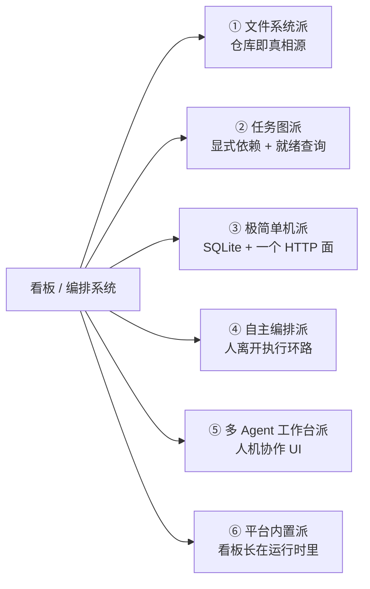

# 给本地 Agent 造一块看板（一）：总览——看板只是壳，调度与验收才是本体

> 本系列共八篇，用同一套评价框架横向解剖 20 个开源任务看板 / 编排项目。
> 所有仓库元数据（星数、许可证、最近提交时间、仓库体量、创建时间）均于 **2026-10-08 通过 GitHub REST API 一手核验**，不采信二手索引站与聚合博客。
> 本系列刻意区分「架构设计」与「工程成熟度」，对明星项目同样保留独立判断。

---

## 一、场景：一句话的需求，七层的实现难度

先把需求写清楚：

> 人在一块看板上发布任务 → 本机的多个 coding agent（CodeBuddy / Codex / Trae / CodeArts 之类）定时扫描看板 → 自动领取并完成 → 持续产出可复用的资料或信息 → 由此把各家的免费额度用满。

这个描述里最容易被抓住的关键词是**看板**。于是绝大多数调研都会从「找一个开源看板」开始——我第一轮也是这么做的，然后发现结论很别扭：看起来功能最全的几个项目，恰恰都不能自主干活；而真能自主干活的，看板又都很简陋。

问题出在提问方式。**看板只是这套系统里最外面的一层壳。** 把需求拆开会发现，真正决定"能不能无人值守长跑"的，是底下那几层：

| # | 能力层 | 验收口径（做到什么算覆盖） |
|---|---|---|
| **C1** | 看板呈现 | 人可读写任务、状态可视、最好有终端或 Web UI |
| **C2** | 原子领取与互斥 | 多方同时取单不丢更新；有 WIP 上限；claim 有租约、超时能回收 |
| **C3** | 定时扫描与心跳 | 有守护进程或周期扫描；agent 存活可判定；无任务时正确挂起而非空转 |
| **C4** | 异构 agent 驱动 | 能统一调起多类本地 CLI 的 headless 入口；能探测各自能力差异 |
| **C5** | 执行隔离 | 每任务独立工作目录（worktree / 沙箱），失败可回滚 |
| **C6** | 产出回收与验收 | 交付物有约定落点；有质量门；不合格能自动派生补做任务 |
| **C7** | 额度感知调度 | 「剩余额度 → 派给谁 → 耗尽切换或排队」的闭环 |

这张分层图是本系列的评价基准。后面每篇都会用同一把尺子去量不同项目。

需要说明的是，C1 到 C7 的难度是**递增**的，而不是并列的：

- **C1 几乎不是问题。** 画一个 Kanban 是前端练习。市面上有几十个开源看板，随便拿一个都够用。
- **C2、C5 是工程问题，有成熟解法。** 原子领取、租约、worktree 隔离都有人做对了。
- **C3、C4 开始变难。** 因为要跟"别人的 CLI"打交道——参数会变、沙箱语义不同、输出格式各异。
- **C6、C7 是这套系统的**真正难点**，也是最稀缺的能力。**

先记住这个分布。它是理解后面所有"看起来很好但用不起来"现象的钥匙。

---

## 二、一次重要的自我修正

在给结论之前，必须先交代本系列相对早期草稿的一处**结论级修正**。

早期调研（同一批 GitHub 检索的前几轮）给出的判断是：**「额度感知调度」（C7）与「产出质量门」（C6）在开源侧完全空白**——现有工具只做额度**观测**，不做**调度**；所有看板只追踪任务**状态**，不追踪**交付物**。

这个判断在补充检索后被推翻了。`BradGroux/veritas-kanban`（838★，MIT，活跃）文档里明确写着：

- **Agent budget enforcement** —— 对 workspace / agent / workflow / per-run 多级设置 token、成本、工具调用数、运行时长、重试次数与扇出上限，超限时的动作是"告警 / 审批 / 降级 / 暂停 / 取消"，且决策可审计；
- **Output Evaluation** —— 按加权评分档案（正则、关键词、数值区间、出现比例）对 agent 产出打分；
- **Agent registry** —— 带心跳追踪、能力声明与实时状态的服务发现。

也就是说，**C6 与 C7 不是"没人想到"，而是"有人在某个未必最出名的项目里做出来了"。** 早期判断之所以错，是因为检索口径一直围绕"kanban"这个名字打转，而这类能力往往出现在自称 "task management board with agent orchestration" 的项目里，名字里没有 kanban。

这个教训写进总览篇，因为它同时是方法论问题：**一旦用词锚定太死，检索就会系统性漏掉最相关的项目。** 本系列后续每一篇都会尽量从"机制"而不是"名字"去覆盖候选。

---

## 三、被解剖的 20 个项目，按架构家族分成六派

不按 star 数排，按**架构思路**分。同一派里的项目往往共享同一组优点和同一组缺陷——这才是可迁移的知识。

| 派别 | 代表项目 | 一句话定位 |
|---|---|---|
| ① **文件系统派** | kanban-md、Backlog.md、Kanbanito、mdboard | 卡片就是 Markdown 文件，可 grep、可 diff、可分支合并 |
| ② **任务图派** | beads、claude-task-master、BMAD-METHOD | 显式依赖图 + 「下一个可做的任务」查询 |
| ③ **极简单机派** | kanban-mcp、agent-kanban(nerkoman)、cocopilot、task-kanban-mcp | 单进程 + SQLite，一条命令起看板 |
| ④ **自主编排派** | cline/kanban、saltbo/agent-kanban、veritas-kanban | 明确主张"把人从执行环路里拿出去" |
| ⑤ **多 Agent 工作台派** | AionUi、ai-agent-board、claude-squad、Nimbalyst、kanban-code | 好 UI、多 CLI、可视化协作 |
| ⑥ **平台内置派** | Hermes Agent 内置 Kanban | 看板是 agent 运行时的一等公民 |

另有若干"缺口指示器"会在相应篇章出场：`emo-xiaoyu/harness-mix`（279★，多 CLI harness 引擎，给出原生 ACP 接入清单，回答 C4）、`mintopia/cocopilot`（0★，语义最精确的轮询领取 HTTP 契约，回答 C2+C3）、`community-archive/obsidian-kanban`（4,528★，Markdown 看板已被归档，是文件系统派的典型案例）。

---

## 四、方法论：为什么这篇里的数字你可以信

本系列所有项目数据都经过同一套核验，规则如下：

**1. 只用一手数据。** 星数、许可证、最近 push、仓库体量、创建时间全部来自 GitHub REST API。早期调研中，二手索引站推荐的 `eyalzh/mcp-kanban` 在 GitHub 上已 **404**——一个被正经推荐的项目根本不存在。这类笑话只要回到一手续航就能避免。

**2. 星数**不等于**成熟度，更不等于**存活力**。本系列最大的反面案例是 `vibe-kanban`：**28,292★**，最知名的 agent 看板，README 顶部却直接写着 "Vibe Kanban is sunsetting." 并链向关停公告。星数是历史热度的存量，不是未来维护的保证。

**3. 许可证是选型的第一道闸。** 本系列里出现了无许可证、GPL-3.0、AGPL-3.0、MIT + Commons Clause、FSL-1.1-ALv2、NOASSERTION 等多种形态。两个典型陷阱：
   - **FSL-1.1-ALv2**（Functional Source License）不是 OSI 认可的开源许可证，它限制与产品竞争的商用，通常约定两年后自动转为 Apache-2.0；
   - 一个 0★ 且**没有 license 文件**的项目，法律上默认"保留一切权利"，不能作为依赖，只能当参照实现读。

**4. 看更新节奏，也看 issue 存量。** 最近一次 push 与未关闭 issue 数要合起来看。`steveyegge/beads`（约 174 MB 仓库、1,385 个未关 issue）与 `JRGould/Kanbanito`（37 KB 仓库、0 issue、全仓库一次提交）显然不是同一类事物。

**5. 不把"能跑"当成"该用"。** 本系列区分三个使用强度：**当依赖**（要许可证 + 活跃度 + 体量）、**当参照实现读**（要设计清晰）、**当反面教材看**（要诚实归因）。

以下是本系列涉及项目的元数据快照（2026-10-08 核验）：

| 项目 | ★ | 许可证 | 最近 push | 语言 | 仓库体量 | 创建 |
|---|---|---|---|---|---|---|
| `NousResearch/hermes-agent` | 252,141 | MIT | 2026-10-08 | Python | ~1.2 GB | — |
| `iOfficeAI/AionUi` | 33,383 | Apache-2.0 | 2026-09-09 | TypeScript | ~679 MB | 2025-08-07 |
| `BloopAI/vibe-kanban` | 28,292 | Apache-2.0 | 2026-09-19 | Rust | ~102 MB | 2025-06-14 |
| `steveyegge/beads` | 27,733 | MIT | 2026-10-08 | Go | ~174 MB | 2025-10-12 |
| `MrLesk/Backlog.md` | 6,962 | MIT | 2026-10-07 | TypeScript | ~45 MB | 2025-06-04 |
| `smtg-ai/claude-squad` | 8,580 | AGPL-3.0 | 2026-08-20 | Go | ~3.4 MB | 2025-03-09 |
| `community-archive/obsidian-kanban` | 4,528 | GPL-3.0 | 2026-03-06 | TypeScript | ~16 MB | 2021-04-16 |
| `cline/kanban` | 1,353 | Apache-2.0 | 2026-10-01 | TypeScript | ~34 MB | 2026-03-09 |
| `Nimbalyst/nimbalyst` | 1,853 | MIT | 2026-10-08 | TypeScript | — | — |
| `BradGroux/veritas-kanban` | 838 | MIT | 2026-10-06 | TypeScript | ~120 MB | 2026-01-26 |
| `saltbo/agent-kanban` | 486 | FSL-1.1-ALv2 | 2026-10-02 | TypeScript | ~5.9 MB | 2026-03-20 |
| `langwatch/kanban-code` | 328 | Apache-2.0 | 2026-10-07 | Swift | ~15 MB | 2026-02-28 |
| `emo-xiaoyu/harness-mix` | 279 | Apache-2.0 | 2026-10-02 | TypeScript | ~18 MB | 2026-09-07 |
| `antopolskiy/kanban-md` | 223 | MIT | 2026-10-05 | Go | ~3.3 MB | 2026-02-07 |
| `owainlewis/agent-worker` | 65 | MIT | 2026-07-05 | TypeScript | — | — |
| `DanWahlin/ai-agent-board` | 63 | MIT | 2026-09-19 | TypeScript | ~3.6 MB | 2026-02-28 |
| `nerkoman/agent-kanban` | 4 | MIT | 2026-09-25 | Python | 771 KB | 2026-05-09 |
| `rgracey/kanban-mcp` | 2 | 无 | 2026-02-24 | Go | — | — |
| `JRGould/Kanbanito` | 0 | 无 | 2026-03-14 | HTML | 37 KB | 2026-03-14 |
| `mintopia/cocopilot` | 0 | 无 | 2026-02-08 | Go | — | — |

---

## 五、三条先行结论

读完八篇之后，如果只记得三件事，应该是这三条。

### 结论一：看板呈现是伪难点，领取与验收才是分水岭

几乎所有项目都能画出一块好看的看板，但**能正确处理"两个 agent 同时抢同一张卡"的项目不到一半**，**能给交付物设质量门、且能对额度做预算约束的项目更是少数**。

原因是可见性偏差：UI 是能截图的，claim 租约与验收门是截不了图的。开源项目的作者与使用者都被前者吸引。所以一个项目"看起来架构完整"，与它"架构上完整"，往往不是一回事——本系列每篇都会把这个差距摆出来。

### 结论二：star 数与存活力无关，「最知名」经常等于「最先死」

28,292★ 的 vibe-kanban 已关停；4,528★ 的 obsidian-kanban 已被挪进社区存档组织、停止维护；而真正把多 agent 并发做扎实的 beads（27,733★）反而是被底层需求推着走的项目。

对选型来说，正确的信号顺序是：**许可证 → 最近提交 → issue 响应 → 架构是否可拆 → 最后才是星数。**

### 结论三：稀缺的不是看板，是「领取 + 验收 + 额度」三件套的闭环

这是本系列最值得记住的结构性发现。

大量项目做好了 C1（好看）；相当一部分做好了 C2/C5（原子领取、隔离）；少数做好了 C4（多 CLI 驱动）。但**同时把 C6（产出验收）与 C7（额度预算）当成一等公民的项目极少**。而这两层恰恰是"长期无人值守跑出有价值产出"的必要条件——没有 C6，产出是废话却和成功任务长得一样；没有 C7，免费额度会在无人察觉时烧光。

值得注意的规律是：**凡是把 C6/C7 做出来的项目，都把自己定位成"agent 编排 / 控制平面"（control plane），而不是"看板"。** 这个自我定位的差别，决定了它们会不会顺手把额度与产出纳入模型。第六篇的平台内置派，会把这个规律推到极致。

---

## 六、全系列导航

| # | 篇目 | 核心问题 |
|---|---|---|
| 一 | **总览（本篇）** | 评价框架、家族地图、方法论与自我修正 |
| 二 | [文件系统派](/posts/2026-10-08-agent-kanban-01-filesystem-kanban/) | 把看板塞进 Git 仓库，代价是什么？ |
| 三 | [任务图派](/posts/2026-10-08-agent-kanban-02-task-graph/) | 为什么"下一个任务"必须是一次查询？ |
| 四 | [极简单机派](/posts/2026-10-08-agent-kanban-03-minimal-local/) | 最小可用看板到底需要什么？ |
| 五 | [自主编排派](/posts/2026-10-08-agent-kanban-04-autonomous-orchestration/) | 三个最接近目标的项目，差在哪一步？ |
| 六 | [多 Agent 工作台派](/posts/2026-10-08-agent-kanban-05-agent-workbench/) | 派单模型和认领模型差在哪？ |
| 七 | [平台内置派](/posts/2026-10-08-agent-kanban-06-platform-native/) | 看板长在运行时里，会多出什么能力？ |
| 八 | [日落的教训与横向对照](/posts/2026-10-08-agent-kanban-07-sunset-and-synthesis/) | 28k★ 为什么会死？横向该怎么选？ |

建议按顺序读。第二到七篇是分派解剖，可以按兴趣跳；但第八篇的横向矩阵与结论建立在前面所有材料之上。

---

**一句提醒**：本系列讨论的是"技术上能否实现"。把厂商的消费级或免费额度用于无人值守长跑是否违反各自服务条款，需要读者自行核对——技术上可行不等于条款上允许。这一点在涉及额度调度的第五、七、八篇会再次出现。

---

**系列导航**

- 一、总览：看板只是壳，调度与验收才是本体 ← 本篇
- 二、[文件系统派：把看板塞进 Git 仓库，代价是什么？](/posts/2026-10-08-agent-kanban-01-filesystem-kanban/)
- 三、[任务图派：把「下一个任务」变成一次查询](/posts/2026-10-08-agent-kanban-02-task-graph/)
- 四、[极简单机派：一个二进制、一条命令](/posts/2026-10-08-agent-kanban-03-minimal-local/)
- 五、[自主编排派：把「人」从执行环路里拿出去](/posts/2026-10-08-agent-kanban-04-autonomous-orchestration/)
- 六、[多 Agent 工作台派：派单模型与认领模型的分野](/posts/2026-10-08-agent-kanban-05-agent-workbench/)
- 七、[平台内置派：当看板成为 Agent 运行时的一等公民](/posts/2026-10-08-agent-kanban-06-platform-native/)
- 八、[日落的教训与横向对照](/posts/2026-10-08-agent-kanban-07-sunset-and-synthesis/)
