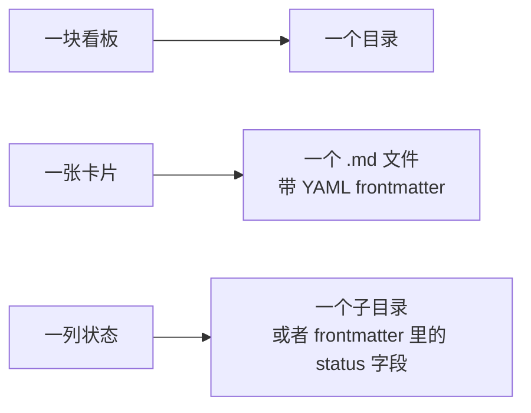

# 给本地 Agent 造一块看板（二）：文件系统派——把看板塞进 Git 仓库，代价是什么？

> 本系列共八篇，用同一套七层能力框架（C1–C7）横向解剖开源任务看板。
> 本篇覆盖 `antopolskiy/kanban-md`、`MrLesk/Backlog.md`、`JRGould/Kanbanito`、`Patrik-Stas/mdboard`。
> 元数据于 2026-10-08 经 GitHub API 一手核验。

---

## 一、这一派的共同信念

文件系统派的出发点是一个很朴素的想法：**既然 agent 已经能读写文件，那看板为什么不是一堆文件？**

于是它们把看板的三个元素直接映射到文件系统：

这个映射带来的好处是立竿见影的，而且几乎全是"agent 视角"的好处：

- **agent 零成本可读。** 不需要 API、不需要 SDK、不需要鉴权，一个 `Read` 就能拿到任务全文。凡是能让 agent 直接读文件的地方，上下文成本就比走 HTTP + JSON 低一档。
- **可 grep、可 diff、可 review。** 任务变更走 git，天然有历史、有 blame、能回滚。
- **可分支、可合并。** 多人（或多 worktree）可以各自在分支上改任务，再合并回来。
- **无守护进程、无数据库、无端口。** 它不需要"起来"，它本来就在那儿。

但也正是这个映射，埋下了这一派最大的结构性缺陷。先把四个项目摆出来，再回来说这个缺陷。

---

## 二、四个项目逐个看

### 2.1 `antopolskiy/kanban-md`（223★，MIT，Go）—— 唯一把 claim 当一等公民的文件方案

**它把「领取」这件事当成核心协议来设计，而不是当成一次文件移动。**

数据布局是 `kanban/config.yml` + `tasks/*.md`（YAML frontmatter），无 DB、无服务、无鉴权。真正有意思的是这几个机制：

- **`pick --claim` 一步完成「查找 + 认领 + 移动」。** 这是它与其它文件方案的分水岭——其它项目是把这三步留给用户或 agent 自己按顺序做，它把三步合成一个可加锁的操作。
- **claim 默认 1 小时超时、自动过期。** 也就是说，一个 agent 拿到任务后如果死掉了，这张卡会被自动释放回队列，而不是被永久霸占。
- **WIP 上限 + 任务类（`expedite` / `fixed-date` / `standard`）。** 用 Kanban 方法论里的任务分级来约束并发。
- **`--compact` 输出模式。** 专门为了省 token 而设计的精简输出。
- **自带 agent skill**（`kanban-md skill install`），把工作流固化成：`claim → 建 worktree → 实现 → 测试 → commit → 释放 claim → done`。
- **TUI 随文件变更自动刷新。** 人在终端里能实时看到别人的 claim 状态。

把这几点合起来看：**kanban-md 其实是在文件系统之上重新实现了一个轻量版的"任务队列语义"**。它没有数据库，却做出了数据库才该有的原子性保证。

**但它仍然缺一环**：它**没有守护进程**。claim 超时靠的是"下一次有人读时判断是否过期"，而不是有一个后台 loop 主动回收。在没有 dispatcher 的前提下，"定时扫描"这一层（C3）必须靠外部 cron 驱动。

### 2.2 `MrLesk/Backlog.md`（6,962★，MIT，TypeScript）—— 人机双读做得最好

**这一派里星数最高、生态最完整的项目。** 形态是：`backlog/`（或自定义）目录下每任务一个 `.md`，配可配置前缀的任务 ID，git 可选（`--no-git`）。

它的定位是"Markdown 原生任务管理器 + 终端/Web 看板"，面向 spec-driven 的 AI 开发。关键设计有两点：

- **机器通道完整。** 提供 **MCP 连接器**，能自动为 Claude Code / Codex / Gemini / Kiro / Cursor 写好 MCP 配置；同时有 CLI。
- **`task list --json --watch` 输出全量替换流。** 这一点非常重要——它把"文件看板"变成了一个**可被外部轮询的数据源**。

第二条是 Backlog.md 相对其它文件方案真正的加分项。因为文件方案普遍缺守护进程，一个「`--json --watch` 的输出流」就等于给了外部 supervisor 一个标准挂载点：**你不需要读文件，你订阅流**。

它的代价是体量——仓库约 45 MB，是这个派别里最重的（因为它把 Web UI、MCP、文档站都装了进去）。对一个"只想把卡片放进仓库"的人来说，这已经是半个应用了。

### 2.3 `JRGould/Kanbanito`（0★，无许可证，HTML）—— 理念最好，风险也最极端

**理念上它是最贴"个人 + agent 共存"这个场景的。**

- 卡片即项目内的 `.kanbanito/cards/*.md`；
- **纯 Node 内建模块、零依赖**：没有 `node_modules`；
- 拖拽 Web UI + SSE 实时刷新；
- CLI 完整：`init / add / list / move / done / note / board / serve / export`；
- **可导出静态 HTML 快照**——把看板状态冻成一个文件发出去。

"看板住在项目文件夹里、人和 agent 同等舒适"这个理念，几乎就是本系列场景想要的东西。

**但它不能当依赖，只能当参照。** 三个硬指标同时亮红灯：全仓库 **37 KB**、**只有一次提交**、**没有 license 文件**。前两条说明它从没被真正迭代过，第三条说明法律上默认"保留一切权利"——你不能拿它做二次开发。

### 2.4 `Patrik-Stas/mdboard`（2★，无许可证）—— 「移动文件即换列」的最纯形态

**它把这一派的核心机制暴露得最赤裸：** `tasks/<列>/<id>.md`，**移动文件就等于换列**。

实现极轻：Python 标准库零依赖、`uvx` 直接跑、Web UI 在 `:8080`。它安装了一个 Claude Code skill（`/mdboard`），工作流里写明：

> agent 扫 `tasks/todo/` 中 `assignee=自己` 的任务 → `mv` 到 `in-progress` → 完成 → `mv` 到 `done`。

这句话是整派方法论的自白。它简明、直观、人机都能理解——**同时也把这一派的缺陷一字不差地写了出来**。

（另有一个 `gelform/flatban`，形态类似，但 2★ 且 2025-11 后长期停更，不单独展开。）

### 2.5 一个来自另一侧的旁证：`community-archive/obsidian-kanban`（4,528★，GPL-3.0）

如果把视野放宽到"**给**人**用的** Markdown 看板"，这一派最成功的项目是 `community-archive/obsidian-kanban`：4,528★、Markdown 原生、GPL-3.0、在 Obsidian 里生成看板。

它的现状值得单独提一句：**仓库的组织者已变成 `community-archive`——原维护者停止维护，项目被挪进了社区存档。**

这个旁证说明两件事。第一，**Markdown 看板确实可以做到数千星**，说明"人想在纯文件上管理任务"是个真实且强烈的需求。第二，**面向人的 Markdown 看板与面向 agent 的任务队列，是两个不同的需求**：前者要的是好看、顺手、能在编辑器里活着；后者要的是原子性、可查询、能被轮询。把前者的成功直接迁移到后者身上，是不成立的——这也是本派大多数项目"理念动人、并发残废"的根源。

---

## 三、这一派最大的缺陷：`mv` 不是原子领取协议

回到开头那个映射。文件系统派把"换列"实现成了"移动文件"。问题在于：

**`mv` / 目录重命名是"文件系统层面原子"的，但它不是"任务领取协议层面原子"的。**

区别在哪？一个合格的领取协议要保证的是：**同一张卡，在任一时刻最多被一个 agent 持有。** 而"移动文件"只保证单次系统调用的原子性，不保证"读-判断-移动"这一整串逻辑的原子性。两个 agent 同时发现 `tasks/todo/T-0007.md` 并同时执行 `mv`，结果是：一个成功、一个报错，或者两个都"成功"（在跨设备或某些实现下会退化成复制+删除，产生竞态）。

于是就有了分水岭：

| 机制 | 有原子领取？ | 有租约到期回收？ | 代表 |
|---|---|---|---|
| `mv` 换列 + agent 自己判断 | ❌ | ❌ | mdboard、Kanbanito |
| `--json --watch` 订阅流 | ❌（只解决了读，没解决写） | ❌ | Backlog.md |
| `pick --claim` + 独立 claim + 超时 | ✅ | ✅（惰性回收） | kanban-md |
| hash ID + 就绪查询 + 心跳 | ✅ | ✅（主动回收） | beads（见第三篇） |

**这张表是文件系统派最重要的知识。** 它说明：文件方案不是"天生做不到原子领取"，而是"默认做法做不到，需要额外设计"。kanban-md 证明了只要愿意加一层 claim 协议，纯文件也能做到原子；而 beads（第三篇）则证明，如果既要原子又要多机并发，就得引入中心化的可查询索引。

### 次生缺陷：没有守护进程，就没有"定时扫描"

文件方案的第二个系统性短板是 C3。因为"看板"只是磁盘上的一堆文件，**没有任何东西在主动扫描它们**。所有文件派项目都把这件事外包给：

- 外部 cron；
- 或者 agent 自己"想起来"去看一眼（即依赖提示词工程）。

这在单人单机、人还在场的时候没问题。但本系列的目标场景是"无人值守长跑"，那么"没有人按门铃"就是致命的——**僵尸任务没人回收，新任务没人发现**。

### 第三个缺陷：状态是隐式的

当"列"是目录时，任务状态由文件位置表达；当"列"是 frontmatter 字段时，状态由字段值表达。前者的问题是移动即状态变更（不可逆转地抹掉了"上一次在哪一列"），后者的问题是状态与位置可能不一致。两者都让**审计"这张卡经历过什么"**变得困难——而审计恰恰是长跑系统必需的。

---

## 四、优劣对照

| 维度 | 评价 |
|---|---|
| **C1 看板呈现** | ✅ 中上。Kanbanito / mdboard / Backlog.md 都有可用 Web UI；kanban-md 有自动刷新的 TUI。 |
| **C2 原子领取** | ⚠️ 分化极大。只有 kanban-md 做到了（claim + 超时）；其余依赖 agent 自觉。 |
| **C3 定时扫描** | ❌ 普遍缺失，需外部 cron 补齐。 |
| **C4 异构 agent 驱动** | ❌ 都不负责。它们只提供"文件"和"技能说明"，不负责调起 CLI。 |
| **C5 执行隔离** | ⚠️ 靠 skill 里写死的 `worktree` 步骤（kanban-md 的 skill 流程里有），不是框架能力。 |
| **C6 产出验收** | ❌ 完全没有。 |
| **C7 额度感知** | ❌ 完全没有。 |
| **部署轻量度** | ✅✅ 极高。kanban-md ~3.3 MB、Kanbanito 37 KB、mdboard 纯标准库。 |
| **可审计 / 可回滚** | ✅✅ 走 git，这是它的核心优势。 |
| **agent 可读性 / 上下文成本** | ✅✅ 零成本，直接读文件。 |
| **工程成熟度** | ⚠️ 6,962★ 的 Backlog.md 与 223★ 的 kanban-md 可靠；0–2★ 三兄弟只能当参照读。 |

---

## 五、三条可迁移的启示

### 启示一：文件方案的真正附加值不是"简单"，而是"人机双读 + 零上下文成本"

很多人选文件方案的理由是"简单"。这是个误读。**它的真正优势是：人和 agent 读的是同一份真相，且 agent 读取不需要任何协议。**

这一点在"产出型任务"上尤其值钱：任务描述、验收标准、已有素材，全都可以是文件。agent 不需要被喂 JSON，它自己 `Read` 即可。

### 启示二：「换列」与「领取」必须解耦

`mv` 换列解决的是**呈现**问题，不是**互斥**问题。任何打算在多 agent 场景用文件看板的人，都必须额外引入一层 claim 原语（独立 claim 文件 / `flock` / 依赖 OS rename 的原子性），并配租约超时。

**kanban-md 的 `pick --claim` 是这个动作的最佳参考实现**：一次调用、原子、带超时。它的存在证明这个设计不难，只是绝大多数文件方案没想到要做。

### 启示三：缺守护进程 = 必须被外部编排

既然这一派天生没有 dispatcher，那么把它接进无人值守系统的正确姿势是：**把它当"状态存储"，而不是"系统"**。由外部 supervisor 承担 C3–C7，文件看板只负责 C1–C2 里它做得好的那部分。

这也解释了为什么本系列最终会走向"平台内置派"（第六篇）——那里看板与守护进程是一体的。而如果要用文件方案，就必须自己补上整个 supervisor。

---

## 六、这一派值不值得用？

**作为独立系统：不够。** 缺 C3–C7 五层中的四层，无人值守长跑跑不起来。

**作为状态层：值得。** 尤其是 `kanban-md`——它把 claim 做对了，而 claim 是整个系统的地基。如果后续自研 supervisor，文件看板是一个可替换、可 `git diff`、对 agent 极友好的状态层选项。

**作为参照实现：非常值得读两个文件。**
- kanban-md 的 claim 与超时逻辑——学"纯文件怎么做出原子性"；
- Backlog.md 的 `--json --watch`——学"文件看板怎么暴露给外部轮询"。

下一篇看另一半：当项目不满足于"一堆文件"，而是把依赖关系显式建模成一张图，会多出什么能力。

---

**系列导航**

- 一、[总览：看板只是壳，调度与验收才是本体](/posts/2026-10-08-agent-kanban-00-overview/)
- 二、文件系统派：把看板塞进 Git 仓库，代价是什么？ ← 本篇
- 三、[任务图派：把「下一个任务」变成一次查询](/posts/2026-10-08-agent-kanban-02-task-graph/)
- 四、[极简单机派：一个二进制、一条命令](/posts/2026-10-08-agent-kanban-03-minimal-local/)
- 五、[自主编排派：把「人」从执行环路里拿出去](/posts/2026-10-08-agent-kanban-04-autonomous-orchestration/)
- 六、[多 Agent 工作台派：派单模型与认领模型的分野](/posts/2026-10-08-agent-kanban-05-agent-workbench/)
- 七、[平台内置派：当看板成为 Agent 运行时的一等公民](/posts/2026-10-08-agent-kanban-06-platform-native/)
- 八、[日落的教训与横向对照](/posts/2026-10-08-agent-kanban-07-sunset-and-synthesis/)
