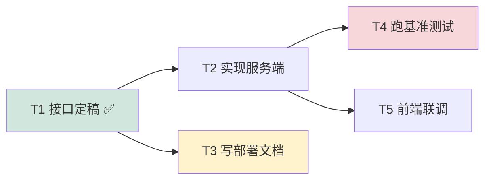
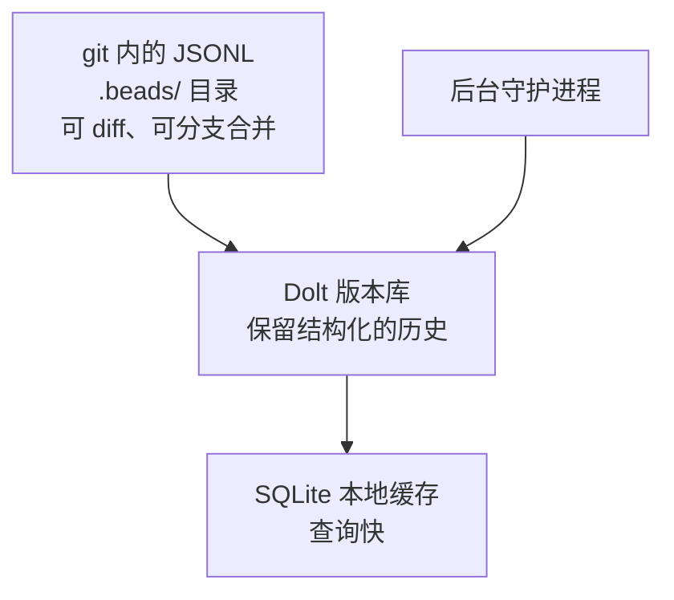
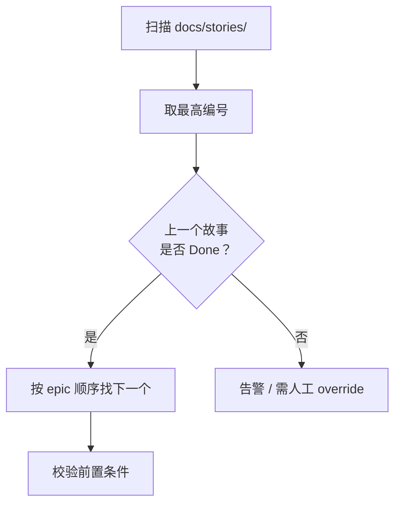

# 给本地 Agent 造一块看板（三）：任务图派——把「下一个任务」变成一次查询

> 本系列共八篇，用同一套七层能力框架（C1–C7）横向解剖开源任务看板。
> 本篇覆盖 `steveyegge/beads`、`eyaltoledano/claude-task-master`、`bmad-code-org/BMAD-METHOD`。
> 元数据于 2026-10-08 经 GitHub API 一手核验。

---

## 一、这一派放弃了看板

上一篇的文件系统派，本质是「把看板换个存储介质」。任务图派的野心更大：**它认为看板这个隐喻本身就是错的。**

看板的说法是"一张张卡片，从左边流到右边"。这个隐喻隐含了一个假设：**任务之间是独立的**。它默认你拿起最左边那张卡就能做，不需要等谁。

真实的多 agent 场景里，这个假设经常不成立。"写部署文档"要等"接口定稿"，"跑基准测试"要等"数据集清洗完"。如果看板不知道这些依赖，那么 agent 取任务时就只能按创建顺序或一个优先级数字去猜——**它随时可能取到一个"前置条件还没满足"的任务，然后在那里空转、报错，或者更糟：基于不存在的产物瞎编。**

任务图派的回答是：**别猜，把它算出来。** 把依赖显式建成图，然后提供一个查询，直接返回"当前真正可以开工"的那批任务。

在上图里，绿色的 T1 已完成；黄色 T3 虽然前置已满足但依赖另一条链；红色的 T4 被 T2 阻塞。**问题"我现在该做哪个"的答案，就是所有"前置全部完成"的节点集合——术语叫就绪集（ready set）。**

---

## 二、三个项目逐个看

### 2.1 `steveyegge/beads`（27,733★，MIT，Go）—— 这一派唯一的地基级项目

**它不是看板，它是队列底座。** 自称"为 AI agent 设计的、分布式、git 支撑的图式 issue tracker"。

先看它最容易被忽略、却最关键的设计——**它把"就绪"做成了一条命令**：

- **`bd ready` 直接返回"无未满足阻塞"的可执行任务。** 注意这跟"列出所有 todo"是两回事。它做的是一次**依赖闭包求解**，返回的是一份已经算好的可执行清单。agent 不需要理解依赖，它只需要取第一条。

围绕这条命令，beads 还解决了另外几个多 agent 场景的硬问题：

- **哈希型 ID（形如 `bd-a1b2`）天然避免冲突。** 多个 agent 或多个分支同时创建任务，不会撞 ID。这是"分布式下 ID 怎么定"的经典解法，也是它敢做多机的前提。
- **层级 ID（epic / task / subtask）。** 让"任务树"和"依赖图"能共存。
- **`bd compact` 语义压缩旧任务。** 把已完成的长历史压成摘要，省上下文——对长跑系统非常重要。
- **agent 心跳存活检测。** 谁还活着、谁掉线了，是可判定的。
- **swarm analysis 计算最大并行度。** 直接回答"这个图现在最多能并发几个 agent"。
- **federation 支持多机 worker 共享同一任务库。**

存储设计是它的另一个亮点，叫"二象性存储"：

**JSONL 存进 git（可 diff / 可合并）+ Dolt 版本库（结构化历史）+ SQLite 本地缓存（查询性能）**，三层各司其职。这是一个很成熟的取舍：既要"像文件一样可审计"（上一派的核心优势），又要"像数据库一样可查询"（本派的核心优势）。

**客观评价**：它是目前唯一把**多 agent 并发 + 跨机 + 心跳 + 就绪集查询**四件事都做出来的开源件。仓库约 174 MB、1,385 个未关 issue、2026-10-08 仍有提交，活跃度实打实。

**但它不是给"单人单机"设计的。** 二象性存储、后台同步守护进程、federation，这些都服务于多机多用户的复杂场景。对本系列的目标场景（单人单机、只求别让 agent 空转）来说，它有一部分复杂度是"不需要的"——**但这部分复杂度并不构成负担，因为它以"你可以不用"的方式存在。**

### 2.2 `eyaltoledano/claude-task-master`（28,180★，NOASSERTION，JavaScript）—— 「取下一个任务」最标准的实现

**它回答的是单会话场景：一个 agent，我怎么让它一直有活干。**

工作流是：PRD → 结构化任务图（`tasks.json`）→ MCP 取下一个任务。具体来说：

- `.task-master/tasks/tasks.json` 随 git 版本化；
- MCP server 暴露 `get_next_task` / `complete_task` / `get_task_tree` 三个工具；
- 依赖图（DAG）+ **复杂度评分** + **tags 作泳道**（如 backlog / in-progress）。

它的价值在于"标准"：**如果你要设计"agent 取下一个任务"的接口，`get_next_task` 这个形状是最小、最直接的。**

**两个必须标注的问题：**

1. **许可证是 NOASSERTION，实际为 MIT + Commons Clause。** Commons Clause 的核心含义是**禁止转售**——你可以自用、可以改，但不能把它本身当商品卖。二次开发前必须逐字确认。本系列把它列出来，是因为它在同类项目里星数最高、被引用最多，**不代表它可以直接拿来当依赖**。
2. **近半年未更新。** 最近一次 push 为 2026-04-28，而同期 beads / BMAD 都在持续提交。结合"无守护进程、无额度概念"的设计，它的定位更适合被读成**一个思路模板**，而不是一个在维护中的系统。

### 2.3 `bmad-code-org/BMAD-METHOD`（53,893★，NOASSERTION，Python）—— 文件系统即状态机，且算法是确定性的

**这一派里思路最"古典"、也最值得细读的一个。**

它模拟一个"虚拟团队"，把状态机直接架在文件系统上：

- 故事文件：`docs/stories/{epic}.{story}.story.md`；
- 状态流转：`Draft → Approved → InProgress → Review → Done`。

真正有意思的是**它选下一个故事的算法**。BMAD 的 Scrum Master agent 用的不是"让模型读一遍目录然后决定"，而是一个**确定性算法**：

**"扫目录 → 取最高编号 → 检查上一个是否 Done → 按 epic 顺序推进 → 校验前置条件"**——这套逻辑完全确定，不依赖模型判断。这是一个被低估的设计选择：**把"该做哪个任务"从"模型的自由发挥"降级成"一段可测试的代码"。**

它还有一个很实用的机制叫 **core-dump 任务**：把会话上下文压缩成一份 token 高效的交接文件，让下一个接手的 agent 不必重读全部历史。这个模式在长跑系统里几乎必然要用到。

**它的问题也正是"古典"带来的：它由人在 IDE 内逐步触发，不是自主编排。** 53,893★ 的体量说明这套方法论有大量拥趸，但它的执行者是"坐在 IDE 前的开发者"，不是"无人值守的调度器"。把一个为人设计的流程自动化，中间的差距比看上去大。

---

## 三、优劣对照

| 维度 | beads | claude-task-master | BMAD-METHOD |
|---|---|---|---|
| **C1 看板呈现** | ❌ 本体非看板（社区有多个第三方 UI） | ⚠️ 有任务树视图 | ⚠️ 靠文件与 IDE |
| **C2 原子领取** | ✅✅ hash ID + 就绪查询 + 心跳 | ⚠️ 单会话语义 | ❌ |
| **C3 定时扫描** | ✅ 后台守护进程同步 | ❌ 无 | ❌ 人工触发 |
| **C4 异构 agent 驱动** | ❌ 不负责 | ⚠️ 走 MCP | ❌ 不负责 |
| **C5 执行隔离** | ❌ 不负责 | ❌ | ❌ |
| **C6 产出验收** | ⚠️ 有 issue 关闭语义，无产物契约 | ❌ | ⚠️ 有 Review 状态，无自动质量门 |
| **C7 额度感知** | ❌ | ❌ | ❌ |
| **依赖图 / 就绪集** | ✅✅ `bd ready` | ✅ `get_next_task` | ✅ 确定性算法 |
| **多机 / 分布式** | ✅✅ federation + Dolt | ❌ | ❌ |
| **活跃度（2026-10-08）** | ✅✅ 当天仍有提交 | ⚠️ 近半年未更新 | ✅ 当天仍有提交 |
| **许可证风险** | MIT，干净 | ⚠️ MIT + Commons Clause | ⚠️ NOASSERTION |

**一个必须说清楚的判断**：这三个项目里，只有 beads 可以被当成"系统的地基"来用。另外两个更适合被读成**具体机制的参考**——claude-task-master 给你"取下一个任务"的接口形状，BMAD 给你"用确定性算法替代模型判断"的思路。把它们的模式搬进自己的 supervisor，比把它们当依赖更划算。

---

## 四、三条设计启示

### 启示一：「下一个任务是什么」必须是一次廉价、可重复的查询

这是本派最核心的贡献，也是与文件系统派最本质的差别。

让 agent "自己读一遍 Markdown 目录，分析依赖，决定做哪个"，看起来更灵活，实际上有三个致命问题：**不可重复**（同样输入可能得到不同答案）、**不廉价**（每次决策都烧一遍上下文）、**不可审计**（出了错说不清是推理错了还是数据错了）。

把它做成一条命令（`bd ready` / `get_next_task`）之后，这三条同时解决：决策变成确定的、成本从"一次模型调用"降到"一次索引查询"、错误可以被复现。

**这条启示可以直接迁移**：任何多 agent 编排系统的调度核心，都应该是"查询就绪集"而不是"让模型挑一个"。

### 启示二：依赖图的真正价值不是"好看"，是"防止 agent 空转"

看板能显示状态，但**显示不了"为什么这张卡现在不能做"**。依赖图补上的正是这一块。在无人值守场景里，这一点被放大：一个取到阻塞任务的 agent，后果不是效率低一点，而是**它可能开始编造前置产物**——这是比空转严重得多的失败模式。

所以依赖建模不是"锦上添花的可视化"，而是**防止幻觉产出的基础设施**。

### 启示三：确定性算法 > 模型判断，凡是可以确定的就不要交给模型

BMAD 的 Scrum Master 算法值得反复看：它没有说"让 agent 看看哪个故事该做"，而是写了一段可测试的代码。

这个原则在多 agent 系统里应该被当成默认：**凡是能用代码确定的事——任务排序、依赖校验、租约判定、失败分类——就绝不要交给模型的自由发挥。** 模型应该被用在真正需要判断的地方（比如"这份产出是否有价值"），而不是浪费在"按编号取下一个"这种事上。

---

## 五、这一派与本场景的关系

任务图派没有解决"看板呈现"（C1），也完全没碰"产出验收"（C6）与"额度调度"（C7）。**但它解决了整个系统里最难被替代的一层：调度决策。**

这带来一个清晰的结论：**如果要自研 supervisor，调度核心应该照抄任务图派（查询就绪集），而不是照抄看板派的"列 + 状态"。**

下一篇换到另一个极端：不谈依赖、不谈并发，只看"一个人 + 一台机器，怎么用最少的东西把看板立起来"。

---

**系列导航**

- 一、[总览：看板只是壳，调度与验收才是本体](/posts/2026-10-08-agent-kanban-00-overview/)
- 二、[文件系统派：把看板塞进 Git 仓库，代价是什么？](/posts/2026-10-08-agent-kanban-01-filesystem-kanban/)
- 三、任务图派：把「下一个任务」变成一次查询 ← 本篇
- 四、[极简单机派：一个二进制、一条命令](/posts/2026-10-08-agent-kanban-03-minimal-local/)
- 五、[自主编排派：把「人」从执行环路里拿出去](/posts/2026-10-08-agent-kanban-04-autonomous-orchestration/)
- 六、[多 Agent 工作台派：派单模型与认领模型的分野](/posts/2026-10-08-agent-kanban-05-agent-workbench/)
- 七、[平台内置派：当看板成为 Agent 运行时的一等公民](/posts/2026-10-08-agent-kanban-06-platform-native/)
- 八、[日落的教训与横向对照](/posts/2026-10-08-agent-kanban-07-sunset-and-synthesis/)
