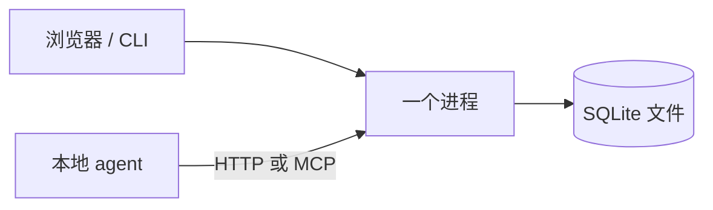

# 给本地 Agent 造一块看板（四）：极简单机派——一个二进制、一条命令

> 本系列共八篇，用同一套七层能力框架（C1–C7）横向解剖开源任务看板。
> 本篇覆盖 `rgracey/kanban-mcp`、`nerkoman/agent-kanban`、`mintopia/cocopilot`、`AdamManuel-dev/task-kanban-mcp`、`SimonBlancoE/kanban-mcp`。
> 元数据于 2026-10-08 经 GitHub API 一手核验。

---

## 一、这一派的共同追求：把"部署"这件事消灭掉

前两派都在解决"看板该放在哪"（仓库里 / 依赖图里）。这一派不关心这个，它的目标极其单纯：**让一个人在一台机器上、用一条命令，把看板立起来。**

于是它们的形态高度一致：

一个进程、一个 SQLite 文件、一个 HTTP 面（外加可选一个 MCP 面）。没有 Docker、没有外部数据库、没有鉴权体系。

这个追求是合理的——本系列的目标场景就是"单人单机"。**但这一派的表现也最参差：它的能力上限不低（有的做到了相当完整的自动派单），可它的存活率是全系列最差的。**

先把项目摆出来。

---

## 二、五个项目逐个看

### 2.1 `rgracey/kanban-mcp`（2★，无许可证，Go）—— 部署轻量度的满分答案

**它是"单二进制"这个形态的教科书。**

一个 Go 二进制里，**SQLite + Web UI + MCP server 全部内嵌**，零外部依赖，Web UI 在 `:8080`。功能上也有几个亮点：

- **SSE 实时刷新**（不是轮询）——UI 永远是最新的，不靠定时器硬刷；
- **审计历史时间线**——每张卡都有一条可回看的事件轨；
- **blocking relations + `ready` action**——它有依赖阻塞概念，且 `ready` 动作会返回"未被阻塞的工作"。这一点让它比纯看板更靠近任务图派；
- 明暗主题。

**但它的三个红灯同时亮：** 2★、**没有 license 文件**、2026-02 之后停更。而且它**没有自动领取的守护进程**——`ready` 是一个你主动调的动作，不是一个后台循环。

**结论：当部署形态的参照读，不当依赖。**

### 2.2 `nerkoman/agent-kanban`（4★，MIT，Python）—— 语义上最贴合本场景的开源看板

**如果只看功能设计，它是这一派里最接近"看板上发任务 → agent 自动干完"的项目。**

形态：SQLite + FastAPI，明确写着 `no auth, no cloud`，支持多项目（URL 路由 `/p/{slug}`），明暗主题，拖拽。

它有三处设计特别值得看：

**① Inbox watcher —— 用"丢文件"发布任务。**

往 `kanban_data/inbox/` 丢一个 `.md` 文件，**5 秒内就会生成一张卡**。而且这个 watcher 的监听目录**可以指向任意路径**——文档里直接举例可以指向 `~/.claude/projects/*/memory/inbox/`。

这个设计很聪明：它把"发布任务"的成本降到"写一个文件"。对 agent 来说，这比调 API 还便宜；对人来说，这就是记事本。**这是全系列里"人给系统投喂"最优雅的实现之一**（与后面会讲的 Nimbalyst 的移动端投喂是同一类思路的不同形态）。

**② Agent launcher —— 卡片落到 Approved，自动起 headless agent。**

`examples/agent-launcher/` 演示了一条完整链路：**卡片被拖到 `Approved` → headless Claude Code 开始工作 → 干到 `Testing`**。并且带 `timeout`、`max_concurrent`（并发上限）、`max_runs`（重跑上限），失败了就落到 `blocked` 并附上失败原因。

这一段就是 C2+C3+C4 的一个小型实现。

**③ Automation rules —— 事件驱动的自动化规则。**

`rules.json` 里可以写：**触发条件**（`task_moved` / `task_idle` / `blockers_done` / `task_count_in_status`）→ **动作**（`move` / `comment` / `assign` / `set priority` / `archive` / `run a command`）。并且支持 WIP 上限、暂停开关、**热重载**。

工作流是 9 列：`Backlog → Approved → Analyst → In progress → Testing → UAT → Done`，外加 `Blocked` / `Cancelled`。另有 MCP server（16 个工具）与 webhooks（Slack / Telegram / 通用）。

**它的硬伤只有一个，但是致命的：4★，2026-05 建库，单人维护。** 功能设计几乎命中了本场景的 C1–C4，却没有任何迹象表明它会长期存在。**这是本系列反复出现的一个模式——设计最贴合的，往往是最不安全的。**

### 2.3 `mintopia/cocopilot`（0★，无许可证，Go）—— 领取契约写得最清楚，也已停更

**这个项目在架构上没有任何惊人之处，但它的 API 契约是全系列写得最清楚的。**

它是一块 Web 看板（三列 `To Do / In Progress / Done`，可设"agent 工作目录"）+ 一个供 agent 轮询的 HTTP API。取任务的核心就一个端点：

- **`GET /task` —— 取最老的、尚未被领取的任务，并自动置为 `IN_PROGRESS`。** 注意"取单即占位"是原子语义：一次调用同时完成"查询"和"认领"。
- **无任务时返回 `"No tasks available. Wait 15 secs for new instructions."`** —— 这不是错误，而是一条**退避指令**：agent 侧 sleep 15 秒再来。
- `POST /save` —— 把任务置为 `COMPLETE` 并保存输出；
- `POST /update-status` —— 换状态；
- `SSE /events` —— 供 UI 实时更新；
- **`parent_task_id` —— 任务链上下文传递**，即父任务的输出可以作为子任务的输入；
- `GET /instructions` —— 返回给 agent 的初始指令模板。

**把这七个端点连起来读，就是一套完整的"轮询领取"协议**：取单即占位、无单即退避、完成后回写、父子传上下文。

它的命运也很典型：**0★、无 license、2026-02 停更。**

### 2.4 `AdamManuel-dev/task-kanban-mcp`（2★，无许可证）—— 有独占锁，也有取下一个任务

形态很小（约 14 MB 的 TypeScript 项目），但机制上抓到了两个重点：**独占锁**与 **`get_next_task`**。

前一个是 C2 的核心（防止并发领取），后一个是任务图派的核心（就绪查询）。一个 2★ 的个人项目同时想到了这两点，说明这两个需求是"自然而然会浮现"的——反过来说，那些做了看板却没做这两件事的项目，缺的不是能力，是场景意识。

红灯照旧：2★、**无 license**、最近一次提交停留在 2025-10-28。

### 2.5 `SimonBlancoE/kanban-mcp`（0★，MIT）—— 唯一的 MIT，且引入了"角色分工"

这一派里为数不多带了许可证的项目（MIT）。它的特色是**角色分工**——把 agent 分成 Architect / Agent / QA 三种角色，并有一套被称为"三层学习"的机制。

**角色分工这个思路本身值得记下**：它对应的是 C6（产出验收）——让"写的人"和"验的人"不是同一个，是质量门最简单的一种形态。（第五篇会看到 `saltbo/agent-kanban` 把这个思路做得更严格：**提交的产出必须由一个"不是执行者本人"的授权主体来接受或驳回**。）

红灯：0★，2026-01 后未更新。

---

## 三、一个必须点明的结构性事实：这个流派全是 0–4 星

把本篇五个项目的星数排一下：**4、2、2、0、0。**

这不是偶然。整个本系列中，"极简本地看板"这个位置，**几乎被个人项目占满，没有任何一个成熟团队在做它**。

对这个事实有两种读法，都需要说清楚：

**读法一：这个位置不值得做。** 因为它太容易做——SQLite + 一个 HTTP 面 + 一个 SPA，一个周末就能写完。没有技术壁垒，也就没有商业价值，于是没人维护。这解释了为什么它们的停更率高得惊人。

**读法二：这个位置的需求是真的，只是被更重的产品吃掉了。** 想在本机管 agent 任务的人，最后往往转头去用了带 Electron 界面的工作台（第五篇）或者内置于 agent 平台的能力（第七篇）——因为它们多花的那点部署成本，换来了持续的维护。

无论采哪种读法，**选型结论都一样：这一派的项目可以当参照实现读，不能当依赖。**

---

## 四、优劣对照

| 维度 | 评价 |
|---|---|
| **C1 看板呈现** | ✅ 中上。单二进制内嵌 Web UI、拖拽、SSE 实时刷新、明暗主题，体验都不差。 |
| **C2 原子领取** | ⚠️ 分化。cocopilot（取单即占位）、task-kanban-mcp（独占锁）做对了；其余靠人拖。 |
| **C3 定时扫描** | ⚠️ 部分。nerkoman 的 Inbox watcher 是轮询监听，但"扫描待办并派单"仍需外部驱动。 |
| **C4 异构 agent 驱动** | ⚠️ nerkoman 的 agent launcher 只演示了 Claude Code 一条线；其余只提供 MCP 工具，让 agent 自己来取。 |
| **C5 执行隔离** | ❌ 普遍缺失。 |
| **C6 产出验收** | ❌ 缺失。SimonBlancoE 的角色分工是唯一的方向性尝试。 |
| **C7 额度感知** | ❌ 完全缺失。 |
| **部署轻量度** | ✅✅ 全系列最高。单二进制零依赖，或 `python`+`fastapi` 一条命令。 |
| **工程成熟度** | ❌❌ 全系列最低。五个项目里三个无许可证，停更率过半。 |

---

## 五、三条可迁移的启示

### 启示一：「最小可用看板」的形态可以精确描述

把这一派里做得最干净的几个叠起来，最小可用形态就是：

> **一个 SQLite 文件 + 一个 HTTP 端点集 + 一个实时推送通道（SSE）+ 一个 MCP 面。**

四个部件，缺一不可，也没必要更多。SQLite 负责持久化，HTTP 负责 agent 侧读写，SSE 负责人侧实时，MCP 负责让 agent 用工具的方式操作它。

这个形态可以直接作为自研看板的起点——**而且要意识到：这一层几乎不构成工作量，别在这里花时间。**

### 启示二：轮询领取的契约，cocopilot 已经写对了

这是本篇最有价值的可复用资产。一个"取单"接口要考虑的其实只有三件事：

| 情形 | 正确响应 |
|---|---|
| 有可领任务 | 原子地"取回 + 置为进行中"，返回任务内容 |
| 没有可领任务 | **返回一条退避指令**（比如"15 秒后再来"），而不是空对象或错误 |
| 任务之间有依赖 | 用 `parent_task_id` 之类的字段显式传递上下文 |

第三点在其它派别里常常被忽略：**如果父任务的产出不能自动流到子任务，那么"任务链"就只是名义上的链。**

### 启示三：低星不等于设计差，但等于不能依赖

本篇最反直觉的一点是：**功能设计最贴合需求的 `nerkoman/agent-kanban`（4★）与契约设计最清晰的 `mintopia/cocopilot`（0★），恰恰是最不能用的两个。**

这不是说它们做得不好，而是说明一件更根本的事：**在开源里，"能不能用"由维护状态决定，"好不好"由设计决定，两者几乎不相关。** 任何把 4★ 项目写进生产依赖的人，都在赌一个陌生人的兴趣能持续多久。

**正确的用法**：把它们的设计读出来，搬进自己的实现。这两件事的成本差距，可能只有一个周末。

---

## 六、这一派与本场景的关系

极简单机派证明了：**"把看板立起来"不是问题。** 一个进程、一个 SQLite 文件、几个端点，就够了。

但它也暴露了本场景真正的难点不在这一层：**C5 执行隔离、C6 产出验收、C7 额度感知，这一派一个都没碰。** 而这三层恰好构成了"能不能无人值守跑出有价值的东西"。

下一篇进入本系列最关键的篇章：三个明确主张"把**人**从执行环路里拿出去"的项目——它们是全系列里离目标最近的一批，也是补检中新发现的、此前几轮调研完全遗漏的一批。

---

**系列导航**

- 一、[总览：看板只是壳，调度与验收才是本体](/posts/2026-10-08-agent-kanban-00-overview/)
- 二、[文件系统派：把看板塞进 Git 仓库，代价是什么？](/posts/2026-10-08-agent-kanban-01-filesystem-kanban/)
- 三、[任务图派：把「下一个任务」变成一次查询](/posts/2026-10-08-agent-kanban-02-task-graph/)
- 四、极简单机派：一个二进制、一条命令 ← 本篇
- 五、[自主编排派：把「人」从执行环路里拿出去](/posts/2026-10-08-agent-kanban-04-autonomous-orchestration/)
- 六、[多 Agent 工作台派：派单模型与认领模型的分野](/posts/2026-10-08-agent-kanban-05-agent-workbench/)
- 七、[平台内置派：当看板成为 Agent 运行时的一等公民](/posts/2026-10-08-agent-kanban-06-platform-native/)
- 八、[日落的教训与横向对照](/posts/2026-10-08-agent-kanban-07-sunset-and-synthesis/)
