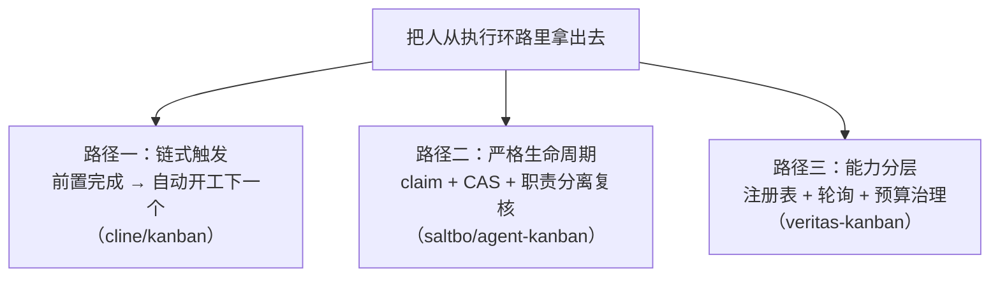

# 给本地 Agent 造一块看板（五）：自主编排派——三个最接近目标的项目

> 本系列共八篇，用同一套七层能力框架（C1–C7）横向解剖开源任务看板。
> 本篇覆盖 `cline/kanban`、`saltbo/agent-kanban`、`BradGroux/veritas-kanban`。
> 元数据于 2026-10-08 经 GitHub API 一手核验；机制描述取自各仓库 README 与架构文档原文。

---

## 一、为什么这一派要单独成篇

前面三派各自缺一大块：文件系统派缺守护进程与验收；任务图派只解决调度决策；极简单机派几乎没碰 C5–C7。

这一派不同。这三个项目**都明确主张同一件事：把人从执行环路里拿出去。**

- `cline/kanban` 的措辞是"更适合并行跑大量 agent 并审查 diff 的 IDE 替代品"；
- `saltbo/agent-kanban` 的标语直接是 **"Don't babysit your agent. Take human out of the loop."**；
- `veritas-kanban` 则是"local-first 的任务管理看板 + 可选的 AI agent 编排层"。

而它们的覆盖度也确实更高——**其中 `veritas-kanban` 是本系列唯一一个同时具备"配额预算"与"产出评分"的项目**，这直接推翻了早期调研"C6/C7 完全空白"的判断（详见总览篇第二节）。

需要坦白一件事：**这三个项目在前几轮检索里全部被漏掉了。** 漏掉的原因很简单——检索词一直围绕 `kanban` 打转，而这三个项目的自我描述分别是"IDE replacement"、"mission-control board"、"task management board with agent orchestration"，名字或描述里根本没有那个词。

这本身就是一条方法论结论：**当你要找的是"机制"时，用"名字"检索会系统性地漏掉最好的答案。** 所以本篇开头先把这个教训摆出来。

---

## 二、三个项目逐个看

### 2.1 `cline/kanban`（1,353★，Apache-2.0，TypeScript，标注 Research Preview）

**它的关键词是"链"。**

用法极简：在任意 git 仓库根目录跑 `npx kanban`，它会**自动探测你本机已安装的 CLI agent**，然后在浏览器里起一个本地 Web 服务。无需账号、无需配置。

核心机制逐条列：

- **每张卡自动获得独立的终端与 worktree。** 不需要你手动 `git worktree add`——点卡上的播放按钮，它就为这个任务建一个临时 worktree，多 agent 并行互不冲突。
- **一个很实用的细节**：它会把 `node_modules` 这类被 gitignore 的文件用**符号链接**接进每个 worktree，从而避免"每份副本都要重跑一次 `npm install`"。
- **卡片链接 = 依赖链。** `⌘+click` 把一张卡连到另一张，**当前置卡完成并被移入回收站时，被链接的任务会自动开始。**
- **这个机制叠加"自动提交"之后，就变成了端到端的自主链**。README 原文的描述是：一个任务完成 → 提交 → 触发下一个 → 重复。它还建议你直接让 agent 把大任务拆成会"自动提交"的子任务，并声称 agent 会"巧妙地按最大化并行的方式拆解，并把任务链接起来以实现端到端的自主性"。
- **用 hook 把每张卡的最近一条消息或工具调用显示在卡片上**——目的是"一眼扫过上百个 agent 而不必逐个打开"。
- 自带检查点系统（可以看到"从你上次发消息以来"的 diff）、行内评论回传给 agent、`Commit` / `Open PR` 按钮（发一条动态提示让 agent 把 worktree 转成提交或 PR 分支并处理冲突）、记录 resume ID 以便恢复。

**它的边界很清楚，而且作者自己写在了 README 顶部：**

> Kanban is a research preview and uses experimental features of CLI agents like bypassing permissions and runtime hooks for more autonomy.

**客观评估：**

- ✅ **它是独立项目里把"依赖链自动开工"做得最自然的一个**。卡片链接 + 自动提交这套组合，实际上已经把 C2（领取）与 C3（触发）用一种非传统方式实现了——谁来"领"这件事被"链"绕过去了。
- ✅ 工程细节成熟（worktree 符号链接、检查点、hook 卡片摘要），这是 Cline 团队的产品功底。
- ⚠️ **但它没有"任务池 + 空闲 agent 抢单"的语义。** 起点仍然是"人建卡、人点播放"，自主性体现在**链的传导**上，而不是**池子的认领**上。
- ❌ 没有额度感知；没有产出质量门（只有人看 diff）。
- ⚠️ **标注"研究预览"且明确依赖 CLI agent 的实验性特性**，1,353★ 对应 314 个未关 issue，稳定性预期要放低。

### 2.2 `saltbo/agent-kanban`（486★，FSL-1.1-ALv2，TypeScript）—— 全系列生命周期最严格

**这个项目的价值不在功能多，而在它把"自主编排"当成一门严肃的生命周期工程来做。**

它的自我定位是 **"mission-control board for autonomous software agents"**，并且有一段很精确的表述：

> takes humans out of the execution loop without removing human control: people observe work, inspect execution, and make review decisions, while Agents operate Boards and Tasks through stable, machine-discoverable interfaces.

注意后半句的反面："**把人不放进执行环路，但不拿走人的控制**"。这句话定下了它的全部设计取向。

**① 任务生命周期（这是全系列最值得抄的一段设计）**

它的任务状态机原文是这样的：

```text
todo
  ├─ assign ─► todo + assigned actor
  │              └─ claim ─► in_progress
  │                            └─ submit review ─► in_review
  │                                                  ├─ reject ─► in_progress
  │                                                  └─ complete ─► done
  └──────────────────────────── cancel ─────────────► cancelled
```

关键点有三处，都不是"看板会不会做"的层次，而是并发正确性的层次：

- **`assign`（派单）本身不启动任何执行。** 原文说：分配只是把 agent 标识写进 `assignedTo` 并原子地记录一条"启动意图"，**它不会同步去调用或启动一个会话**。任务从 `in_progress` 的跃迁，只能由 **claim** 触发。
- **只有被验证过的那个 agent 主体，才能为自己的任务创建 claim。** 换成"谁来执行"这件事不能由请求方随意指定。
- **复核必须由"不是执行者本人"的角色完成。** 一个授权的人，或者**另一个被授权的 agent**，才能把任务从 `in_review` 推回去或推出去。这是**职责分离**。

**② 并发控制用的是比较交换（CAS）**

原文：每次任务 PATCH 都读取当前版本号并以内部 compare-and-swap 提交；**并发修改会返回 `409 Conflict`**，让调用方重新读取。

这一句把它的工程质量和其他项目拉开了距离。绝大多数看板项目对并发写入没有明确语义（谁后写谁赢），而它把 409 作为一等响应。

**③ 领取凭证是"验证过的"，不是"自报的"**

原文：**claim 会把 `runtime` 与 `session_id` 这两项溯源信息，从已验证的签名绑定中复制过来；这些值不接受来自请求 JSON 的输入。**

这一条解决的是一个很实际的信任问题：agent 声称"我是用某某运行时、某某会话跑的"，这句话本身不可信；可信的是它携带的、由签发方背书的绑定。

**④ 依赖与跨租户防护**

任务的依赖被存成任务之间的关系；**只要任一依赖既不是 done 也不是 cancelled，该任务就被计算为 blocked**；递归检查会**拒绝依赖环与跨租户的关系**。

**⑤ 明确"没做"的东西，这一点很诚实**

文档直接写明：**延迟调度没有实现**。`scheduledAt` 字段为兼容保留，但创建或更新时若传非空值会返回 `422`。

**客观评估：**

- ✅ **全系列最严格的并发与生命周期设计**：CAS、签名溯源的 claim、职责分离的复核、依赖环拒绝。这几条在别处都没有同时出现。
- ✅ 依赖是"计算出来的阻塞"（computable blocked），而不是一个手工维护的状态字段——这正是第三篇强调的正确做法。
- ❌ **部署形态与本场景冲突**：它是 **Cloudflare 原生**——React 应用与 Hono API 作为同一个 Worker，底座是 D1（Cloudflare 的托管数据库）。这是云原生架构，不是"本地文件系统"。
- ❌ **没有定时调度**（`scheduledAt` 直接拒绝），意味着它不打算做"定时扫描"这一层。
- ⚠️ **许可证是 FSL-1.1-ALv2，不是 OSI 认可的开源许可。** 它限制与产品竞争的商用，通常约定一段时间后转为 Apache-2.0。把它当依赖之前必须逐字确认条款。

### 2.3 `BradGroux/veritas-kanban`（838★，MIT，TypeScript，v6.2.1）—— 覆盖度最完整的独立项目

**如果整个系列只能挑一个项目细读，选它。** 理由是：它是本系列唯一一个**同时具备配额预算、产出评分、Agent 心跳注册表**的项目。

先看它的定位措辞：**"Local-first task management board with optional AI agent orchestration."**

这个措辞里最重要的词是 **optional**。它的架构是**分层可选**的：先起一块本地的看板；然后按需叠加 CLI、MCP、OpenClaw、Squad Chat webhooks、workflows、governance。文档把它拆成 board-only / CLI / MCP / OpenClaw / self-hosted 几条清晰的搭建路径。

这一点在设计上非常值得称赞：**它把"复杂度"变成了用户的选择，而不是强制负担。** 一个只想要好看看板的人，不会被迫吞下整个编排引擎。

现在看它到底有什么。以下全部是 README 原文的能力项：

**① 领取与心跳（C2 / C3）**

- **Agent registry** —— 带**心跳追踪（heartbeat tracking）**、能力声明与实时状态的服务发现；
- **Efficient Polling** —— 一个 `/api/changes?since=...` 端点，**带 ETag 支持**，专门为"agent 高效轮询看板变更"而优化。

**注意这两个机制合起来的含义**：agent 注册自己、被追踪心跳、然后通过一个增量变更端点轮询取任务。这正是**本系列从第一篇就在描述的"定时扫描 + 领取"架构**，而它是第一个把这一层作为独立能力暴露出来的独立项目。

**② 额度与预算（C7）—— 全系列唯一**

> **Agent budget enforcement** —— 对 workspace / agent / workflow / workflow-agent / per-run 多个层级设置上限，覆盖 **tokens、成本、工具调用数、运行时长、重试次数、扇出**；超限时的动作是**可审计的"告警 / 审批 / 降级 / 暂停 / 取消"**。

**③ 产出评审（C6）—— 全系列唯一**

> **Output Evaluation** —— 按加权、有界的评分标准档案对 agent 产出打分，支持**正则、关键词、数值区间、出现比例**等判据。

再加一条相关的：**Decision Audit Trail**（记录 agent 决策的置信度、支撑证据、显式假设，并在事后回填结果以检验假设是否成立）。

**④ 安全档位与策略（对应早期调研判定的"空缺"）**

> **Policy Engine** —— 用 `allow` / `deny` / `require-approval` 三种规则定义 agent 能做什么；**Sandbox Policy Presets** 把文件系统、网络、环境变量、凭证规则打包复用；**不支持的必要控制项会在启动前直接失败（fail closed）**，并留下脱敏审计痕迹。

还有 **Behavioral Drift Detection**（给指标设基线与阈值，行为偏离时告警）与输出反馈闭环。

**⑤ 工作流引擎**

> YAML 定义的**多步 agent 流水线**：顺序步骤、并行扇出/扇入、集合上的循环迭代、**带人在环路中的门禁审批**、重试路由。官方自己的比喻是"**像 GitHub Actions，但是给 AI agent 的**"。

**⑥ 工程与协作层**

每任务独立 worktree；统一 diff 查看器 + 行内评论的代码评审；审批流（批准 / 要求修改 / 驳回）；可视化合并冲突解决；直接从任务面板建 GitHub PR；**与 GitHub Issues 双向同步（含 label 映射）**；Squad Chat 给 agent 一个共享通信频道（带 spawned / completed / failed 生命周期事件）；权限分级 Intern / Specialist / Lead；单任务可指派多个 agent。

**⑦ 供应商与生态**

Codex 被当作一等 agent（`codex exec`、SDK 会话、`@codex` GitHub 委派、workflow 步骤、MCP）；另有 Ollama 本地/云与 LM Studio 本地档位作为可选路由目标。文档里还提到一种组合形态：**Veritas 作为真相源（source of truth），由 HermesAgent / Hermes Gateway 充当执行控制平面。**

**客观评估：**

- ✅✅ **C1–C7 基本全覆盖**，且 C6、C7 的实现是全系列唯一的。
- ✅ **MIT 许可证、838★、活跃**（v6.2.1，2026-10-06 仍有提交），工程完整度（CI、变更日志、版本化升级指南）远超同类。
- ✅ **分层可选**的架构让"轻量"与"能力"不再互斥——这是解决本系列"轻量 vs 功能"矛盾最优雅的一种答法。
- ✅ 由 CEO 带团队维护、有配套播客与文档站，**项目存活的概率显著高于本篇另两个**。
- ⚠️ **体量偏大**：约 120 MB 仓库，Node 24 应用，打包分发以 **Mac 桌面应用**为主（`brew install --cask`）。要在 Windows 上用，需走源码路线（Node 应用通常可行，但没有官方打包）。
- ⚠️ **"自主"的方向在公开文档里不够清晰**。它有 agent 注册表、心跳与轮询端点，说明 agent 侧确实在轮询；但"是看板 spawn agent，还是 agent 主动 claim"这件事，没有像 `saltbo/agent-kanban` 那样给出严格的 CAS 语义。所以**它的并发正确性无法从文档层面确认**——这是选型时必须实测的一条。

---

## 三、三个项目横向对照

| 维度 | `cline/kanban` | `saltbo/agent-kanban` | `veritas-kanban` |
|---|---|---|---|
| ★ / 许可证 | 1,353 / Apache-2.0 | 486 / **FSL-1.1-ALv2（非开源）** | 838 / **MIT** |
| 最近 push | 2026-10-01 | 2026-10-02 | 2026-10-06 |
| 部署形态 | 本地 `npx`，浏览器 UI | **Cloudflare Worker + D1（云）** | 本地源码 / Mac 桌面应用 |
| 自主性实现路径 | **链式触发**（卡片链接 + 自动提交） | **严格生命周期**（claim + CAS + 复核） | **能力分层**（注册表 + 轮询 + 预算） |
| C2 领取语义 | 弱（人点播放起步） | ✅✅ 最强（签名溯源 + CAS） | ⚠️ 有轮询端点，语义待实测 |
| C3 扫描/心跳 | 靠链触发 | ❌ 明确不做定时调度 | ✅ 心跳注册表 + ETag 增量轮询 |
| C6 产出验收 | ❌（人看 diff） | ✅ 职责分离的复核 | ✅✅ 可配置评分档案 |
| C7 额度 | ❌ | ❌ | ✅✅ 多层级预算 + 超限动作 |
| 执行隔离 | ✅ 临时 worktree + 符号链接 | ⚠️ 未在文档中强调 | ✅ 每任务独立 worktree |
| 风险 | 研究预览、依赖实验性特性 | 云原生 + 非开源许可 + 无定时 | 体量较大、Windows 打包缺失 |

---

## 四、四条来自这一派的启示

### 启示一：把"人拿出去"有三条路，而且它们不互斥

这三个项目代表了三种不同的自主化路径：



**这三条路可以叠加。** 一张卡既有链接（路径一），又走 claim 生命周期（路径二），还受预算约束（路径三）——技术上没有任何冲突。**这意味着"自研"其实不必从零设计自主性，而是从这三条路里挑已经验证过的机制拼装。**

### 启示二：越认真的系统，越不允许完全放任

这可能是本篇最反直觉的一点。

**两个设计最成熟的系统（saltbo 与 veritas），都把"复核"当成一等公民而不是可选项**：前者要求产出必须由一个"非执行者本人"的主体接受或驳回；后者提供带人在环路中的门禁审批与治理策略。

这与"让 agent 长时间无人值守跑、把免费额度用满"的直觉**方向相反**。原因不难理解：**能无人值守跑的前提，是你能撤销它做错的事。** 一个不能复核、不能回滚、不能暂停的系统，跑得越久风险越大。真正的工程实践给出的答案是"自动化执行 + 保留审批与回滚"，而不是"全自动"。

### 启示三：全系列唯一做出 C6+C7 的项目，管自己叫 "board with orchestration"，而不是 "kanban"

回到总览篇结论三的规律：**凡是把产出验收与额度约束做出来的项目，都不认为自己是"看板"。**

- `veritas-kanban` 自称"task management board **with optional AI agent orchestration**"；
- `saltbo/agent-kanban` 自称"**mission-control board** for autonomous software agents"。

这个自我定位的差别是实质性的：**把它叫"看板"，模型里就只有卡片和列；把它叫"控制平面"，模型里自然就会有注册表、预算、策略、审计、审批。** 这是本系列最值得带走的一条设计直觉。

### 启示四：一个关键错位——「预算上限」不等于「用满额度」

必须单独点出这一点，因为它直接关系到本场景的原始动机。

**这三个项目对额度的处理，方向都是"约束"而不是"利用"：**

- `veritas-kanban` 做的是**预算上限**（tokens / 成本 / 调用数 / 时长上限，超限就告警、降级、暂停、取消）；
- 其余两个对额度完全没有处理。

而本场景想要的是相反的东西：**在额度耗尽之前尽可能多地干活，甚至跨账号轮换以"吃满"免费额度。**

**这两件事看起来都在谈"额度"，实际上是两个相反的目标。** 业界成熟的系统在做**成本治理**（防止烧光、防止失控），而"额度感知派单"（剩余额度 → 派给谁 → 耗尽换谁）在独立开源项目里**依然是空白**——它只出现在把额度凭证纳入运行时内部的平台里（下一篇的主角）。

这个错位值得记住：**如果你要的是"吃满免费额度"，你不能直接复用任何现成的额度模块，因为它们的设计目标和你相反。**

---

## 五、这一派与本场景的关系

**这是全系列离目标最近的一派，但依然没有现成答案。**

- `cline/kanban` 给了"依赖链自动开工"的现成体验；
- `saltbo/agent-kanban` 给了"并发正确性与职责分离"的现成设计；
- `veritas-kanban` 给了"注册表 + 轮询 + 预算 + 评分"的现成覆盖，且有 MIT 许可与最活的维护。

**但三个都有各自的硬约束**：一个只是研究预览、一个部署在云上且非开源许可、一个体量偏大且 Windows 打包缺失、三个都不做"额度轮换"。

下一篇换一个角度：如果看板不是外挂工具，而是**长在 agent 运行时内部**，会不会反而顺手把额度这件事做对？答案是会——而且这是本系列唯一一个把"额度耗尽"当成显式设计来处理的地方。

---

**系列导航**

- 一、[总览：看板只是壳，调度与验收才是本体](/posts/2026-10-08-agent-kanban-00-overview/)
- 二、[文件系统派：把看板塞进 Git 仓库，代价是什么？](/posts/2026-10-08-agent-kanban-01-filesystem-kanban/)
- 三、[任务图派：把「下一个任务」变成一次查询](/posts/2026-10-08-agent-kanban-02-task-graph/)
- 四、[极简单机派：一个二进制、一条命令](/posts/2026-10-08-agent-kanban-03-minimal-local/)
- 五、自主编排派：三个最接近目标的项目 ← 本篇
- 六、[多 Agent 工作台派：派单模型与认领模型的分野](/posts/2026-10-08-agent-kanban-05-agent-workbench/)
- 七、[平台内置派：当看板成为 Agent 运行时的一等公民](/posts/2026-10-08-agent-kanban-06-platform-native/)
- 八、[日落的教训与横向对照](/posts/2026-10-08-agent-kanban-07-sunset-and-synthesis/)
