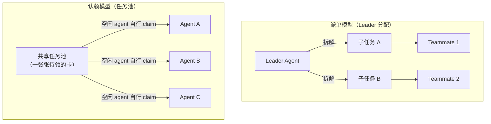

# 给本地 Agent 造一块看板（六）：多 Agent 工作台派——派单模型与认领模型的分野

> 本系列共八篇，用同一套七层能力框架（C1–C7）横向解剖开源任务看板。
> 本篇覆盖 `iOfficeAI/AionUi`、`DanWahlin/ai-agent-board`、`smtg-ai/claude-squad`、`Nimbalyst/nimbalyst`、`langwatch/kanban-code`。
> 元数据于 2026-10-08 经 GitHub API 一手核验。

---

## 一、这一派是最"像产品"的一批

如果说前面几派是"给工程师用的工具"，这一派就是"给人用的产品"：有像样的界面、有自动探测、有向导、有通知、有移动端。

它们的共同强项高度一致：

- **C1 看板呈现**：拖拽、实时流式输出、diff 查看器、行内评论，体验是全系列最好的；
- **C4 异构 agent 驱动**：**启动时自动探测本机已装了哪些 CLI**，这是本派最实用的一项能力；
- **C5 执行隔离**：worktree 隔离几乎是标配，且往往配了自动清理。

它们的共同软肋也高度一致：**C2/C3（自主领取与扫描）与 C6/C7（验收与额度）基本不在射程内。**

而这一切背后有一个更本质的差别，本篇的主要论点就围绕它展开。

---

## 二、核心分野：派单模型 vs 认领模型

先把这个区别讲清楚，因为它解释了本派为什么"功能很多，却依然不能无人值守"。

| | 派单模型 | 认领模型 |
|---|---|---|
| 谁决定任务归属 | 一个中心 Agent（Leader） | 空闲的 agent 自己 |
| 任务有没有"在列上等人来抢"的状态 | **没有** | 有 |
| agent 是长期存活还是被唤起 | 被 Leader 唤起 | 常驻，自行轮询 |
| 新增一个 agent 的成本 | 要改 Leader 的分配逻辑 | 几乎是零 |
| 与"吃满免费额度"的契合度 | 低（Leader 决定谁干活） | **高（谁有额度谁来接）** |

**这个区别对本场景是决定性的。** 因为本场景的动机是"让多个 agent 长时间持续运行、吃满各家免费额度"——这要求系统能**根据 agent 的可用性动态分配任务**，而不是由一个 Leader 预先分好。**认领模型天然适合这件事；派单模型天然不适合。**

而本派的主要项目，做的都是派单。

---

## 三、五个项目逐个看

### 3.1 `iOfficeAI/AionUi`（33,383★，Apache-2.0，TypeScript）—— 量级最大，也是派单模型的典型

**它是本系列里功能覆盖最广的项目**，自述为"面向 OpenClaw、Hermes、Claude Code、Codex、OpenCode 等 20+ CLI agent 的开源 7×24 协作应用"。

能力清单（原文口径）：

- **自动探测本机已装 CLI**，列表里明确包含 **CodeBuddy**、Claude Code、Codex、Qwen Code、Goose、OpenClaw、Augment、Kimi、OpenCode、Factory Droid、Copilot、Qoder、Mistral Vibe、Nanobot、Snow CLI、Kiro、**Hermes Agent**、Cursor Agent；
- **Team Mode**：Leader Agent 接指令 → 拆子任务 → 经内置 Team MCP Server 派给 Teammate → 并行执行 + 异步邮箱 + **写入共享任务看板**；**外部 agent 经 ACP 接入**；支持动态增删 Teammate，静默成员会被自动标记失败；
- **YOLO / Full-Auto Mode**：一键绕过权限提示，支持无人值守；
- **定时任务**：cron（带时区）/ 固定间隔 / 单次触发；运行期间防止休眠、唤醒后检测漏触发；
- WebUI 远程访问 + IM 接入（Telegram / 飞书 / 钉钉 / 微信）。

**它的两处关键差异，必须说清楚：**

**① 它的看板是"派单"产生的，不是"认领"的。** 任务先被 Leader 拆解、再被分配给 Teammate，然后**被写进共享看板**。看板在这里扮演的是**可视化与协作界面**，而不是**任务池**。它与"一张卡静静地躺在列上，等某个空闲 agent 来抢"是两种完全不同的机制。

**② 体量。** 仓库约 **679 MB**，是一个 Electron 桌面应用。这与"轻量"直接冲突。

**结论：不 fork，但必须读它的源码。** 它是"多 CLI 经 ACP 统一接入"最接近现成的参考实现，值得读的文件明确定位在 `tests/e2e/specs/ext-acp.e2e.ts`、`docs/guides/acp-image-output.zh-CN.md` 与 `teamTypes.ts`。

### 3.2 `DanWahlin/ai-agent-board`（63★，MIT，TypeScript）—— 唯一值得考虑 fork 的目标

**在这个派里，它的星数不高，但"可 fork 性"最高。**

形态：拖拽看板（`Backlog / In Progress / Review / Done`），每张任务可以选择一个 agent。启动时**自动探测本机 CLI**（GitHub Copilot / Claude Code / OpenAI Codex / OpenCode / **Hermes** / OpenClaw）。

它的架构亮点在于**抽象层次**：

- 通过 `@codewithdan/agent-sdk-core` 的 **provider pattern**，把多个 agent 归一化到统一的 session / event 模型上——**每个 harness 一个适配器**；
- **WebSocket + xterm.js** 实时流式输出；
- **Task Groups**：一次创建 2–20 个子任务，并可设置并行度；
- **worktree 隔离**（可选），完成后自动清理，支持本地合并或建 PR；
- 支持 **Linux / macOS / Windows**；
- SQLite 零配置默认（也可切 PostgreSQL）；**MIT**。

**它缺的恰好只有一件事：任务自动领取。** 当前是"拖拽触发"。

**为什么说它是最值得 fork 的**：在"不依赖任何特定 agent 平台"的前提下，自己从零写一套多 CLI + worktree + 实时流的 UI，成本远高于把它 fork 过来、补上一个领取循环（外加额度池与验收门）。它已经把最难做对的那部分（provider 抽象 + 进程管理 + 实时流）做完了。

**但要注意**：63★ + 5 个未关 issue，意味着社区很小；fork 之后基本就是你自己维护。

### 3.3 `smtg-ai/claude-squad`（8,580★，AGPL-3.0，Go）—— 终端路线的代表

**它回答的是"能不能在 TUI 里管一堆 coding agent"，答案是可以。**

- **tmux 会话 + git worktree 双隔离**，状态存在 `~/.claude-squad/config.json`；
- **人工创建会话**（`cs new <task>`）；
- 支持 claude / aider / codex / gemini / 自定义 shell；
- 最多 10 个并发；无轮询。

**它的价值在于"证明了终端路线的可行性"**，以及它把"隔离"这件事做成了双层（tmux 层 + git 层）。但它的模型同样是"人建会话"，且星数高而更新慢（2026-08-20 后约两个月未提交）。

**许可证是 AGPL-3.0**——如果你的衍生作品需要对外提供服务，AGPL 的传染性必须提前考虑。

### 3.4 `Nimbalyst/nimbalyst`（1,853★，MIT，TypeScript）—— 唯一在语义上承诺"自动更新看板"

**它的产品语义是本派里最贴近本场景的。**

关键表述是：目标是让 **"agent 读你的 backlog、按上下文排优先级、完成任务后自动更新看板"**。这已经不是"可视化的看板"，而是"可被 agent 读写的状态层"。它同样有多 harness 支持（Claude Code / Codex / OpenCode alpha / Copilot alpha）与 worktree 隔离，存储用本地文件与开放格式，桌面与 iOS 为 MIT（团队层 AGPL）。

**但真正被低估的是它的移动端"Queue next tasks"。**

这句话描述的是：**人可以在手机上往流水线里投喂下一个任务，让流水线保持不空。**

为什么这件事重要？因为本系列一直在说"无人值守"，但几乎所有方案都忽略了一个真实瓶颈：**瓶颈往往不是 agent 干得慢，而是人审环节在空转。** 一个任务跑完进了 `Review`，如果没人看，整个流水线就停在那儿。所有方案里，只有 Nimbalyst 认真对待了"人不在电脑前时怎么给系统投喂与放行"这个问题。

**这是本派最值得带走的一个产品设计。**

### 3.5 `langwatch/kanban-code`（328★，Apache-2.0，Swift + Tauri）—— 把"上下文收敛到卡片"

**它的定位很窄但有启发性**：一块"管理 Claude Code 会话"的看板，macOS 原生（SwiftUI）+ Windows（Tauri）。

机制上：**每张卡把四样东西自动链接在一起——Claude 会话、git worktree、tmux 终端、GitHub PR**。卡片会随着 Claude 干活、开 PR、被合并而从 backlog 流到 done。另有：agent 需要人介入时推送到手机、可把工作卸载到远程服务器执行、防止 Mac 休眠。

它自述的设计目标是：**"把每个 Claude 会话所需的全部上下文，集中收敛到它对应的卡片上，以尽可能缓解现代开发的上下文切换瓶颈。"**

**这句话值得单独摘出来。** 它给出的产品洞察是：一块看板的价值不只是"看进度"，而是**把散落在终端标签页、分支、PR、会话记录里的上下文，收敛到一个可以一眼看懂的对象上**。

两条客观限制：**它是 Claude Code 专用的**（不是异构 CLI）；它支持 Windows 是通过 Tauri 另做一份，而非原生跨平台。

---

## 四、优劣对照

| 维度 | 评价 |
|---|---|
| **C1 看板呈现** | ✅✅ 全系列最强。拖拽、实时流、diff 查看、行内评论、通知、移动端。 |
| **C2 原子领取** | ❌ 基本缺失。多数是"人拖拽触发"或"Leader 派单"，没有任务池认领语义。 |
| **C3 定时扫描** | ⚠️ AionUi 有 cron 定时任务（但那是"定时唤起 agent"，不是"扫描任务池派单"）。 |
| **C4 异构 agent 驱动** | ✅✅ 全系列最强。自动探测本机 CLI，provider 抽象，部分已走 ACP。 |
| **C5 执行隔离** | ✅✅ 标配。worktree 隔离 + 自动清理；claude-squad 做到 tmux + git 双隔离。 |
| **C6 产出验收** | ❌ 缺失。有人工 review 界面，但没有自动化质量门。 |
| **C7 额度感知** | ❌ 缺失。 |
| **部署轻量度** | ❌ AionUi 约 679 MB；kanban-code 是原生桌面应用。唯二轻的是 ai-agent-board（~3.6 MB）与 claude-squad（~3.4 MB）。 |
| **存活力** | ✅ 星数与活跃度最高的一派；但 AionUi 有 938 个未关 issue，claude-squad 已约两月未更新。 |

---

## 五、三条可迁移的启示

### 启示一：做"环境探测"而不是"配置填写"

这一派最实用的一项能力，是**启动时自动探测本机装了哪些 CLI**，而不是让用户手写配置。

对本场景的价值很直接：**同一份看板配置要能同时驱动 CodeBuddy / Codex / Trae / CodeArts，而这些工具在不同机器上的安装路径、版本、可用性都不同。** 让用户为每个 CLI 手写一遍启动命令，是把"环境探测"这件本可自动化的事推给了人。

**设计动作**：为每个支持的 CLI 写一个能力探测函数，返回三态——**可用 / 需要配置 / 不可用**，并在 UI 上直接呈现。第三篇提到的 `emo-xiaoyu/harness-mix` 用一个"可执行路径可被环境变量覆盖"的约定做这件事，是很轻的实现。

### 启示二：把「反向通道」当一等公民

Nimbalyst 的"移动端投喂"提示了一个全系列普遍忽略的事实：**无人值守的瓶颈通常不在执行侧，而在审批侧。**

一张卡跑完进了 `Review`，系统就会停在那里等一个"人"。如果人不在电脑前，整条流水线就空了——而这时候 agent 的额度正在白白流逝。**所以"人怎么在离开电脑时给系统投喂与放行"应当是一个被显式设计的功能，而不是副产品。**

可选的实现方向很多：移动端投喂、IM 机器人（AionUi 已做）、邮件回复放行、甚至一条"把产出塞进指定目录即视为通过"的文件约定。核心是**要有一条不依赖"坐在电脑前"的放行通道**。

### 启示三：把上下文收敛到卡片，而不是散落在标签页里

kanban-code 的洞察值得直接复用：**一块看板最有价值的产出，可能不是"进度可视化"，而是"把散落的上下文收敛到一个对象上"。**

具体到本场景：一张卡上应该能一眼看到——任务描述与验收标准、被分配给了哪个 CLI、跑在哪个 worktree、当前是第几轮尝试、产出物落在哪里、失败原因是什么、剩余额度还在不在。**这些信息如果散在四个地方，人就不会去看；收敛到一张卡上，人才会在三秒内判断出"该不该插手"。**

---

## 六、这一派与本场景的关系

**工作台派解决的是"人机协作的体验"，而本场景要的是"机器之间的调度"。** 这两件事有交集（都要驱动多个 CLI、都要 worktree 隔离），但核心诉求不同。

所以正确的用法是**拆开来取**：

- 要 **C1 + C4 + C5**（界面、探测、隔离）→ 这一派做得最好，可以直接复用或 fork（`ai-agent-board` 是最佳起点）；
- 要 **C2 + C3**（自主领取）→ 回到第二、三、五篇（`kanban-md` 的 claim、`bd ready` 的就绪查询、`cline/kanban` 的链式触发）；
- 要 **C6 + C7**（验收与额度）→ 只有第五篇的 `veritas-kanban` 与下一篇的平台内置派提供了答案。

下一篇是本系列的最后一块拼图，也是唯一一个把"额度"真正做成一等公民的地方。

---

**系列导航**

- 一、[总览：看板只是壳，调度与验收才是本体](/posts/2026-10-08-agent-kanban-00-overview/)
- 二、[文件系统派：把看板塞进 Git 仓库，代价是什么？](/posts/2026-10-08-agent-kanban-01-filesystem-kanban/)
- 三、[任务图派：把「下一个任务」变成一次查询](/posts/2026-10-08-agent-kanban-02-task-graph/)
- 四、[极简单机派：一个二进制、一条命令](/posts/2026-10-08-agent-kanban-03-minimal-local/)
- 五、[自主编排派：三个最接近目标的项目](/posts/2026-10-08-agent-kanban-04-autonomous-orchestration/)
- 六、多 Agent 工作台派：派单模型与认领模型的分野 ← 本篇
- 七、[平台内置派：当看板成为 Agent 运行时的一等公民](/posts/2026-10-08-agent-kanban-06-platform-native/)
- 八、[日落的教训与横向对照](/posts/2026-10-08-agent-kanban-07-sunset-and-synthesis/)
