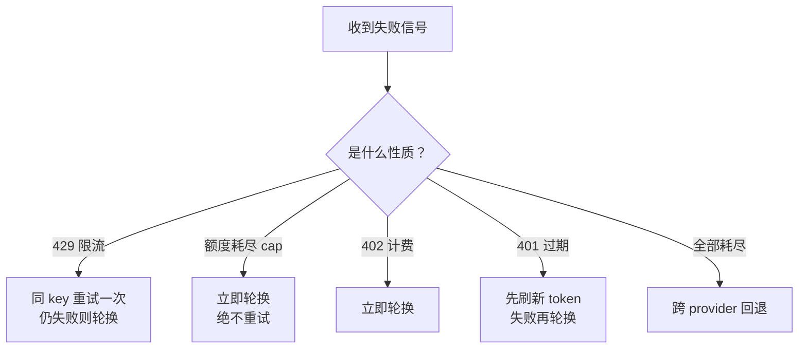

# 给本地 Agent 造一块看板（七）：平台内置派——当看板成为 Agent 运行时的一等公民

> 本系列共八篇，用同一套七层能力框架（C1–C7）横向解剖开源任务看板。
> 本篇覆盖 `NousResearch/hermes-agent`（252,141★，MIT）内置的 Kanban。
> 机制描述取自**本机安装目录中的一手文档**（`website/docs/user-guide/features/`），非二手转述。
> ⚠️ Hermes 迭代极快，本文所有路径、环境变量名与配置项均为 **2026-10-08 快照**，实际使用前需重新核对。

---

## 一、这一派只有一个样本，但它的位置很特殊

前面五派有一个共同前提：**看板是一个外挂工具。** 它可能住在你的仓库里（文件系统派）、住在数据库里（极简单机派）、或者带一个漂亮的桌面界面（工作台派），但无论哪种，它**站在 agent 的外面**：它负责记状态，然后想办法去调用 agent。

平台内置派的前提完全不同：**看板长在 agent 运行时内部。** 它不是"一个会调 agent 的看板"，它是"一个自带看板的 agent 平台"。

这个位置的差异，直接决定了能力上限。用一句话概括：

> **一个独立看板只能"调用 CLI 并解析输出"；而一个拥有 agent 生命周期的看板，可以"回收一个 PID 已经消失的 worker"。**

举个具体的例子。所有独立看板项目都在某个地方承诺"任务超时会自动释放"。但它们能做的其实只是"把 claim 时间戳过期的任务标记为可领取"。而 Hermes 的 dispatcher 做的是：

- 定期回收过期的 claim；
- 并且**专门回收"PID 已经消失、但 TTL 还没到"的崩溃 worker**；
- 还有一个反直觉的细节——**只有进程真的死了才回收**。也就是说，一个跑得很慢但活着的模型会被**续期**，而不是被杀掉。

**这三条之所以能做到，是因为 dispatcher 本身就持有 spawn 权。** 它 spawn 了那个 worker，所以它知道 PID；它能探活，所以它能区分"慢"和"死"。外挂式看板永远拿不到这个信息——它启动 CLI 只能拿到一个子进程句柄，而那个句柄在 CLI 内部又 fork 出什么，它一无所知。

**这一篇的全部价值，就在这个"位置差异带来的能力差异"上。**

---

## 二、逐层拆解

以下所有条目均来自本机一手文档。我按总览篇的 C1–C7 逐层对应，方便和前面几派对照。

### 2.1 存储与状态机（C1）

- **存储**：每张任务一行，落在 `~/.hermes/kanban.db`；多 board 时按 `~/.hermes/kanban/boards/<slug>/kanban.db` 分库，用 **SQLite WAL**。
- **状态机**：`triage | todo | ready | running | blocked | review | done | archived`。
- **双入口**：
  - **agent 侧**走 `kanban_*` 工具集（16 个工具）；
  - **人侧**走 `hermes kanban …` CLI、`/kanban` 斜杠命令、或 Web dashboard（拖拽 + 评论 + 多 board 切换 + 事件 WebSocket）。

### 2.2 Dispatcher：一个常驻的调度循环（C2 + C3）

这是整个设计的核心。它是一个**长驻循环，默认 60 秒一个 tick**，每个 tick 做这些事：

1. **回收过期的 claim**；
2. **回收崩溃的 worker**（PID 已消失但租约未到期）；
3. **提升 ready**——当某任务的依赖全部满足时，把它从 `todo` 提升到 `ready`；
4. **原子 claim**；
5. **spawn 被分配的 profile**。

**注意第 3 条的措辞**：依赖满足后是**自动 promote `todo → ready`**。这和第 3 篇讲的"就绪集"是同一件事——只不过那里是一次查询（`bd ready`），这里是一个主动循环。

### 2.3 隔离的两层语义（C5）

- **board 是硬边界**：worker 进程会被钉上 `HERMES_KANBAN_BOARD`，看不到别的 board；
- **tenant 是软命名空间**。

**工作区有三档**，这一条设计得很讲究：

| 档位 | 行为 |
|---|---|
| `scratch` | 用临时目录，**完成后删除**——但任务**声明的 artifacts 会被复制到持久存储** |
| `dir:<绝对路径>` | 使用指定目录，保留 |
| `worktree` | 用 git worktree，保留 |

**第一档是"临时执行环境 + 持久产出"的分离**，这正是长跑系统需要的形态：中间过程可以随时丢弃，只有验收过的产出留下来。第三篇讲的文件系统派把"可 git diff"当成卖点，而这里是"默认不留垃圾，只留产出"。

### 2.4 依赖与附件（C2/C6 的一部分）

- 依赖用 `task_links` 表达父子关系；**父任务全部 done 时自动 promote**；
- 附件可从 dashboard 上传（单文件 25 MB），**在 worker 的上下文中以绝对路径给出**。

### 2.5 产出验收：PR 完成契约（C6）

**这是全系列里"质量门"最有意思的一种实现。**

它叫 **PR completion contract**（`--completion-contract OWNER/REPO`）：任务在创建时声明"完成后必须存在对应的 GitHub PR"，dispatcher 在任务声称完成时会**校验该仓库的必需检查与 ruleset**——**未通过就不能 complete**。

这个设计的高明之处在于：**它把验收责任外包给了已有的 CI 体系。** 一个"整理资料"型任务很难定义质量门，但一个"提交代码"型任务的质量门其实早就存在了——就是 CI。**不需要发明新的验收标准，只要接上现成的那一套。**

另有评审机制 `kanban_request_review`：把任务推进 `review` 状态，**默认用内置的 `sdlc-review` skill spawn 一个 reviewer**；配置 `review_dispatch: false` 可以切成纯人工评审。

### 2.6 长跑保护与崩溃容错（C3 的延伸）

- **迭代预算** + **90% 时的 checkpoint 提醒** + **硬上限** + **无工具调用时的最终总结** + **连续失败熔断**；
- 崩溃容错：`kanban.failure_limit` 默认 2，**连续 spawn 失败会自动把任务 block 并附上最后一次错误**。

第二、三、四篇里各派拼凑出来的熔断、退避、checkpoint，在这里是原生能力。

### 2.7 审计

- 每个任务的日志落 `<board-root>/logs/<task_id>.log`；
- `task_runs` / `task_events` 两张表记录**全部状态迁移**；
- `hermes kanban tail` / `runs` 可以实时跟。

### 2.8 CLI 面

命令集相当完整：`init create list show assign set-model claim --ttl reclaim reassign complete block unblock schedule promote archive specify decompose swarm link unlink dispatch daemon gc stats runs log heartbeat notify-*`。

其中几个值得注意的名字：**`--ttl`**（领取时指定租约时长）、**`reclaim`**（收回）、**`swarm`**（并行度分析）、**`gc`**（垃圾回收）、**`heartbeat`**（心跳）。

---

## 三、本篇重点：Credential Pools，全系列唯一把额度当一等公民的地方

如果这一篇只记一件事，记这个。

### 3.1 它是什么

**同一 provider 下多个 API key / OAuth 凭证池化，自动轮换。** 轮换策略有四档：`fill_first`（默认，按 priority 顺序）、`round_robin`、`least_used`、`random`。

### 3.2 真正值钱的是那张错误分类表

这才是这一节的核心。它把"调不通"这件事**拆成了五种性质完全不同的情况**，并给出**五种不同的动作**：

| 错误 | 行为 | 冷却 |
|---|---|---|
| **429 限流** | 同 key **重试一次**（判断为瞬时抖动）；**第二次 429 才轮换** | 1 小时 |
| **"usage limit reached"（额度耗尽）** | **立即轮换，不重试** | 1 小时 |
| **402 计费问题** | 立即轮换 | 1 小时 |
| **401 凭证过期** | 先刷新 OAuth token，**刷新失败才轮换** | 5 分钟 |
| **全部耗尽** | 落到 `fallback_model`（跨 provider 回退） | — |

**第二行是整张表的灵魂。** 文档里对它的理由写得很直白：额度上限**不会因为重试而解除**。

**为什么这行值得单独强调？** 因为早期调研在"额度感知调度"这一块给出的判断是"完全空白"，同时强调过一个关键设计点：**「额度耗尽」必须与「任务失败」在失败分类里区分开，否则退避策略会把额度烧在重试上。**

也就是说，这个设计难点是能被"推演出来"的，但**只有真做过的人才会有把它写进文档里、并注明"不重试"的理由的那份确信**。Hermes 的这张表，就是那份工程经验的成品。

而它对 429 与 402 的区别处理也说明它想过另一件事：**限流是"你太快了"，计费问题是"你没钱了"——前者值得重试，后者不值得。**

### 3.3 凭证来源与作用域

- **自动发现来源**：环境变量、OAuth token、**`~/.claude/.credentials.json`（即 Claude Code 的登录态）**、Hermes PKCE、自定义端点；
- **子 agent 共享父池** + **per-task credential leasing** + 跨进程文件锁串行化 OAuth 刷新；
- 与 fallback provider 的分工：**先试池（同 provider 换 key），池全耗尽才跨 provider 回退。**

最后一条的分工逻辑很清楚：**能换 key 就别换模型**，因为换模型意味着输出质量与行为特征都会变。

### 3.4 一个必须知道的隐藏成本

**凭证轮换会重置 provider 侧的 prompt cache。**

这意味着：一次长对话如果在中间发生了轮换，那么新 key 需要按**全价重新读一遍上下文**。

**结论：轮换不是免费的。** 一个"额度一紧张就立刻换 key"的策略，可能在 prompt cache 上付出比省下的额度更高的代价。这个成本在写调度策略时必须纳入计算——**不要把轮换当成零成本操作。**

---

## 四、唯一的缺口，位置精确到一行文档

前面六层（看板呈现、原子领取、定时扫描、执行隔离、产出验收、额度轮换）都是原生的。**唯一缺的是 C4：非 Hermes CLI 不能作为看板的 worker。**

### 4.1 官方怎么承认这件事

官方文档的原话是：把一个非 Hermes 的 CLI 工具（Codex CLI、Claude Code CLI、OpenCode CLI、本地编码模型运行器等）**接成 kanban worker lane，"is not yet a paved path"**（尚未铺路）。

但同一节也说明了**扩展点是开着的**：`spawn_fn` 是 `dispatch_once` 的**可插拔参数**，插件可以为非 Hermes 的 assignee 注册自己的 spawn 函数。

### 4.2 worker lane 的契约（任何 lane 必须提供三件套）

| 契约 | 内容 |
|---|---|
| **assignee 字符串** | dispatcher 用 `task.assignee` 匹配"某个 Hermes profile 名"**或**"一个注册过的、不可 spawn 的标识符（插件 lane 形态）" |
| **spawn 机制** | profile lane 由 `_default_spawn` 执行 `hermes -p <assignee> chat -q <prompt>`；**非 Hermes lane 由插件提供自己的 `spawn_fn(task, workspace, board)`**，可返回可选 pid 供崩溃检测 |
| **生命周期终结** | 每次 claim **必须**以 `kanban_complete` / `kanban_request_review` / `kanban_block` 三者之一结束；**worker 不带工具调用直接退出会被判为 crashed** |

其中关于 assignee 匹配失败的处理值得一提：**匹配不上的任务会留在 `ready` 并记一条 `skipped_nonspawnable` 事件——既不会被静默丢弃，也不会被随便兜底执行。** 这个"宁可留着不办，也不猜着办"的取向，在无人值守系统里是正确且必要的。

### 4.3 dispatcher 注入 worker 的环境变量

lane 必须正确映射这些变量：

| 变量 | 含义 |
|---|---|
| `HERMES_KANBAN_TASK` | 当前任务 id |
| `HERMES_KANBAN_DB` | 当前 board 的 SQLite 绝对路径 |
| `HERMES_KANBAN_BOARD` | board slug |
| `HERMES_KANBAN_WORKSPACES_ROOT` | board 工作区树根 |
| `HERMES_KANBAN_WORKSPACE` | **本任务**的工作区绝对路径 |
| `HERMES_KANBAN_RUN_ID` | 当前 run id（生命周期门控） |
| `HERMES_KANBAN_CLAIM_LOCK` | claim 锁串 `<host>:<pid>:<uuid>` |
| `HERMES_PROFILE` / `HERMES_TENANT` | 作者归属 / tenant |

### 4.4 需要自己做的三件事

官方明确了外接 lane 需要自行处理的三块：

1. **把 CLI 的退出码包装成 `kanban_complete` / `kanban_block`**；
2. **把该 CLI 的 workspace / sandbox 约定映射到 `HERMES_KANBAN_WORKSPACE`**；
3. **处理 auth 与 per-CLI policy**。

**而实现形态（"每个 CLI 一个插件"还是"一个由配置参数化的通用 CLI-runner 插件"）官方明确说是开放的。**

### 4.5 两条旁证：这条路被走通过，也有人在推

- **已被走通一次**：还有一个"Codex App-Server Runtime"特性，允许把 `openai/*` 与 `openai-codex/*` 的回合**交给 Codex CLI 的 app-server 执行**（Hermes 退化为外壳），并且在这个运行时下 **Kanban worker 依然可用**。这证明了"外部 agent 运行时 + Hermes Kanban 生命周期"这条路是通的——只不过官方走的是"Codex 作为模型运行时"，而不是"任意 CLI 作为 worker lane"。
- **有人在推**：issue **#19931** 提出过原始架构；PR **#19924**（Codex 专用）**已关闭未合并**——方向被认可，实现没落地。另有一条 issue **#5257**（"Generalized ACP client for multi-agent CLI orchestration"，2026-04 创建，至今 open）提议用 Zed 官方 ACP 适配器替代"裸 subprocess 调 CLI"，理由之一是规避直接调用 CLI 的合规顾虑。

### 4.6 不要重复实现的东西

文档里有一份清单，列出 dispatcher **已经替你处理**的失败模式：

- stale claim TTL（默认 15 分钟），且**只在 PID 真的死了才回收**（慢模型被续期而非杀掉）；
- 崩溃 worker 检测；
- run 级重试（`expected_run_id`）；
- per-task `max_runtime_seconds`；
- **僵尸任务检测**：默认 30 分钟无人 claim 会报 `stranded_in_ready`，2 倍阈值升 error、6 倍升 critical；
- review 依赖死锁检测。

**这份清单的价值在于它是"负面清单"**：任何打算自建调度器的人，都应该先读一遍，避免把已经解决过的问题重新踩一遍。

---

## 五、优劣对照

| 维度 | 评价 |
|---|---|
| **C1 看板呈现** | ✅ Web dashboard 拖拽 + 评论 + 多 board + 事件流；另有 CLI 与斜杠命令。 |
| **C2 原子领取** | ✅✅ 原子 claim + 租约 + `reclaim` + 乐观并发（`--ttl`、`CLAIM_LOCK`）。 |
| **C3 定时扫描** | ✅✅ 常驻 dispatcher，60 秒一 tick，含崩溃检测与僵尸任务诊断。 |
| **C4 异构 agent 驱动** | ❌ **唯一缺口**。非 Hermes CLI 接 worker lane"尚未铺路"，但 `spawn_fn` 扩展点开着。 |
| **C5 执行隔离** | ✅ 三档工作区，其中 `scratch` 实现"临时环境 + 持久产出"分离。 |
| **C6 产出验收** | ✅ PR 完成契约（校验 GitHub 必需检查）+ 评审 skill + 附件。 |
| **C7 额度感知** | ✅✅ Credential Pools：五类错误的差异化处理，额度耗尽立即轮换不重试。 |
| **平台绑定** | ⚠️ 它是 **agent 平台**而非"看板工具"，能力与 Hermes 生命周期深度耦合。 |
| **工程成熟度** | ✅✅ 252,141★、MIT、当日仍有提交；但有 1.2 GB 体量与极快的迭代节奏。 |

**一个诚实的说明**：这一派只有 Hermes 一个样本。这不是因为它独特，而是因为**"看板长在 agent 运行时里"这个形态本身就很罕见**——绝大多数项目的做法是"做一个通用看板，然后想办法接各种 agent"，而 Hermes 走的是反方向。**这个方向上的对手本来就少。**

---

## 六、四条可迁移的启示

### 启示一：看板的能力上限，取决于它是否拥有 agent 的生命周期

这是全篇最重要的一条。

把 C2/C3 做到"能自动回收崩溃 worker、能区分慢与死"，前提是**看板必须自己 spawn agent**。一个只负责"调用 CLI 并解析 stdout"的外挂看板，永远做不到——它看不见 CLI 内部真正在跑什么。

**推论**：如果目标系统要长时间无人值守运行，那么**"调度器"与"执行器"必须在同一个进程边界内**，而不是通过 shell 调用隔开。这条推论直接否定了"用一个纯看板去驱动多个 CLI"的架构。

### 启示二：额度要按"错误性质"分类处理，而不是笼统重试

那张五行的错误分类表可以直接搬进任何调度器：

**核心是第二行：额度耗尽不属于"重试能解决"的失败。** 任何把它归进"任务失败"的分类器，都会在退避重试里把额度烧光——这是这类系统最贵的一个 bug。

### 启示三：验收门可以外包给现成的 CI

"PR 完成契约"这个设计给了一个通用套路：**不要自己发明验收标准，先看这个任务类型有没有既有的质量信号。**

代码类任务的质量信号是 CI；文档类任务的质量信号可以是"链接全部可解析 + 字数下限 + 去重"；数据类任务可以是"schema 校验通过"。**关键是把"完成"这件事从 agent 的自我声明，变成一个外部可验证的事实。**

### 启示四：轮换不是免费的——把 prompt cache 重置计入成本

凭证轮换会重置 provider 侧的 prompt cache，长对话每次轮换都按全价重读上下文。

**这意味着调度策略不能是"一紧张就换"**，而应该包含一个"这次轮换省下的额度，是否大于 cache 重读的成本"的估算。这是本系列里最容易被忽略的一个成本项，因为它在任何"额度"仪表盘上都看不见。

---

## 七、这一派的风险

必须把边界说清楚：

1. **依赖非稳定的内部参数。** `spawn_fn` 是内部参数，官方未承诺 API 稳定性。任何基于它的插件都应锁定版本，并在升级时重跑验证脚本。
2. **上游可能自己实现该 lane。** issue #19931 与 #5257 是明确信号——一旦 official 实现落地且形态不兼容，第三方插件可能被吸收或需要重写。缓解方式是把"CLI 注册表 + 退出码翻译"做成独立模块，接口面尽量小。
3. **无人值守的安全代价。** headless 桥会**自己替人批准权限请求**——文档里对同类桥的警告原文是 "runs shell commands on the host without prompting"。这意味着你实际上把文件系统与 shell 交给了一个非确定性进程。**建议至少在独立 worktree + 可丢弃环境 + 独立账号里跑。**
4. **合规仍需自行判断。** 把消费级或免费额度用于无人值守长跑是否违反各家服务条款，本文不作判断。技术上可行不等于条款上允许。

---

## 八、把它放回全系列

到这一篇为止，六派都看完了。把它们的覆盖情况叠在一起，第八篇要给出的横向矩阵已经成形：

- **C1 看板呈现**：工作台派最强，平台内置派够用；
- **C2 原子领取**：平台内置派与 `saltbo/agent-kanban` 最强，`kanban-md` 是纯文件方案里的唯一正解；
- **C3 定时扫描**：平台内置派是唯一原生拥有"常驻 dispatcher"的；
- **C4 异构驱动**：工作台派最强，这一层恰好是平台内置派唯一的缺口；
- **C5 执行隔离**：普遍到位，平台内置派的"临时环境 + 持久产出"最优雅；
- **C6 产出验收**：只有平台内置派（CI 契约）与 `veritas-kanban`（评分档案）有真正的质量门；
- **C7 额度感知**：**只有平台内置派把"利用额度"做对了**——独立项目里要么没有，要么做的是相反方向的"成本上限"。

最后一篇：为什么 28,292★ 的项目会死？以及把 20 个项目放进同一张表之后，该怎么选、该自研什么。

---

**系列导航**

- 一、[总览：看板只是壳，调度与验收才是本体](/posts/2026-10-08-agent-kanban-00-overview/)
- 二、[文件系统派：把看板塞进 Git 仓库，代价是什么？](/posts/2026-10-08-agent-kanban-01-filesystem-kanban/)
- 三、[任务图派：把「下一个任务」变成一次查询](/posts/2026-10-08-agent-kanban-02-task-graph/)
- 四、[极简单机派：一个二进制、一条命令](/posts/2026-10-08-agent-kanban-03-minimal-local/)
- 五、[自主编排派：三个最接近目标的项目](/posts/2026-10-08-agent-kanban-04-autonomous-orchestration/)
- 六、[多 Agent 工作台派：派单模型与认领模型的分野](/posts/2026-10-08-agent-kanban-05-agent-workbench/)
- 七、平台内置派：当看板成为 Agent 运行时的一等公民 ← 本篇
- 八、[日落的教训与横向对照](/posts/2026-10-08-agent-kanban-07-sunset-and-synthesis/)
