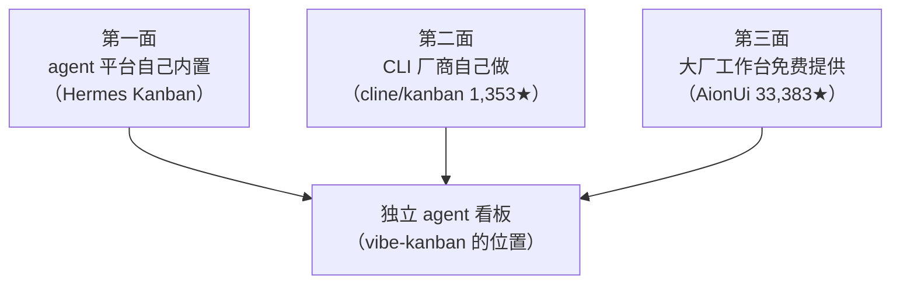
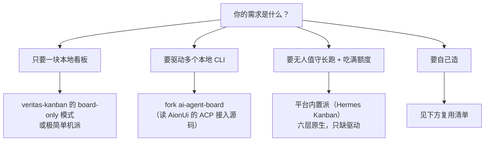

# 给本地 Agent 造一块看板（八）：日落的教训与横向对照

> 本系列共八篇，用同一套七层能力框架（C1–C7）横向解剖 20 个开源任务看板 / 编排项目。
> 本篇分四部分：日落复盘、横向矩阵、跨项目启发、选型与缺口。
> 元数据于 2026-10-08 经 GitHub API 一手核验。

---

## 第一部分：一次有意识的商业止损

### 1.1 事实

先把事实摆清楚，全部来自一手核验。

| 项 | 值 |
|---|---|
| 仓库 | `BloopAI/vibe-kanban` |
| ★ | **28,292** |
| 许可证 | Apache-2.0 |
| 语言 | Rust |
| 仓库体量 | 约 102 MB |
| 创建 | 2025-06-14 |
| 最近 push | 2026-09-19 |
| 未关 issue | 544 |
| **状态** | **README 顶部原文："Vibe Kanban is sunsetting."，并链向关停公告** |

README 顶部的原文是一句加粗的 `<strong>Vibe Kanban is sunsetting.</strong>`，后面跟着一个指向官方博客关停公告的链接。

**它是全系列里星数第二高的项目。** 一个 28,292★ 的项目，在创建不到两年后主动关停。

### 1.2 它解决的是什么问题

要理解它为什么死，先要看准它做的是什么事。它自己的 Overview 写得很清楚：

> In a world where software engineers spend most of their time planning and reviewing coding agents, the most impactful way to ship more is to get faster at planning and review. ... Use kanban issues to plan work... When you're ready to begin, create workspaces where coding agents can execute.

翻译成一句话：**它优化的是"工程师"规划"与"审查"的效率。**

也就是说，它瞄准的用户是**坐在电脑前的工程师**，它的价值主张是**"让你更快地计划和审查"**。这个定位本身没问题——它对应的是一个真实的高频痛点。

**但它与本系列的场景是两件事。** 本系列要的是"人不在场时，系统自己找活干、自己干完、自己验收"。而 vibe-kanban 的模型自始至终是**"人创建 workspace，agent 在里面执行"**——**没有任务池，没有自主领取循环。**

这两个需求都合理，但**它们的商业属性完全不同**：前者服务的是"人的注意力效率"（可以被感知、可以被付费），后者服务的是"机器的时间利用率"（用户感知不到，也不愿意为此付钱）。

### 1.3 三条归因（这是分析，不是内幕）

以下是我的分析。它基于公开可见的事实，不涉及任何内部信息。

**归因一：变现路径与产品定位相冲突。**

本地开源工具很难直接变现。最自然的路径是做一个云服务——把团队协作、托管执行搬上去收费。

但问题在于：**"本地 agent"这个品类，用户选择它的核心理由之一恰恰是"代码不要离开我的机器"。** 第五篇里 `saltbo/agent-kanban` 把"把人从执行环路里拿出去"当标语、`veritas-kanban` 把 "local-first" 放在定位的第一句——这些措辞都在回应用户对"本地"的诉求。**把一个靠"本地"吸引用户的工具云化，等于与自己的用户基础对抗。**

**归因二：重工程的维护成本 × 无收入 = 不可持续。**

Rust monorepo、Tauri 桌面应用、约 102 MB 的仓库。这意味着持续的、不便宜的人力投入。

**当 cloud 侧变现不成立时，这个成本就没有任何东西可以覆盖。** 而且要注意：关停公告是写在官方博客上的——这说明它是一次**主动的商业决策**，不是技术崩溃、也不是团队跑路。

**归因三：时间窗被三个方向的免费供给夹击。**

这是最容易被忽略的一条。

vibe-kanban 在 2025-06 创建时，"agent 看板"是一个空白地带。到了 2026 年，这块地被三面合围：

- **上游**：agent 平台发现"看板"是自己运行时的一部分，顺手就内置了（第七篇）；
- **侧翼**：CLI 厂商发现"跑很多 agent"是自己的用户场景，顺手就做了（第五篇的 `cline/kanban`）；
- **下游**：大型工作台以免费形态提供更完整的体验（第六篇的 AionUi，33,383★）。

**当一个独立产品的位置，恰好被上游、侧翼、下游同时用免费方式覆盖时，它需要非常强的差异化才能活下来。** 而 vibe-kanban 的差异化是"更好的规划与审查体验"——这个差异化不足以支撑一个独立商业体。

### 1.4 fork 生态：一个不值得接手的遗产

已经有人 fork 它。核验结果：

| 仓库 | ★ | 许可证 | 状态 |
|---|---|---|---|
| `Alexi5000/vibe-kanban` | 0 | Apache-2.0 | 自称"stand on its own"，Rust 多 crate，Tauri 桌面 |
| `russosalv/new-vibe-kanban` | 1 | Apache-2.0 | npm 社区 fork，恢复了被上游移除的 kanban 路由 |

**两个 fork 分别是 0★ 与 1★，而它们要维护的是一份约 102 MB 的 Rust monorepo。**

**结论：不要接手。** 一个已经宣布关停、且没有社区接力的重工程代码库，fork 过来等于自己给自己发了一份长期的维护工作。

### 1.5 三条教训

**教训一：star 数是"历史热度存量"，不是"未来维护保证"。**

28,292★ 的仓库 README 顶部写着 "sunsetting"。4,528★ 的 `obsidian-kanban` 已被挪进社区存档组织。**在选型时，去读 README 的顶部和最后一条 release，比看 star 数有用得多。**

**教训二：一个产品解决的问题，决定了它能不能收钱。**

"帮工程师更快地规划与审查"是一个真实需求，但它天然绑定在"人的注意力"上——而人的注意力很难通过云服务二次收费。**相反，任何以"本地"为卖点的工具，都要提前想清楚：如果不云化，靠什么活下去。**

**教训三：独立产品的位置正在被"顺手"吃掉。**

这是一个2026 年反复出现的模式：**当某项能力变成上游平台的顺手之作时，独立产品的窗口就关闭了。** 对个人开发者而言，这条教训的实践含义是——**不要去做"某个平台顺手就能内置的东西"，除非你有平台做不到的差异化。**

---

## 第二部分：20 个项目的七层能力矩阵

### 2.1 六派 × 七层覆盖度

✅ = 原生完整支持；⚠️ = 部分支持或需外部补齐；❌ = 缺失。

| 派别 | C1 呈现 | C2 领取 | C3 扫描 | C4 异构驱动 | C5 隔离 | C6 验收 | C7 额度 |
|---|---|---|---|---|---|---|---|
| ① 文件系统派 | ✅ | ⚠️ | ❌ | ❌ | ⚠️ | ❌ | ❌ |
| ② 任务图派 | ❌ | ✅ | ⚠️ | ❌ | ❌ | ⚠️ | ❌ |
| ③ 极简单机派 | ✅ | ⚠️ | ⚠️ | ⚠️ | ❌ | ❌ | ❌ |
| ④ 自主编排派 | ✅ | ✅ | ⚠️ | ⚠️ | ✅ | ⚠️ | ⚠️ |
| ⑤ 工作台派 | ✅✅ | ❌ | ⚠️ | ✅✅ | ✅✅ | ❌ | ❌ |
| ⑥ 平台内置派 | ✅ | ✅✅ | ✅✅ | ❌ | ✅ | ✅ | ✅✅ |

**这张表是本系列的全部内容压缩成的一屏。** 三个规律直接从表里读出来：

1. **C4（异构驱动）与 C6/C7（验收与额度），从来没有在同一行里同时为 ✅。** 工作台派拿下了 C4 但丢掉了 C6/C7；平台内置派拿下了 C6/C7 但缺 C4。**这正好指出了缺口的位置。**
2. **C1 到处都是 ✅，C7 只有一格。** 印证总览篇结论一：呈现是伪难点。
3. **C2 的分布是分水岭。** 有 ✅ 的三派（任务图派、自主编排派、平台内置派）恰好是最"工程化"的三派。

### 2.2 代表项目的具体评级

| 项目 | ★ | 许可 | 最强项 | 最弱项 | 判定 |
|---|---|---|---|---|---|
| `hermes-agent` Kanban | 252,141 | MIT | C2/C3/C6/C7 全原生 | **缺 C4** | 最强覆盖，唯一缺口是驱动层 |
| `veritas-kanban` | 838 | MIT | C6/C7 唯一独立实现 | 体量大、自主方向待实测 | **最完整的独立项目** |
| `saltbo/agent-kanban` | 486 | FSL-1.1-ALv2 | 并发与生命周期最严格 | 云原生部署、非开源许可 | 设计最佳，部署不合场景 |
| `cline/kanban` | 1,353 | Apache-2.0 | 依赖链自动开工 | 研究预览、无额度 | 体验最好，稳定性待观察 |
| `beads` | 27,733 | MIT | `bd ready` 就绪查询 | 非看板 | **队列底座的最佳选择** |
| `kanban-md` | 223 | MIT | 纯文件做出原子 claim | 无守护进程 | 文件方案里的唯一正解 |
| `ai-agent-board` | 63 | MIT | 多 CLI provider 抽象 | 无自动领取 | **最值得 fork 的独立目标** |
| `AionUi` | 33,383 | Apache-2.0 | 多 CLI 探测 + ACP 接入 | 679 MB、派单模型 | 读源码，不 fork |
| `backlog.md` | 6,962 | MIT | 人机双读、`--json --watch` | 无领取 | 状态层的好选择 |
| `vibe-kanban` | 28,292 | Apache-2.0 | （已关停） | 无人值守 | 反面教材 |

---

## 第三部分：五条跨项目启发

### 启发一：把系统叫"看板"，就等于给自己设了能力上限

这是整个系列里最反直觉、也最可操作的一条。

**凡是把 C6/C7 做出来的项目，都不认为自己是"看板"：**

- `veritas-kanban` 自称 "task management board **with optional AI agent orchestration**"；
- `saltbo/agent-kanban` 自称 "**mission-control board** for autonomous software agents"；
- 而 Hermes 干脆把它做成了**运行时的一部分**。

反过来，凡是自称 "kanban"、"board"、"看板" 的项目，模型里就只有**卡片和列**。

**推论**：如果你要造这套系统，**从命名开始就要避免把自己框在"看板"里**。叫它"控制平面"（control plane）、"调度器"、"任务运行时"，你的设计清单里自然会长出注册表、预算、策略、审计、审批这些东西；叫它"看板"，你就只会去做拖拽和列。

### 启发二：「下一个任务是什么」必须是一次查询，而不是一次推理

第三篇的结论，在整个系列里被反复验证：

- `beads` 用 `bd ready` 把"就绪集"做成一条命令；
- `claude-task-master` 用 `get_next_task` 做成一个 MCP 工具；
- BMAD 的 Scrum Master 用一段**确定性算法**选下一个故事；
- `saltbo/agent-kanban` 把"blocked"做成**计算出来的属性**（任一依赖未完成即 blocked），而不是一个手工维护的字段；
- Hermes 的 dispatcher 在依赖满足时**自动 promote**。

**所有做得认真的系统，都把调度决策从"模型的自由发挥"降级成了"确定性的代码"。** 理由是三个：可重复、成本低（一次索引查询 vs 一次模型调用）、可审计。

而**让 agent "读一遍 Markdown 然后自己决定做哪个"的做法，在这五个项目里一次都没出现。** 这不是巧合。

### 启发三：领取必须原子 + 有租约 + 能回收，且"只有真死才算死"

这是 C2 的完整要求，分三步：

1. **原子**：查找、认领、置为进行中必须是一次不可分割的操作（`kanban-md` 的 `pick --claim`、`cocopilot` 的 `GET /task`、`saltbo` 的 CAS）；
2. **租约**：claim 必须带过期时间，否则一个死掉的 agent 会永久霸占任务；
3. **回收**：到期后要能自动释放。

而 Hermes 在第三步上加了一个很关键的细节：**只有进程真的死了才回收——跑得慢但活着的 worker 会被续期，而不是被杀掉。**

这个细节值得所有做租约的人抄：**naive 的 TTL 会把正在慢跑的模型误判为崩溃并杀掉，然后另起一个重跑，结果是双倍成本。**

### 启发四：额度耗尽必须与任务失败分开；而「预算上限」与「用满额度」是相反方向

前半句是第七篇那张五行错误分类表的核心：**`usage limit reached` 绝不重试，立即轮换**——因为额度上限不会因为重试而解除。

后半句是本系列最值得警惕的一个错位：

| | 目标 | 代表实现 |
|---|---|---|
| **成本治理** | 防止烧光、防止失控 | `veritas-kanban` 的多级预算（超限即告警/降级/暂停/取消） |
| **额度利用** | 在耗尽前尽可能多干活 | Hermes 的 Credential Pools（耗尽即换 key） |

**两者都在谈额度，方向却相反。** 如果你要的是后者，**你无法直接复用任何现成的额度模块**，因为它们的设计目标和你的相反。这也意味着，"额度感知派单"（按剩余额度决定派给谁）在独立开源项目里**至今依然是空白**。

### 启发五：产出验收是普遍缺失的一环，而它决定"跑出来的东西有没有价值"

全系列只有两个项目有真正的质量门：

- Hermes 的 **PR 完成契约**（把验收外包给 GitHub 必需检查）；
- `veritas-kanban` 的 **Output Evaluation**（按加权评分档案打分）。

**其余全部项目——包括那些功能最花哨的工作台——都只追踪任务状态，不追踪交付物。**

这件事在本场景里是致命的。因为本场景的目标产出是"**有价值的资料或信息**"。而在一个没有质量门的系统里，一版"跑完了但输出是废话"的任务，在看板上和一个成功任务**长得完全一样**。你会得到一个看起来很忙、产出全是垃圾的流水线。

---

## 第四部分：选型、缺口与结论

### 4.1 按需求分流的选型指引

### 4.2 如果要自己造：该复用什么、该自研什么

**直接复用（不要重写）：**

| 层 | 复用来源 |
|---|---|
| 状态存储 | SQLite（所有极简单机派的做法）；需要可 diff 就用 Markdown（`kanban-md` / `backlog.md`） |
| 领取与就绪查询 | `beads` 的 `bd ready` 思路，或 `kanban-md` 的 `pick --claim` 语义 |
| 轮询契约 | `cocopilot` 的七端点契约（取单占位、无单退避、父子传上下文） |
| 多 CLI 驱动 | 走 **ACP**（`codex-acp` 等 Zed 官方适配器），不要自己实现协议栈；能力探测参考 `harness-mix` |
| 执行隔离 | git worktree + 自动清理（`ai-agent-board` 的实现） |
| 额度分类 | Hermes 那张五行错误分类表（照抄即可） |
| 长跑保护 | 熔断 + 指数退避 + checkpoint（`beads` 心跳、Hermes 迭代预算） |
| UI | 不要重写。`ai-agent-board` 或极简单机派的 Web UI 都可复用 |

**必须自研的（没有现成件）：**

1. **额度感知派单** —— 按 `(预计成本, 各 agent 剩余额度, 重置时间, 任务价值)` 决定派给谁。**全系列空白。**
2. **非代码类产出的质量门** —— 见下方缺口第 1 条。
3. **统一的异构 CLI 适配层** —— 把 CLI 退出码翻译成统一的生命周期事件（`complete` / `block`）。

### 4.3 四项目前仍然空白的缺口

**缺口一（最要紧）：非代码产出的质量门。**

现有的质量门都是为代码设计的——GitHub 必需检查、CI 状态、diff 审查。而本场景的核心产出是**资料与信息**，它的"合格"该怎么判定？

- 引用链接是否全部可解析？
- 结论是否非空、是否与既有产出去重？
- 结构是否合规（有没有覆盖要求的几个子问题）？
- 与同类任务的既有产出相比，是否真的带来了新增信息？

**`veritas-kanban` 的 Output Evaluation（正则 / 关键词 / 数值区间 / 出现比例）是这个方向上最接近的现成答案，但它的判据仍偏机械。** 这个缺口是本场景最值得投入的地方，因为它直接决定产出是不是垃圾。

**缺口二：额度感知派单。** 如上所述，独立项目里完全空白。

**缺口三：反向通道。** 人离开电脑时，怎么给流水线投喂任务、怎么放行一个待在 `review` 的任务。只有 Nimbalyst 的移动端投喂认真做了这件事，其余方案都默认"人会在电脑前"。

**缺口四：全链路的单点覆盖。** 把"领取 + 异构驱动 + 验收 + 额度"四件事放进同一个系统、且不依赖某个特定 agent 平台的项目，**至今不存在**。最接近的是 Hermes，但它缺异构驱动；第二接近的是 `veritas-kanban`，但它的自主方向待实测。

### 4.4 结论

回到本系列开头那个需求：

> 人在看板上发布任务 → 本机的多个 coding agent 定时扫描看板 → 自动领取并完成 → 持续产出可复用的资料 → 把各家的免费额度用满。

**八篇读下来，结论可以精确表述为三句：**

1. **看板这一层不必造，也不必 fork。** 它已经被解决了，而且解决得比大多数人需要的更好。**在这一层花时间是纯浪费。**
2. **真正稀缺的是三件事：原子领取、产出验收、额度调度。** 前两者有分散的参考实现，第三者（按额度派单）在独立生态里没有答案。
3. **系统该怎么被定位，决定了它能长多高。** 叫它"看板"，你就只会做卡片；把它当"控制平面"或"任务运行时"，你才会顺手把注册表、预算、策略、审计都做出来。

如果只带走一句话，我选这一句：

> **别再造看板了。造一个"能把看板当副产品"的调度与验收系统。**

---

## 后记：这个系列接下来会去哪

写这八篇的过程本身做了一次完整的技术选型调研。这些结论会喂给下一步的一次个人实践——按 4.2 的复用清单拼装、把自研范围压到最小、优先补齐 4.3 里那两个真正的缺口。

**但有一件事必须先说清楚：技术上可行，不等于条款上允许。** 把各家厂商的消费级或免费额度用于无人值守的长跑，是否违反各自的服务条款，需要你按自己的情况判断。本系列只讨论技术，不构成任何合规建议。

另外，无人值守意味着 **headless 桥会替你批准权限请求**——第七篇引过的原文是 "runs shell commands on the host without prompting"。**如果你打算这么跑，请至少把 agent 关在一个独立的 worktree、一个可丢弃的环境、一个独立账号里。**

---

**系列导航**

- 一、[总览：看板只是壳，调度与验收才是本体](/posts/2026-10-08-agent-kanban-00-overview/)
- 二、[文件系统派：把看板塞进 Git 仓库，代价是什么？](/posts/2026-10-08-agent-kanban-01-filesystem-kanban/)
- 三、[任务图派：把「下一个任务」变成一次查询](/posts/2026-10-08-agent-kanban-02-task-graph/)
- 四、[极简单机派：一个二进制、一条命令](/posts/2026-10-08-agent-kanban-03-minimal-local/)
- 五、[自主编排派：三个最接近目标的项目](/posts/2026-10-08-agent-kanban-04-autonomous-orchestration/)
- 六、[多 Agent 工作台派：派单模型与认领模型的分野](/posts/2026-10-08-agent-kanban-05-agent-workbench/)
- 七、[平台内置派：当看板成为 Agent 运行时的一等公民](/posts/2026-10-08-agent-kanban-06-platform-native/)
- 八、日落的教训与横向对照 ← 本篇
