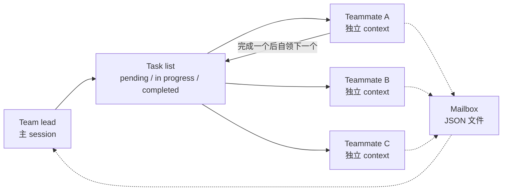

# Anthropic 的看板不在看板里

> 这是[《给本地 Agent 造一块看板》系列](/posts/2026-10-08-agent-kanban-00-overview/)的番外。系列正文用同一套七层能力框架（C1–C7）解剖了 20 个开源看板与编排项目，本篇回到一个更上游的问题：如果这个场景真有标准答案，行业里最有钱、最懂 agent 的那家公司是怎么做的？

## 三条先行结论

1. **事是真的，形态是假的。** Anthropic 确实有一套让人和 agent 一起接活、认领、交付、复核的机制，而且已经在全员规模上跑了大半年。但公开材料里**没有任何一处**把这件事描述成看板。

2. **最像看板的那套东西，是用文件实现的。** 它的共享任务列表、消息邮箱、并发防冲突，全部落在本机文件系统上——`~/.claude/tasks/` 加一堆 JSON 文件加文件锁。跟我在系列第二篇里拆的 `kanban-md` 几乎是同构的。

3. **它主动放弃了无人值守。** 这是最反直觉的一点，也是最值得带走的一点：Anthropic 做了自动领取（self-claim）、做了原子防冲突（file lock）、做了依赖自动解除，然后在最关键的入口上写下一句「**非交互模式下不会创建 teammate**」。它把「人」当成设计的一部分，而不是需要消除的瓶颈。

---

## 先澄清：这条说法可能混了三个东西

搜下来，容易被并成一个「Anthropic 内部看板」的，实际是三套不同层面的东西：

| 名称 | 是什么 | 面向谁 | 时间 |
|---|---|---|---|
| **Claude Tag** | Slack 里的常驻 Claude，一个频道一个身份，多人共享 | 客户（Team / Enterprise） | 2026-06-23 发布 |
| **Claude Code Agent Teams** | 多 session 协同机制，含共享任务列表与文件邮箱 | 开发者，实验特性 | 2026-02-05 预告，文档 2026-10-02 更新 |
| **《Building effective human-agent teams》** | 组织方法论，讲角色、验证与注意力预算 | 公众 | 2026-06-24 |

此外还有第四件：**Anthropic 把自己内部「有多少活是 AI 干的」做成了公开指标**，2026-09-17 发布。它不算看板，但它提供了理解前三个的坐标系。

我的核实原则和系列一致：**一手优先，二手标注，推测剔除**。下面每一条事实都给出出处，末尾附证据分级。

---

## 第一套：Claude Tag —— 把 agent 放进通讯录，而不是放进看板

Claude Tag 的官方描述里有一句很关键的话：

> Tagging @Claude is now one of the main ways we get things done at Anthropic. Today, 65% of our product team's code is created by our internal version of Claude Tag.

一个频道里有一个 Claude，所有人 `@Claude` 给它派活。它不是「每人一个聊天窗口」，而是**多人共享一个 agent 实例**——官方管这叫 multiplayer。你看到别人让它做什么，它能接着别人没说完的上下文往下走。

注意它的机制里**没有「列」**：

- 任务的载体是 **Slack 线程**，不是卡片
- 状态的载体是线程的自然生命周期（有人在说话 = 在推进），不是「从 Doing 拖到 Review」
- 权限按频道隔离，一个频道一个 Claude 身份，legal 的 Claude 不把记忆传给 engineering 的 Claude
- 管理员能设 token 花费上限（组织级 + 频道级），能看「每一项任务是谁请求的」

这里有个容易被忽略的设计：**Claude Tag 把「可审计」放在「可可视化」之前。** 官方原文强调的是 "a log of everything that @Claude has done, along with who requested each task"——它要的是事后追责链，不是实时看板上的红点。

换句话说，如果你把「看板」理解成「一屏看清谁在干什么」，Claude Tag 压根不打算给你这一屏。**它的假设是：你不需要看板，你需要一个能替你顶事的同事，和一个能事后查账的日志。**

---

## 第二套：Agent Teams —— 这才是真看板，但它是文件

如果说这套体系里有一处真的叫得上「看板」，就是它了。看它的组件清单：

> An agent team consists of:
> - **Team lead** — The main Claude Code session that spawns teammates and coordinates work
> - **Teammates** — Separate Claude Code instances that each work on assigned tasks
> - **Task list** — Shared list of work items that teammates claim and complete
> - **Mailbox** — Messaging system for communication between agents

四个组件里，「Task list」就是任务看板，「Mailbox」就是通知系统。再看任务模型：

> Tasks have three states: **pending, in progress, and completed**. Tasks can also depend on other tasks: a pending task with unresolved dependencies cannot be claimed until those dependencies are completed.

**三态、可依赖、有阻塞判定**——这就是一块看板该有的全部语义。而分配方式有两种，正好对应我在系列里的那个分叉：

> The lead can assign tasks explicitly, or teammates can self-claim:
> - **Lead assigns** — tell the lead which task to give to which teammate
> - **Self-claim** — after finishing a task, a teammate picks up the next unassigned, unblocked task on its own

「Self-claim」就是**任务自动领取**。Anthropic 做了。

### 它怎么解决并发

这是整份文档里最让我意外的一句话：

> **Task claiming uses file locking to prevent race conditions** when multiple teammates try to claim the same task simultaneously.

文件锁。不是数据库事务，不是 CAS，不是分布式锁服务。就是本机文件锁。

存储路径也很直白：

- 任务列表：`~/.claude/tasks/{team-name}/`
- 邮箱：`~/.claude/teams/{team-name}/inboxes/{agent-name}.json`

邮箱的实现细节更能说明取向：每封信就是一个 JSON 条目，Claude Code 读文件时逐条校验，格式不对的条目**报错并从文件里删掉，但合法消息照常投递**。文档还专门记了一笔历史 bug：v2.1.207 之前，一个格式错误的条目会导致每秒报错一次、直到你手动删掉文件才恢复。

**这条 bug 记录本身就是信息。** 一个把 UI 做到极致的公司，用一个可读、可手动修复的文本文件当消息总线，代价是偶尔要人去删文件——他们接受了这个代价。因为换来的是：**agent 能直接读写权威状态，不需要经过任何服务**。

### 它怎么保证「干完了」

任务状态是会骗人的。Agent 说自己做完了，不等于真做完了。Anthropic 的解法是**外部强制**，不是信任：

> - `TeammateIdle` — runs when a teammate is about to go idle. **Exit with code 2** to send feedback and keep the teammate working.
> - `TaskCreated` — runs when a task is being created. **Exit with code 2** to prevent creation and send feedback.
> - `TaskCompleted` — runs when a task is being marked complete. **Exit with code 2** to prevent completion and send feedback.

三个钩子，全部用**退出码**做闸门。这跟我在系列第七篇里夸 Hermes「回收 PID 已消失的崩溃 worker」是同一种思路——**永远不要信任执行者自报的状态**。

### 它的限制清单，比功能清单更有价值

官方列出的限制里，有几条是整个领域的通用病：

> - **No session resumption with in-process teammates** — `/resume` and `/rewind` do not restore in-process teammates. After resuming a session, the lead may attempt to message teammates that no longer exist.
> - **Task status can lag** — teammates sometimes **fail to mark tasks as completed, which blocks dependent tasks**.
> - **Shutdown can be slow** — teammates finish their current request or tool call before shutting down.
> - **One team per session** / **No nested teams** / **Lead is fixed**.
> - **Split panes require tmux or iTerm2** — 不支持 VS Code 集成终端、**Windows Terminal**、Ghostty。

「Task status can lag」值得单独拎出来。**这是所有自动领取系统的通用病**：即使你有了原子领取、有了依赖图、有了心跳，仍然会有人（或 agent）干完了活却忘了标记。而它的下游任务是**卡住的**——在一个号称自动化的系统里，一个忘记点的复选框可以让整条依赖链停摆。

Anthropic 的解法不是更聪明的领取算法，而是那个 `TaskCompleted` 钩子：**把状态一致性外包给一个可以拒绝的闸门**。这是廉价且有效的，但前提是你得承认「agent 会忘事」是常态而不是异常。

### 成本：它不装作这是免费的

> Agent teams use **significantly more tokens** than a single session. Each teammate has its own context window, and token usage scales with the number of active teammates.

还有一个很实际的坑：in-process teammate 的请求**落在主会话的 prompt cache TTL 桶之外**，默认只缓存五分钟（在订阅制上也是），要拉长到一小时得显式设置并接受更高的缓存写入计费。

这和我上一轮调研里的发现完全咬合：**多 agent 并行的成本不是线性上涨，而是带着缓存失效的隐性惩罚上涨。** Anthropic 的建议是 3–5 个 teammate 起步，`15` 个独立任务也用 3 个 teammate 起。

---

## 反差点：它明确不让你无人值守

现在到了全文最关键的一句。在「启用」那一节里，文档写着：

> **Spawning teammates also requires an interactive session.** In non-interactive mode with the `-p` flag, including Agent SDK sessions, Claude doesn't spawn teammates, and a subagent that Claude names runs as an ordinary subagent even with agent teams enabled.

翻译一下：**你没法用 `claude -p "..."` 从一个脚本里拉起一支 agent 队伍。** 无头模式下，即使开了开关，系统也不会组建团队，被命名的 subagent 会退化成一个普通 subagent。

这一句话把整件事的性质说清楚了。

Anthropic 实现了自动领取、实现了原子并发控制、实现了依赖自动解除——所有「无人值守」必需的零件它都有。然后它在**唯一的入口**上装了锁，钥匙是「必须有人在场」。

原因不难猜。看它的限制清单就明白了：

- 不能恢复 session，恢复后 lead 会去找已经不存在的 teammate
- 任务状态会滞后，会卡住依赖链
- 关闭很慢
- lead 不能转移，team 不能嵌套

这些都不是「还没做完」的功能缺口，而是**「人来兜底」这个设计前提的直接后果**。它默认有人坐在终端前，看到卡住的任务可以手动标记完成，看到 lead 找不到 teammate 可以叫它重新生成。

**所以：想拿 Claude Code 的 Agent Teams 当无人值守的底座，这条路是堵死的。** 不是难做，是官方立场上不做。

这跟我们系列里的核心判断撞上了：**如果目标是「吃满免费额度、让多个 agent 长时间持续跑」，你要的东西和 Anthropic 在做的东西，优化方向是相反的。** 它优化的是「有人的时候协作效率」；你要的是「没人的时候产出量」。

---

## 第三套：真正的新东西不在软件里

如果只看到 Agent Teams，会以为 Anthropic 的答案是「文件系统 + 文件锁」。不是。它的官方方法论文章《Building effective human-agent teams》（2026-06-24，作者 Kristen Swanson）里，**一个字都没提看板**。

它讲的是这些：

**一、花名册能写出来。** 五条自检里有一条是：

> Can you write down your team's roster (humans and agents), and say what each member owns?

人和 agent 在同一个名册上，每人写清楚拥有什么。这和系列第七篇里 Hermes「外部 CLI worker lane」缺少显式注册表的问题，其实是同一个诉求的两个说法。

**二、角色靠技能文件固化。** 中文转述里提到「团队通过编写技能文件（Skill files）为不同的智能体分配专有角色（例如让特定智能体担任软件发布经理），防止员工各自运行个人 AI 导致团队信息碎片化」。**注意后半句**——他们要防的不是「agent 做错事」，是「每个人各带一个私人 AI，导致团队知识碎成孤岛」。

**三、Doer-Verifier，一个 agent 干、另一个 agent 查。**

> it often helps to give one agent the job of doing the task and another agent the job of checking the first agent's work. This is often called the "**Doer-Verifier**" agent harness.

**四、信任是逐步授予的，不是一次性配置的。** 官方列的路径是：先人工复核每一件 → 让 agent 用 verifier 自检 → 把反思纳入循环 → **按任务类型分别记录哪些已获得自主权，反复成功后再扩范围**。最后一条很关键：不是「这个 agent 可信」，是「**这个 agent 在这类任务上可信**」。

**五、他们那个 backlog 案例。** 一个工程主管接手了积压严重的团队，做法是：

- 一组 agent 读全部积压项，判断有没有人在做，给**无人认领的项**打复杂度分
- 另一组 agent 读列表，**筛出中低复杂度**的，直接改代码
- 初期人类复核 agent 的每一个决策，标记哪些必须人工介入
- 之后教 agent 把这类决策**主动上报**，而不是等人类发现
- 每周让 agent 交一份含 **「lessons & missteps」** 的周报

顺带一提，中文二手转述里那个「派遣 agent 独立修复 500 个 bug」的说法，在官方原文里的准确表述是上面这套**分组流水线 + 逐级放权**，不是「扔给一个 agent 500 个 bug」。这个差别不小。

**六、也是最重要的一条：人类注意力是稀缺资源。**

> once the agents were more independent, the leader coached them to **treat human attention as the scarce resource it is**: to **batch questions** to be answered in a single pass, repeat key context to get a human up to speed quickly, and **limit how many things each human sees at once**.

紧接着还有：

> Others set **guardrails around how much work agents should do per day**, so that humans are able to meaningfully engage with the work. Such guardrails ensure that humans maintain skills that are important to them, and that the number of items requiring human review stays sustainable.

请把这段读两遍。**他们主动限制 agent 每天的工作量上限**——不是为了省钱，是为了让人类跟得上、让需要人工复核的条目数量「可持续」。

这就是为什么他们不需要看板：**看板是把任务暴露给人类注意力的装置。而这套体系的中心思想，恰恰是尽量少占用人类注意力。** 30,000 个 agent 在跑，每周只有约 50 条被升级到人类面前。

---

## 第四层：他们把「有多少活是 AI 干的」变成了公开指标

2026-09-17，Anthropic 发布了《Measurements for understanding the pace of AI development inside frontier labs》（作者 Marina Favaro 与 Phillie Wright），提出三组任何人都能发布的度量，并给出了自家 8 月的数据：

| 度量 | 官方数字 |
|---|---|
| AI 主导的 AI 研发占比 | Claude「主导」（AL4）**26%**，2026 年 2 月还不足 1%；超过 90% 的研发工作至少达到 AL3（协作）；**没有任何被测子集达到 AL5（完全自主）** |
| Agent 监督 | 最常用内部平台上**任意时刻约 30,000 个 agent** 在做研发或工程工作；8 月超过 10 亿次 agent 决策中，在线监控拦截 **0.002%**（约 1/47,000）；离线监控每周标记约 100,000 条记录，其中约 50 条最高优先级升级给人工 |
| 算力分配 | 被观测的一周里，约 **6%** 的 AI 研发算力用于安全；若只算 AI 驱动的 AI 研发，约 **12%** |

**这组数字最值得评论的不是 26%，而是 Anthropic 自己写下的局限。** 官方原文承认：安全与能力研究很难切分，实验室会有动机把界线画得宽松；自动化评级依赖 judge 模型，**而 judge 模型可能与被评模型犯同样的错**；6% 的单周快照不足以代表长期；agent 监控这门科学只有几个月历史。

这段话值得点赞，但也值得警惕：「我的评估器可能和我犯同样的错误」——这句话的另一面是，**0.002% 这个数字不能读作「很安全」，只能读作「这套监控的召回率尚未被独立验证」**。他们把第三方评估写成了**计划**，不是既成事实。

对个人开发者的意义倒是很直接：**Anthropic 跑 30,000 个 agent，背后有在线监控、离线复核、每周 50 条人工升级、6–12% 的算力预算。你跑 30 个 agent 的时候，这些东西一个都没有。** 你的 agent 做错的每一件事，都会 100% 落到你自己头上。

---

## 评论：为什么「看板」这个类比会系统性误导人

回到最初那条传闻。核实完所有一手材料，我的判断是：**不是 Anthropic 用了一个像看板的系统，而是我们用看板的框架去理解了一个完全不同的东西。**

三套体系对照一下就清楚了：

- **有 UI 的那套（Claude Tag）没有列**——任务活在线程里
- **有列的那套（Agent Teams）没有 UI**——状态活在文件里
- **讲方法论的那套一个字没提看板**——它讲的是角色、验证和注意力

唯一有「看板感」的描述，来自二手报道里 Mike Krieger 在 Dreamforce 2026 的说法：他一个人一天用 30 个 Claude Code agent，指定一个 Claude 当 lead 去协调其他 agent，而「**a separate document compiles in real time the decisions still pending and the tasks completed**」——一份实时汇总「待决事项与已完成任务」的文档。

那是一份**文档**，不是一个看板软件。但它恰好暴露了 Anthropic 真正的取舍：**待决项之所以要被汇总，是为了让人类用最少的注意力接管，而不是为了让人盯着它。**

### 两种核心资产的假设

这是我认为最值得从这次核实里带走的一句话：

> 看板隐喻的隐含假设是「**任务的状态**是核心资产」。
> Anthropic 的隐含假设是「**注意力的分配**是核心资产」。

这个差别能解释他们所有的设计选择：

| 设计选择 | 如果核心资产是任务状态 | 如果核心资产是注意力分配 |
|---|---|---|
| 要不要做看板 UI | 必须做，而且要好看 | 最好别做，看了就分心 |
| agent 之间怎么沟通 | 靠看板上的状态同步 | 靠邮箱直连，人类不进群 |
| 人类该看多少条 | 越多越好，全量可见 | **设上限**，`batch questions`，每天只暴露几条 |
| agent 每天干多少 | 越多越好 | **设护栏**，多到人类跟不动就失去意义 |
| 领取方式 | 中心化派单更好审计 | 自领更省协调开销（但必须有人在场兜底） |
| 成本 | 不在模型里 | 显式警告 token 线性增长，建议 3–5 个起步 |

对照一下我们的场景：「**吃满免费额度、让多个本地 agent 长时间持续产出**」——这个目标的隐含假设是「**产出量**是核心资产」。它和「注意力分配」几乎正交，和「任务状态」也只是部分重叠。

**所以从 Anthropic 这套东西里，能抄的不多，能避的坑很多。**

---

## 对个人开发者的三条启示

**一、抄它的失败对策，别抄它的架构。**

Agent Teams 里最值得搬到我们自己项目里的，是那条 `Task status can lag` 的应对：**不信任执行者自报的状态，用一个可拒绝的外部闸门来保证完成**。

具体到「external CLI worker lane 插件」这个自研范围，就是我一直强调的那件事：**把 CLI 的退出码翻译成 `done` / `blocked`，而不是解析它的自然语言输出**。退出码是硬的，总结是软的。Anthropic 用 hook 退出码做质量门，用的是同一个道理。

**二、「人类注意力是稀缺资源」对单人同样成立，只是形式变了。**

Anthropic 担心的是 30,000 个 agent 淹没一个人。单人场景下，淹没你的是别的东西：看板上的红点、每天几十个需要做决策的分叉、99 个「跑完了但产出是废话」的任务。

护栏的形式可以照搬：**每天最多让你处理 N 件需要决策的事**，其余全部自动归档或自动重试。注意这里有个反直觉的地方——**「全部成功」和「全部失败」都不需要你；只有「部分成功」需要你。** 所以产出验收（C6）不只是质量门，它同时是注意力过滤器。

**三、无人值守是 Anthropic 主动放弃的那条路。**

这条听起来像坏消息，其实是好消息。它意味着：**你要的东西确实还没有标准答案，而且连最有钱的玩家都没打算做。** 这不是市场空白，这是需求形状不同。

反过来看，它没解决的问题正是你的核心问题：**额度调度**。Anthropic 的做法是「警告你 token 会线性增长，建议减少 teammate」；而你的场景要的是「一个 CLI 的额度耗尽就换下一个」。**前者是成本上限，后者是额度利用，方向相反，无法复用。** 这一点在系列第八篇里已经写过，现在多了一条来自行业头部的旁证：他们连尝试都没尝试。

---

## 对系列的修订

写这篇番外时，前面八篇里有三处需要补一笔：

1. **第七篇（平台内置派）**里我称 Hermes 的 Credential Pools 是「唯一做对额度轮换的实现」。这个判断不变，但现在更硬了——**Anthropic 的 Agent Teams 不仅没做，还在文档里明确警告成本线性增长**。在「额度利用」这个维度上，行业头部的选择是「少开几个」，而不是「换着用」。

2. **第四篇（自主编排派）**里我分析过派单模型与认领模型的分野。Anthropic 的答案现在清楚了：**两者都做**（Lead assigns + Self-claim），并发原语用文件锁。而 `kanban-md` 的 `pick --claim` 在语义上和它几乎对等。**这个领域最权威的玩家，在文件系统这条路上和开源社区殊途同归。**

3. **第一篇（总览）**里我说「看板呈现是伪难点」。这篇番外提供了最强的反向印证：**一家把前端体验当作核心竞争力的公司，在这件事上选择了没有 UI。**

---

## 证据分级

**一手（官方，已逐份核对）**

- [Introducing Claude Tag](https://www.anthropic.com/news/introducing-claude-tag) — Anthropic 官方发布，2026-06-23
- [Building effective human-agent teams](https://claude.com/blog/building-effective-human-agent-teams) — 官方 blog，2026-06-24，作者 Kristen Swanson，文中 Doer-Verifier、backlog 案例、注意力预算、五条自检均出自此处
- [Orchestrate teams of Claude Code sessions](https://code.claude.com/docs/en/agent-teams) — Claude Code 官方文档，四组件架构、三态任务、文件锁、邮箱 JSON、三个质量门钩子、`-p` 限制与限制清单均出自此处
- [Measurements for understanding the pace of AI development inside frontier labs](https://www.anthropic.com/institute/measuring-pace-of-ai-development) — Anthropic，2026-09-17，作者 Marina Favaro 与 Phillie Wright（26% / 30,000 agents / 0.002% / 6% 等数字与局限性自述出自此处）

**二手（媒体报道，已标注出处，未独立验证）**

- Mike Krieger 在 Dreamforce 2026 的发言（一日 30 个 agent、指定 lead Claude 协调、实时汇总待决与已完成任务的文档）——经朝鲜日报英文版转述
- 中文科技媒体对官方方法论文章的转述（技能文件分配角色、500 个 bug、周报复盘）——与官方原文比对后，个别表述存在夸大，「500 个 bug」在原文中是分组流水线加逐级放权

**未证实**

- 「Anthropic 在用看板系统派活」——**公开材料中不存在该形态**。最接近的两处是 Agent Teams 的共享任务列表（文件，无 UI）和上述那份实时文档（文档，非软件）。

---

## 一句话收尾

传闻是真的，但它描述的是一个用 Slack 线程、JSON 文件和文件锁拼起来的东西——**Anthropic 没有做看板，它在做的是「让 agent 值得被信任」，需要被看见的部分反而越少越好。**

对我们这些想造看板的人，这大概是最不舒服也最有用的一个提醒：**你最想让用户盯着的那块界面，也许正是别人努力想让用户不用盯着的东西。**
